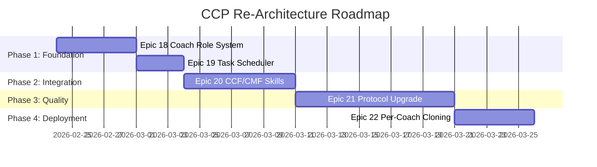

# Conscious Coach Platform (CCP) — Unified System Architecture

**Version:** 1.0  
**Date:** 2026-02-18  
**Scope:** Integrating CCF + CMF + CBCS into one per-coach platform  
**Audience:** Engineering team, future agents, any developer encountering this system for the first time  

---

## 1. First-Principles Technology Glossary

Before discussing architecture, every technology in this stack must be understood from first principles. This section exists so that anyone — new developer, future AI agent, or outside auditor — can understand *why* each piece exists, not just *what* it is.

### 1.1 FastAPI (The HTTP Gateway)

**What it is:** A Python web framework that receives HTTP requests and returns responses.

**Why it matters here:** Telegram doesn't call Python functions directly. When a user sends a message on Telegram, Telegram's servers make an HTTP POST request to a URL we control. FastAPI receives that POST, validates it, and routes it to the right handler. Without FastAPI (or an equivalent), we have no way to receive messages from the outside world.

**First principle:** Every external communication with our system enters through HTTP. FastAPI is the door.

### 1.2 LangGraph (The Brain's State Machine)

**What it is:** A library from the LangChain ecosystem that models AI workflows as directed graphs with persistent state.

**Why it matters here:** A coaching conversation is not a single request-response. It's a stateful journey: the coach sends a voice note on Monday → the system transcribes it → extracts themes → stores them → on Thursday generates ideas → the coach picks one → on Friday the system generates a recording preparation package. LangGraph maintains the state of this multi-day, multi-step workflow. Each "step" is a *node* in the graph. The graph knows where each user/coach currently is in their journey.

**First principle:** Coaching is inherently stateful. LangGraph is the mechanism that prevents the system from forgetting where it left off.

### 1.3 Pydantic AI (Structured Reasoning)

**What it is:** A framework that wraps LLM calls in type-safe schemas, forcing the AI to output structured data (JSON objects with validated fields) instead of free text.

**Why it matters here:** When an agent (say, Aria) analyzes a user's voice note, we don't want a paragraph of text. We want structured entities: `{label: "Fear", name: "Failure", weight: 0.8}`. Pydantic AI enforces this at the Python level — if the LLM returns invalid data, it retries automatically (up to 3 times). This prevents hallucination from propagating downstream.

**First principle:** Unstructured LLM output is unreliable. Pydantic AI converts probabilistic text into deterministic data.

### 1.4 Redis (The Listening Window)

**What it is:** An in-memory key-value store that operates at sub-millisecond latencies.

**Why it matters here:** When a coach sends 5 rapid-fire messages on Telegram, we don't want the bot to respond to each one individually. Redis buffers messages into a "Listening Window" and only triggers the processing pipeline once a "soft silence" is detected (the coach stops typing). This prevents fragmented, annoying bot responses.

**First principle:** Humans don't communicate in single packets. Redis gives the system patience.

### 1.5 Neo4j (The Psychology Graph)

**What it is:** A graph database that stores data as nodes (entities) and edges (relationships) instead of rows and columns.

**Why it matters here:** A user's psychological profile isn't tabular. Their Fear of Failure *connects to* their Dream of Freedom, which *is blocked by* their Enemy (procrastination). Neo4j models these relationships natively, allowing the system to traverse them: "Find the Enemy node blocking this user's primary Dream" — a query that would require painful JOINs in SQL but is a single `MATCH` pattern in Cypher.

**First principle:** Psychology is relational, not tabular. Neo4j models mental architecture as-is.

### 1.6 Supabase (The Operational Database)

**What it is:** A managed PostgreSQL database with built-in authentication, Row Level Security (RLS), and vector storage (pgvector).

**Why it matters here:** While Neo4j stores *why* (psychological patterns), Supabase stores *what*: user profiles, billing status, conversation logs, ritual completions, and assessment results. RLS ensures that Coach A cannot see Coach B's users — critical for the per-coach cloning model.

**First principle:** Psychological data and operational data have different access patterns. They belong in different stores.

### 1.7 Groq / Whisper (Voice Transcription)

**What it is:** Groq is an inference provider that runs OpenAI's Whisper model at extreme speed (~10x faster than real-time).

**Why it matters here:** The coach's primary input is voice notes. Groq transcribes them at $0.03/hour of audio, making it economically negligible. The transcription feeds into both CCF (theme extraction) and CBCS (journal processing).

**First principle:** Voice is the highest-bandwidth input a coach can provide. Groq makes voice-to-text free at our scale.

### 1.8 OpenRouter (LLM Gateway)

**What it is:** An API router that provides access to 200+ LLM models through a single API key.

**Why it matters here:** Different tasks need different models. Content generation (CCF) uses Gemini 2.5 Flash for speed. Script composition (CMF) uses Claude for nuance. CBCS coaching uses GPT-4o for reasoning. OpenRouter lets us switch models without changing code — just change the model string.

**First principle:** No single model is best at everything. OpenRouter is the switchboard.

### 1.9 The Intelligence Library (The Ground Truth)

**What it is:** A collection of YAML and JSON files that encode coaching methodology, psychological frameworks, persuasion strategies, and narrative formulas.

**Why it matters here:** This is the most important architectural concept. The AI *never invents* its coaching framework. It reads it from versioned configuration files at runtime. When we update "what a Rebel identity pillar means," we edit a YAML file — we don't retrain an AI or change code.

**First principle:** Coaching methodology is configuration, not code. The Intelligence Library is the coach's "soul" in machine-readable form.

---

## 2. System Inventory & Code-Level Audit

### 2.1 CCF (Conscious Content Factory)

**Purpose:** Weekly content pipeline — generates themes, research, tier list/rating ideas for YouTube.

| Component | Count | Maturity |
|-----------|-------|----------|
| Skills | 131 files | ⭐⭐⭐⭐ Production-tested |
| Script Prompts | 92 files | ⭐⭐⭐⭐ 3 years of iteration |
| Commands | 21 files | ⭐⭐⭐⭐ Step-tracking with `write_todos` |
| Archetype Prompts | 8 (4 tier list + 4 rating) | ⭐⭐⭐⭐ Recently created |
| Infrastructure scripts | `ccf_infrastructure.py` (29KB), `ccf_setup.py` (9KB) | ⭐⭐⭐ Functional |
| Pipeline automation | `CCF_RUN_PIPELINE.ps1` (16KB) | ⭐⭐⭐ Windows-specific |

**Architecture pattern:** File-based command execution. Each command is a markdown file with step-by-step instructions that an AI agent follows. Commands use `// turbo-all` for auto-execution and `write_todos` for step tracking.

### 2.2 CMF (Conscious Movie Factory)

**Purpose:** AI video production — scripts, storyboards, sonic design, motion graphics.

| Component | Count | Maturity |
|-----------|-------|----------|
| Skills (SKILL.md files) | 66 across 10 families | ⭐⭐⭐⭐⭐ Battle-tested |
| Commands | 32 files | ⭐⭐⭐⭐⭐ Constraint-enforced |
| Hunters | 13 arc-specific | ⭐⭐⭐⭐⭐ Latest SPR/LSP upgrades |
| Analysts | 13 | ⭐⭐⭐⭐ V3 enrichment |
| Composers | 13 | ⭐⭐⭐⭐ MCDA-guided |
| Commanders | 14 | ⭐⭐⭐⭐⭐ 14-point validation |
| Visual pipeline | 4 skills | ⭐⭐⭐⭐ VCP/PRIMAL analysis |
| Motion pipeline | 10 skills | ⭐⭐⭐ GMG/CAC/SB composers |
| Sonic pipeline | 1 skill | ⭐⭐⭐⭐ Suno V5 integration |

**Architecture pattern:** Skill-based routing. Commands read `strategy_brief.selected_arc` and route to the appropriate skill file. Each skill is 20-40KB of constraints, scene-level granularity, quality gates, and verbatim mode enforcement.

### 2.3 CBCS (Conscious Behavioral Change System)

**Purpose:** Real-time Telegram coaching for end-users + coach monitoring.

| Component | Status | Maturity |
|-----------|--------|----------|
| Telegram webhook | ✅ Functional | ⭐⭐⭐⭐ Tested |
| Redis Listening Window | ✅ Functional | ⭐⭐⭐⭐ Tested |
| LangGraph state machine | ⚠️ 2 nodes only (listening → processing → END) | ⭐⭐ Scaffold |
| Pydantic AI agent | ⚠️ Minimal (1 tool: `get_current_time`) | ⭐⭐ Scaffold |
| Agents (Aria, Assembler, etc.) | ⚠️ Schema-defined but not wired into graph | ⭐⭐ Scaffold |
| Tools (Supabase, Neo4j, etc.) | ❌ Empty stubs (`class SupabaseClient: pass`) | ⭐ Stubs |
| Intelligence Library loader | ✅ Pydantic-validated models | ⭐⭐⭐⭐ Good |
| Protocols (12 agent prompts) | ⚠️ 3KB templates with `{format_string}` injection | ⭐⭐ Basic |
| Scheduler | ⚠️ Voice engine keep-warm only, not a task scheduler | ⭐⭐ Limited |
| Voice Engine (IndexTTS-2) | ✅ Integration code exists | ⭐⭐⭐ Functional |
| Transcription (Groq) | ✅ Functional | ⭐⭐⭐⭐ Tested |
| Sprint status | All 8 epics marked "done" | — |

> [!WARNING]
> **The sprint status says "done" but the code tells a different story.** Many components are architectural scaffolds — the Python classes exist, schemas are defined, but the actual business logic is minimal. The LangGraph has only 2 nodes, tools are empty stubs, and agents aren't wired into the graph. The CBCS needs significant development before it can serve production traffic.

---

## 3. Prompt Quality Gap Analysis

The most significant architectural mismatch is the 10x quality gap between CCF/CMF prompts and CBCS protocols.

| Dimension | CBCS Protocols | CCF/CMF Skills |
|-----------|---------------|----------------|
| **Size** | ~3KB per protocol | ~30KB per skill |
| **Structure** | 5 sections, flat markdown | 7-layer structure with YAML frontmatter |
| **Constraints** | Implicit ("adhere to Glass Wall") | Explicit `[!CAUTION]` blocks with enforcement |
| **Variable injection** | Python `{format_string}` | Structured variable tables with types |
| **Quality gates** | 2-item checklist | 13-14 point validation rubrics |
| **Verbatim mode** | Not applicable | Zero-paraphrasing with fallback protocols |
| **Step tracking** | None | `write_todos` with state transitions |
| **Error handling** | `[MISSING_DATA]` implicit | `[MISSING_DATA]` explicit with fallback behaviors |
| **Scene-level detail** | None | Per-scene options with timing and examples |
| **Tested in production** | No | Yes, across 50+ projects |

> [!IMPORTANT]
> **The CBCS protocols must be upgraded to match CCF/CMF skill quality before going live.** A 3KB Aria protocol cannot compete with a 30KB Witness Hunter skill in terms of output reliability. The upgrade path is to rewrite each CBCS protocol as a SKILL.md file using the CCF/CMF 7-layer format.

---

## 4. Multi-Criteria Decision Analysis (MCDA)

### Integration Strategy Decision

We evaluated three options for unifying CCF + CMF + CBCS:

| Criterion (Weight) | NanoBot Gateway (A) | CBCS Extension (B) | Custom Build (C) |
|-----|-----|-----|-----|
| **Infrastructure reuse** (20%) | 3 — duplicates CBCS | 9 — uses existing code | 5 — starts fresh |
| **Data unification** (20%) | 4 — needs API bridge | 10 — single database | 7 — single but new |
| **Time to deploy** (15%) | 8 — 2 hours setup | 6 — 2-3 weeks | 3 — 6-8 weeks |
| **Prompt quality path** (15%) | 5 — no skill system | 8 — can adopt SKILL.md format | 9 — built from scratch |
| **Scalability (multi-coach)** (10%) | 4 — no RLS | 9 — RLS built-in | 7 — needs design |
| **Maintenance burden** (10%) | 3 — two systems | 8 — one system | 9 — one system |
| **Memory/graph access** (10%) | 2 — SQLite vs Neo4j | 10 — native Neo4j | 6 — needs integration |
| **Weighted Score** | **4.25** | **8.65** | **6.35** |

**Decision: CBCS Extension (B) with score 8.65 is the clear winner.**

NanoBot (A) fails on data unification (requires API bridge to access coach/user data) and scalability (no multi-tenant support). Custom Build (C) wastes existing infrastructure. CBCS Extension (B) leverages existing Telegram, Redis, LangGraph, Neo4j, and Supabase while adding missing capabilities.

---

## 5. Epics & Stories for Re-Architecture

### Epic 18: Coach Role System

> **Problem:** CBCS currently routes all Telegram messages through the same pipeline. There is no distinction between a coach and a user.
> **Solution:** Role-based routing at the ingress layer with separate LangGraph subgraphs.

| Story | Description | Dependencies |
|-------|-------------|--------------|
| 18.1 | **Coach Registry** — Supabase table mapping `chat_id` → role (coach/user) + coach_id | None |
| 18.2 | **Role Router** — `ingress.py` checks role before routing to subgraph | 18.1 |
| 18.3 | **Coach State** — Extend `AgentState` with coach-specific fields (current_week, project_id, selected_ideas) | 18.2 |
| 18.4 | **Coach LangGraph Subgraph** — New nodes: `coach_listening`, `content_ideation`, `recording_prep`, `user_monitor` | 18.2, 18.3 |

### Epic 19: Task Scheduler

> **Problem:** The existing scheduler only pings the voice engine for warmth. No mechanism exists for "every Thursday at 9AM, generate tier list ideas for Coach Adèle."
> **Solution:** Replace the keep-warm scheduler with APScheduler integration, supporting per-coach cron expressions.

| Story | Description | Dependencies |
|-------|-------------|--------------|
| 19.1 | **APScheduler Integration** — Add `apscheduler` to FastAPI lifespan with PostgreSQL job store | None |
| 19.2 | **Coach Schedule Config** — Supabase table for per-coach delivery preferences (day, time, timezone) | 18.1 |
| 19.3 | **Scheduled Triggers** — Cron jobs that invoke LangGraph node transitions for content delivery | 19.1, 19.2 |
| 19.4 | **Heartbeat Messages** — Proactive messages (Monday interview prompt, Thursday ideas, Friday recording prep) | 19.3 |

### Epic 20: CCF/CMF CLI Session Integration

> **Problem:** CCF and CMF are CLI-driven command systems executed by Gemini CLI. The 300+ prompt files are designed for agent-driven execution, not Python API calls.
> **Solution:** CBCS acts as coordinator/scheduler — it spawns Gemini CLI sessions at the right time, monitors output files, and delivers results via Telegram. CCF/CMF commands run unchanged.

| Story | Description | Dependencies |
|-------|-------------|--------------|
| 20.1 | **CLI Session Runner** — `cli_runner.py` module that spawns `gemini` CLI sessions via `subprocess`, monitors completion, reads output files | 18.4 |
| 20.2 | **CCF Weekly Trigger** — Scheduler triggers `ccf-weekly` pipeline, reads `dynamic_content_themes.json` output | 19.3, 20.1 |
| 20.3 | **CMF Pipeline Trigger** — Scheduler triggers CMF commands (`cmf-diagnose`, `cmf-hunt`, etc.) in sequence, each as a separate session | 20.1 |
| 20.4 | **Output Monitor** — File watcher that detects when CLI sessions produce output files, triggers next workflow step | 20.1 |


### Epic 21: CBCS Protocol Upgrade

> **Problem:** CBCS protocols (Aria, Assembler, Artisan, etc.) are 3KB flat markdown files with simple `{format_string}` injection. They lack the constraint enforcement, quality gates, and scene-level granularity of CCF/CMF skills.
> **Solution:** Rewrite each CBCS protocol as a SKILL.md file using the 7-layer prompt architecture.

| Story | Description | Dependencies |
|-------|-------------|--------------|
| 21.1 | **Skill Format Adoption** — Define CBCS-specific SKILL.md template with YAML frontmatter + constraints | None |
| 21.2 | **Aria Skill Rewrite** — Upgrade 3KB protocol to 15KB+ skill with quality gates, entity validation, and fallback behaviors | 21.1 |
| 21.3 | **Assembler Skill Rewrite** — Strategy selection with explicit scoring rubrics | 21.1 |
| 21.4 | **Artisan Skill Rewrite** — Script synthesis with narrative constraints | 21.1 |
| 21.5 | **Wire Agents to LangGraph** — Connect upgraded skills to graph nodes, replace stubs with real implementations | 21.2-21.4 |

### Epic 22: Per-Coach Cloning

> **Problem:** Currently one repository serves all coaches. We need isolated instances with customizable API tokens, intelligence libraries, and agent configurations.
> **Solution:** Containerized deployment where each coach instance shares the same codebase but has unique environment variables, intelligence library files, and database schemas.

| Story | Description | Dependencies |
|-------|-------------|--------------|
| 22.1 | **Docker Compose Template** — Per-coach compose file with env injection | Epic 18 |
| 22.2 | **Intelligence Library Mount** — Coach-specific YAML/JSON files mounted as volumes | 22.1 |
| 22.3 | **API Token Rotation** — Per-coach Telegram bot token, OpenRouter key, Groq key | 22.1 |
| 22.4 | **Database Isolation** — Supabase RLS policies scoped to coach_id, separate Neo4j databases or namespacing | 22.1 |
| 22.5 | **Deployment Automation** — Script to clone, configure, and deploy a new coach instance | 22.1-22.4 |

---

## 6. Per-Coach Cloning Strategy

Each coach gets their own isolated instance. The architecture uses Docker Compose with volume mounts.

```
coach-platform/
├── docker-compose.yml          # Shared template
├── shared/
│   ├── skills/cmf/             # 66 CMF skills (READ-ONLY mount)
│   ├── commands/               # 32 commands (READ-ONLY mount)
│   └── ccf-26/intelligence/    # Archetype prompts (READ-ONLY mount)
├── coaches/
│   ├── coach-adele/
│   │   ├── .env                # TELEGRAM_BOT_TOKEN, OPENROUTER_API_KEY
│   │   ├── intelligence_library/  # Coach-specific YAML overrides
│   │   ├── production/            # Project folders
│   │   └── docker-compose.override.yml
│   └── coach-matthis/
│       ├── .env
│       ├── intelligence_library/
│       ├── production/
│       └── docker-compose.override.yml
```

**What's shared (read-only):** Skills, commands, archetype prompts — the 300+ files tested over 3 years.

**What's per-coach:** Environment variables (API tokens), intelligence library (identity pillars, TTT matrix tuned to their coaching style), production folders (client projects), Telegram bot token, and database credentials.

**Why clone, not multi-tenant?** API token rotation. Different coaches may use different OpenRouter quotas, different Telegram bots, different Groq endpoints. Isolation at the container level prevents one coach's API limit from affecting another.

---

## 7. Architectural Risks & Mitigations

| Risk | Severity | Mitigation |
|------|----------|------------|
| CBCS tool stubs never get implemented | 🔴 Critical | Epic 21 prioritizes stub replacement before any live traffic |
| LangGraph 2-node graph can't handle coach flows | 🔴 Critical | Epic 18.4 adds coach-specific subgraph with 4+ nodes |
| CBCS protocols too weak for production | 🟠 High | Epic 21 rewrites all 12 protocols as SKILL.md files |
| Per-coach Docker instances increase ops burden | 🟡 Medium | Epic 22.5 automates deployment with scripts |
| CCF/CMF commands are CLI-only, not API-callable | 🟠 High | Epic 20 wraps them as Pydantic AI tools |
| 300+ prompt files change infrequently but are critical | 🟡 Medium | Read-only volume mount, version-controlled separately |
| Voice engine cold-start breaks UX | 🟡 Medium | Existing keep-warm scheduler + APScheduler upgrade |

---

## 8. Implementation Priority & Roadmap



**Total estimated timeline:** 30 days of development across 4 phases.

**Phase 1** (Foundation) must complete before anything else — without role routing and scheduling, the bot can't distinguish coaches from users or trigger proactive messages.

**Phase 3** (Quality) is the longest because it involves rewriting 12 protocols as full SKILL.md files — but this is the most critical phase. A 3KB protocol cannot reliably guide an AI agent through a complex coaching interaction. The 30KB+ CCF/CMF skills prove that constraint density directly correlates with output quality.

---

## 9. Summary of Decisions

| Decision | Choice | Rationale |
|----------|--------|-----------|
| Unified platform | CBCS Extension | MCDA score 8.65 vs NanoBot 4.25 |
| Per-coach isolation | Docker Compose with volume mounts | API token rotation, blast radius containment |
| Prompt architecture | SKILL.md 7-layer format | Proven across 50+ CMF projects |
| Shared resources | Read-only volume mounts | 300+ tested files, infrequent changes |
| Scheduling | APScheduler with PostgreSQL job store | Persistent across restarts, per-coach cron |
| Database strategy | Supabase (operational) + Neo4j (psychological) | Different data, different access patterns |
| Model routing | OpenRouter | Single API key, model switching without code changes |

> [!NOTE]
> The standalone `tools/telegram-tierlist-bot/` code built earlier in this conversation is **not discarded**. Its `generator.py` (archetype routing + OpenRouter calls) and `formatter.py` (Telegram message formatting) become Pydantic AI tools within Epic 20, maintaining the same logic in a properly integrated architecture.
