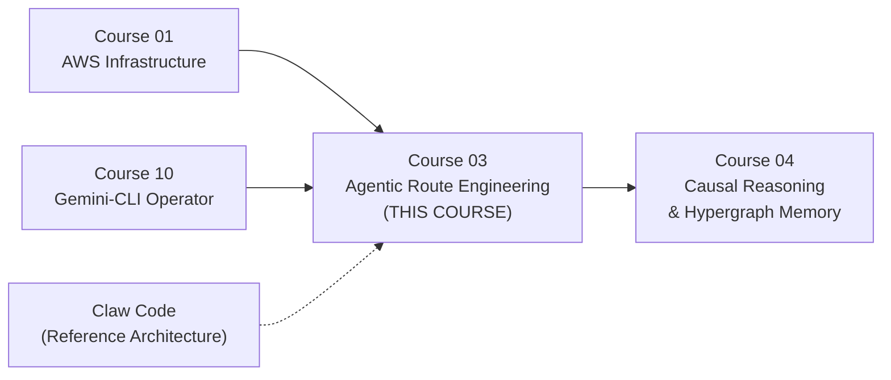

# Course 03 Syllabus — MCDA & SWOT Analysis (v3.1)
## First Principles Deconstruction for the Agentic Harness Engineer
### Enriched with Claw Code Autopsy + Kuber Studio Deep-Dive + NLAH/IHR Research Paper

> **Method:** Multi-Criteria Decision Analysis (MCDA) + SWOT, grounded in First Principles Thinking and Systems Architecture mental models.
> **Inputs:** Current Syllabus Outline, CCP System Documentation (+ PRDs + 60+ Tech Specs), Identity Engine Architecture, Course 04 (Causal Reasoning & Hypergraph Memory), Course 10 (Gemini-CLI Operator), 2026 web research on NLAH/IHR/MCP/A2A/FinOps/Compound Engineering, **Claw Code Python Port (ultraworkers/claw-code)**, **Claude Code Documentation (VineeTagarwaL-code)**, **Kuber Studio Source Code Analysis (kuberwastaken/claude-code)**, **Natural-Language Agent Harnesses (NLAH/IHR, Pan et al. 2026)**.

---

## VIII. The Claw Code Architectural Autopsy — Reverse-Engineering the World's Best Harness

> [!IMPORTANT]
> On March 31, 2026, the source code of Claude Code — the world's most widely deployed agent harness — was exposed. A clean-room Python rewrite (Claw Code) was published within hours and reached 100K+ GitHub stars in 2 hours. This is the **single most valuable intelligence event** for our curriculum. We now have the full architectural blueprint of the system that defined the category.

### Why This Matters For Us

We are building a **custom agentic harness specifically for the CCP and CMF** — a 76-agent cognitive-behavioral intelligence swarm. The Claude Code architecture is not just "interesting" — it is the **production-validated reference implementation** of every pattern our students need to master. Studying it is not optional; it is the equivalent of a med student studying the first published human anatomy atlas.

The Claw Code Python port (`src/`), the VineeTagarwaL documentation, and the Kuber Studio source code deep-dive together expose **14 production-grade architectural patterns** that our current syllabus either partially covers or completely misses.

> [!NOTE]
> **v3.0 Update:** The Kuber Studio analysis (Kuber Mehta, March 31, 2026) gained access to the FULL original TypeScript source via npm sourcemaps — not just the Python port. This exposed 5 additional patterns that were invisible in the clean-room rewrite: the Dream System, KAIROS proactive agent, ULTRAPLAN remote offload, the Dynamic Cache Boundary, and the ML-based Risk Classifier.

---

### Pattern 1: The 4-Level Hierarchical Memory System (CLAUDE.md)

**What Claude Code Does:**
Memory is not a flat string. It is a **4-level cascading hierarchy** with explicit priority ordering:

| Level | Location | Scope | Priority |
|:------|:---------|:------|:---------|
| L1: Managed | `/etc/claude-code/CLAUDE.md` + `rules/` | Enterprise-wide policies | Lowest |
| L2: User | `~/.claude/CLAUDE.md` + `~/.claude/rules/*.md` | Personal preferences | ↑ |
| L3: Project | `CLAUDE.md` + `.claude/CLAUDE.md` + `.claude/rules/*.md` | Team/project standards | ↑ |
| L4: Local | `CLAUDE.local.md` (gitignored) | Personal overrides | Highest |

**Key Mechanics:**
- `@include` directive pulls in external files recursively (max depth 5, circular-ref safe)
- `.claude/rules/*.md` files support YAML frontmatter with `paths:` glob patterns for conditional activation
- `getMemoryFiles()` walks from root to CWD, so ancestor dirs load before children
- `MAX_MEMORY_CHARACTER_COUNT` enforces token budget discipline

**CCP Mapping:**
This maps DIRECTLY onto the CCP's architecture:
- **L1 Managed** = CCP's `genesis_clearance_certificate.json` + global Voice DNA constraints
- **L2 User** = The individual coach's 3D Voice DNA profile (Positive Space, Negative Space, Emotional DNA)
- **L3 Project** = Per-client coaching session rules (graph-derived, from Neo4j relationships)
- **L4 Local** = Ephemeral session-specific overrides (emotional state, trigger-first context)

> [!TIP]
> **Course 03 Impact:** This is the missing architecture for M7 (Pheromone Trails) and M11 (Prompt Caching). Our students must learn to engineer hierarchical context cascades, not flat prompt strings. The CCP already does this implicitly — we need to make it explicit.

---

### Pattern 2: The Permission ACL Engine (allow/deny/ask)

**What Claude Code Does:**
Every tool call passes through a **deterministic permission resolver** with 6 modes:

| Mode | Behavior | CCP Analogy |
|:-----|:---------|:------------|
| `default` | Ask for dangerous ops | CCP Guardian Agent in Stewardship Mode |
| `acceptEdits` | Auto-approve file edits, ask for shell | Normal agent operation |
| `plan` | Read-only, no writes allowed | CCP CBAR pre-validation phase |
| `bypassPermissions` | Skip all checks | **NEVER for CCP** — violates Mandate 4 |
| `dontAsk` | Suppress prompts, deny silently | CCP Negative Space enforcement |
| `auto` | ML classifier decides | Future CCP autonomy tier |

**Permission Rules are JSON ACLs:**
```json
{
  "permissions": {
    "allow": ["Bash(git status)", "Bash(git diff *)", "Read(*)"],
    "deny": ["Bash(rm -rf *)", "Bash(sudo *)", "mcp__untrusted-server"]
  }
}
```

**Critical Design Patterns:**
- Compound commands (`&&`, `||`, `|`, `;`) are decomposed and each sub-command is checked independently
- Output redirections to paths outside the project are blocked
- `sed -i` is tracked specially to detect file modifications
- MCP tools use `mcp__<server>__<tool>` namespacing for granular gating

**CCP Mapping:**
This is EXACTLY the Kill Switch architecture our syllabus teaches in M9. But Claude Code reveals a much richer pattern:
- The CCP needs **per-agent permission profiles**: Aria can read journals but cannot write to Neo4j directly. Chronos can query time series but cannot modify coaching rituals. Sentinel can flag threats but cannot escalate without human approval.
- The `deny` list IS the Negative Space manifesto applied to tool access.

> [!CAUTION]
> **Our current M4 (Tool Defences) and M9 (Kill Switch) teach the concept but never show a JSON ACL permission schema.** Claude Code proves that production harnesses encode permissions as data, not code.

---

### Pattern 3: The 20+ Hook Event System (PreToolUse → Stop → PostCompact)

**What Claude Code Does:**
Hooks are **interceptors injected at precise lifecycle moments.** This is NOT a simple pre/post wrapper. Claude Code defines 20+ distinct hook events:

| Hook Event | When It Fires | Exit Code Semantics |
|:-----------|:-------------|:-------------------|
| `PreToolUse` | Before any tool executes | `0`=proceed, `2`=block+feedback |
| `PostToolUse` | After tool returns | `0`=log, `2`=inject feedback to agent |
| `PostToolUseFailure` | After tool error | Error classification + retry logic |
| `Stop` | Before agent concludes response | `2`=force continuation |
| `SubagentStart` | When a sub-agent spawns | Inject initial context |
| `SubagentStop` | When a sub-agent finishes | Validate output before parent sees it |
| `SessionStart` | Session begins/resume/clear | Bootstrap context |
| `UserPromptSubmit` | User sends a message | `2`=block prompt |
| `PreCompact` | Before context compaction | Inject custom summarization rules |
| `PostCompact` | After compaction | Verify critical context survived |
| `PermissionRequest` | Permission dialog appears | Auto-decide via hook |
| `PermissionDenied` | Auto mode denies a call | Retry with different approach |
| `TaskCreated/Completed` | Task lifecycle | Orchestration control |
| `FileChanged` | Watched file changes | Hot-reload context |
| `ConfigChange` | Settings file changes | `2`=block change |

**Hook Command Types:**
1. **Shell Command:** `{"type": "command", "command": "npm test"}`
2. **HTTP Request:** `{"type": "http", "url": "https://hooks.example.com/event"}`
3. **LLM Prompt:** `{"type": "prompt", "prompt": "Review this for security...", "model": "claude-haiku-4-5"}`
4. **Agent Hook:** `{"type": "agent", "prompt": "Verify unit tests passed..."}`

**CCP Mapping:**
This is the most architecturally significant pattern for the CCP:
- **`PreToolUse` → CCP Guardian Agent pre-validation:** Before any agent writes to Neo4j, a hook validates the write against Voice DNA constraints
- **`PostToolUse` → CCP CBAR post-validation:** After Aria extracts identity data, a hook runs adversarial stress-testing before committing
- **`SubagentStart/Stop` → CCP swarm orchestration:** When Chronos spawns a Trend Analyzer sub-agent, a hook injects the current temporal context
- **`PreCompact` → CCP session continuity:** Before compacting a 30-day coaching history, inject rules that preserve Change Point Detection data
- **LLM Prompt hook type → CCP Sentinel threat detection:** A lightweight model reviews every agent output for identity threat indicators before it reaches the client

> [!IMPORTANT]
> **Our current M14 (Hooks) in Course 10 (Gemini-CLI) teaches hooks. Course 03 teaches NONE.** The Claw Code autopsy proves that hooks are not a CLI feature — they are a fundamental harness engineering primitive. Course 03 must teach the Python implementation of hooks as middleware.

---

### Pattern 4: The Sub-Agent Spawning Architecture (Agent Tool + Worktree Isolation)

**What Claude Code Does:**
The `Agent` tool spawns child agents with:

| Parameter | Purpose | CCP Equivalent |
|:----------|:--------|:---------------|
| `description` | 3-5 word summary (shown in UI) | Agent name in CCP dashboard |
| `prompt` | Full task description | Agent's executive prompt (e.g., `aria_SKILL.md`) |
| `subagent_type` | Specialized agent profile | CCP agent specialization (Aria vs Chronos vs Sentinel) |
| `run_in_background` | Async execution | CCP parallel pipeline stages |
| `isolation: "worktree"` | Git worktree isolation | CCP sandboxed agent execution |

**Critical Design Decisions:**
- Sub-agents get **fresh context windows** — they cannot read the parent's conversation
- The parent must provide **all necessary context in the prompt** (this is Context Engineering)
- Sub-agents can spawn further sub-agents (limited nesting depth)
- Results are capped at **100,000 characters** before returning to parent
- Sub-agents default to `acceptEdits` permission mode
- **Persistent agent memory** at 3 scopes: `~/.claude/agent-memory/<type>/`, `.claude/agent-memory/<type>/`, `.claude/agent-memory-local/<type>/`

**CCP Mapping:**
This is the CCP's entire 76-agent orchestration pattern:
- Aria spawns 5 sub-agents (Narrative Coder, Discrepancy Calculator, Need Profiler, Distortion Classifier, Cultural Adapter)
- Each sub-agent gets a fresh context with ONLY the journal entry + its specific extraction schema
- Results return to Aria, who synthesizes the 12-dimensional identity vector
- Chronos and Sentinel operate as background agents, triggered asynchronously

---

### Pattern 5: The Skills System (Lazy-Loaded Capability Packages)

**What Claude Code Does:**
Skills are **on-demand capability packages** stored as `SKILL.md` files with YAML frontmatter:

```yaml
---
description: Run the full release process
argument-hint: version number (e.g. 1.2.3)
allowed-tools: Bash, Write, Read
when_to_use: Use when the user asks to release
model: claude-sonnet-4-6
context: fork
paths: "**/*.py"
---
```

**Key Mechanics:**
- Invoked via `/skill-name <args>` — progressive disclosure, not pre-loaded
- `$ARGUMENTS` substitution in the body (also `$ARG_NAME` for named args)
- `when_to_use` enables automatic skill selection without explicit invocation
- `context: fork` gives the skill a fresh context window
- `paths` enables conditional activation (only load for matching files)
- Namespaced: `.claude/skills/database/migrate/SKILL.md` → `/database:migrate`
- `!`backtick`` syntax for inline shell command execution in skill bodies

**CCP Mapping:**
This is EXACTLY what the CCP's agent Skills/Tools/Libraries taxonomy does (from Identity Engine Architecture):
- `narrative_identity_coding` = a Skill loaded only when processing journal entries
- `change_point_detection` = a Skill loaded only when Chronos runs PELT
- `threat_classification` = a Skill loaded only when Sentinel detects anomalies
- The CCP already implements progressive disclosure — we just never formalized it as a SKILL.md pattern

---

### Pattern 6: The Query Engine (Token Budgets + Compaction)

**What Claude Code Does:**
The `query.ts` engine manages:
- Streaming token output in real time
- Dispatching `tool_use` blocks to tool handlers
- **Enforcing per-turn token and tool-call budgets**
- Collecting tool results and appending before the next model call
- **Triggering compaction when the context window fills**
- `maxResultSizeChars` truncation for oversized tool outputs

**CCP Mapping:**
- **Per-turn token budgets** = CCP's need to cap Aria's extraction cost per journal entry
- **Compaction** = CCP's 30-day session history management (the Identity Engine's temporal tracking)
- **Tool-call budgets** = CCP's need to limit sub-agent spawning (prevent recursive explosion in adversarial validation)

---

### Pattern 7: The File System IS the Database

**What Claude Code Does:**
The Claw Code Python port layout reveals that the file system is the primary persistence layer:

```
src/
├── commands.py      # Command metadata (file-backed)
├── models.py        # Dataclasses (state as Python objects)
├── port_manifest.py # System self-description (file-backed)
├── query_engine.py  # Rendering logic
├── task.py          # Task state (file-backed)
└── tools.py         # Tool metadata (file-backed)
```

**Combined with the Rust port architecture:**
```
crates/
├── api-client/   # Provider abstraction, OAuth, streaming
├── runtime/      # Session state, compaction, MCP orchestration
├── tools/        # Tool manifest + execution framework
├── commands/     # Slash commands, skills discovery
├── plugins/      # Plugin model, hook pipeline
└── claw-cli/     # Interactive REPL, project bootstrap
```

**CCP Mapping:**
This validates the NLAH research finding that **file-backed state outperforms ephemeral context.** The CCP should store:
- Agent execution manifests as `.json` files on disk
- Session transcripts as versioned `.md` files
- Compaction summaries as persistent artifacts
- CBAR validation results as auditable logs

---

### Pattern 8: TodoWrite — Structured Task Orchestration

**What Claude Code Does:**
The `TodoWrite` tool manages a task list with explicit states:

| State | Meaning |
|:------|:--------|
| `pending` | Planned but not started |
| `in_progress` | Currently executing |
| `completed` | Finished and validated |

**CCP Mapping:**
This is the CCP's coaching ritual lifecycle:
- Ritual prescribed → `pending`
- Client engagement detected → `in_progress`
- Behavioral change confirmed via PELT → `completed`

---

### Pattern 9: The Rust Runtime (Production Hardening)

**What Claw Code Reveals:**
The project immediately ported to Rust for production, revealing the engineering priorities:
- `api-client` crate: Provider abstraction + OAuth + streaming (multi-vendor by design)
- `runtime` crate: Session state + compaction + **MCP orchestration** (protocol-native)
- `plugins` crate: Plugin model + **hook pipeline** (hooks are first-class, not bolted on)
- `compat-harness` crate: Compatibility layer for editor integration
- `server` crate: HTTP/SSE server (headless operation via `axum`)
- `lsp` crate: Language Server Protocol integration

**CCP Mapping:**
This validates our Course 10 insight that the harness operates in multiple modes (TUI, headless, SDK). The CCP must support:
- Interactive mode (coach dashboard)
- Headless mode (automated daily coaching cycles)
- API mode (Telegram bot integration)

---

### Pattern 10: The Dream System (autoDream — Background Memory Consolidation) 🆕

**What Claude Code Does (Kuber Studio Source):**
The `autoDream` service is a **background memory consolidation engine** that runs as a forked sub-agent. It is Claude Code literally "dreaming" — performing reflective passes over memory files to synthesize durable, well-organized memories.

**The Three-Gate Trigger:**
All three gates must pass before a dream runs — preventing both over-dreaming and under-dreaming:

| Gate | Condition | Purpose |
|:-----|:---------|:--------|
| Time Gate | 24 hours since last dream | Prevents rapid-fire consolidation |
| Session Gate | ≥5 sessions since last dream | Ensures enough new signal to consolidate |
| Lock Gate | Acquires consolidation lock | Prevents concurrent dreams (mutex) |

**The Four Phases:**
1. **Orient:** `ls` the memory directory, read `MEMORY.md`, skim existing topic files
2. **Gather Recent Signal:** Find new information worth persisting. Priority: daily logs → drifted memories → transcript search
3. **Consolidate:** Write/update memory files. Convert relative dates to absolute. Delete contradicted facts
4. **Prune and Index:** Keep `MEMORY.md` under 200 lines AND ~25KB. Remove stale pointers. Resolve contradictions

**Critical Design Decision:** The dream sub-agent gets **read-only bash** — it can look at the project but cannot modify anything. It is purely a memory consolidation pass.

**CCP Mapping:**
This is EXACTLY what your **FR38 Memory Tier Promotion** does — but automated and gated:
- **The Architect agent** already performs nightly cron sweeps of the Neo4j Episodic graph
- The Dream System formalizes this as a **3-gate trigger** (Time + Session + Lock) instead of a simple cron schedule
- The 4-phase protocol maps to: Orient (scan `[:EPISODIC]` graph) → Gather (find patterns ≥3 occurrences) → Consolidate (propose Semantic Truths) → Prune (clean old Episodic nodes)
- The **read-only constraint** protects against autonomous memory corruption — matching FR38's Human-in-the-Loop governance gate

> [!IMPORTANT]
> **Course 03 Impact:** This is a critical gap in M11 (Prompt Caching/Compaction) and M16 (Compound Synthesis). Our students must learn background consolidation as a **harness lifecycle primitive** — not just compaction triggered by context window overflow, but proactive, gated, 4-phase memory self-maintenance.

---

### Pattern 11: KAIROS (Always-On Proactive Agent with Tick-Based Monitoring) 🆕

**What Claude Code Does (Kuber Studio Source):**
KAIROS is a persistent, always-running agent that doesn't wait for user input. It watches, logs, and **proactively acts** on things it notices. Gated behind `PROACTIVE` / `KAIROS` compile-time feature flags.

**Key Mechanics:**
- Maintains **append-only daily log files** — observations, decisions, and actions throughout the day
- On a regular interval, receives `<tick>` prompts that let it decide whether to act proactively or stay quiet
- Has a **15-second blocking budget** — any proactive action that would block the user's workflow for more than 15 seconds gets deferred
- **Brief Mode:** Extremely concise responses designed for a persistent assistant that shouldn't flood the terminal
- Gets **exclusive tools** that regular Claude Code doesn't have

**CCP Mapping:**
This is the CCP's **Guardian Agent Stewardship Mode (FR-GA)** formalized as runtime architecture:
- The Guardian Agent already runs **weekly drift checks** (Lexicon Drift, Cultural Evolution, Campaign Fatigue)
- KAIROS proves this should be a **continuous background process** with tick-based proactive monitoring, not just a weekly cron job
- The **15-second blocking budget** maps to the CCP's need to not disrupt active coaching sessions with background intelligence updates
- **Brief Mode** maps to the CCP's need for minimal-footprint status reports (the coach shouldn't get a 500-word drift analysis during a live session)
- The **append-only daily log** maps to the CCP's Receipt Chain Guard — audit-grade provenance of every observation and decision

> [!CAUTION]
> **Course 03 Impact:** Our syllabus has ZERO coverage of proactive, tick-based harness monitoring. M9 (Hook Pipeline) teaches reactive hooks (fire when tool is used). KAIROS proves production harnesses also need **proactive monitoring loops** that autonomously observe, log, and act without user prompts. This is a new sub-primitive under P8 (Harness Lifecycle).

---

### Pattern 12: ULTRAPLAN (Async Remote Planning Offload to Cloud Container Runtime) 🆕

**What Claude Code Does (Kuber Studio Source):**
ULTRAPLAN offloads complex planning tasks to a **Cloud Container Runtime (CCR)** session running a more powerful model (Opus 4.6), gives it up to **30 minutes** to think, and lets the user approve the result from a browser.

**The Flow:**
1. Claude Code identifies a task that needs deep planning
2. Spins up a remote CCR session via `tengu_ultraplan_model` config
3. Terminal shows a polling state — checking every 3 seconds for the result
4. Browser-based UI lets you watch the planning happen and approve/reject it
5. Special sentinel value `__ULTRAPLAN_TELEPORT_LOCAL__` "teleports" the result back to the local terminal

**CCP Mapping:**
This maps to the CCP's separation of reasoning tiers:
- Your `ModelRouter` extension already routes to Gemini Pro High/Low/Flash based on task complexity
- ULTRAPLAN proves that production harnesses support **async offloading of expensive reasoning to remote containers**
- The CCP's **CRAL Research Diagonal** (7 sequential research moments: M1 RELEVANT → M7 RELATABLE) could run as an ULTRAPLAN-style async offload — taking 5-10 minutes per research cycle without blocking the main coaching pipeline
- The **browser-based approval UI** maps to the CCP's operator approval workflow (Guardian Agent `/ccf-guardian approve [id]`)

> [!TIP]
> **Course 03 Impact:** This strengthens M8 (Token Economics) with the concept of **async remote reasoning offload** — the harness doesn't just cascade between cheap/expensive models, it can offload entire reasoning sessions to remote containers with budget caps and human approval gates.

---

### Pattern 13: SYSTEM_PROMPT_DYNAMIC_BOUNDARY (Static/Dynamic Cache Partitioning) 🆕

**What Claude Code Does (Kuber Studio Source):**
The system prompt uses a `SYSTEM_PROMPT_DYNAMIC_BOUNDARY` marker that splits it into:
- **Static sections** — cacheable across organizations (things that don't change per user)
- **Dynamic sections** — user/session-specific content that breaks cache when changed
- `DANGEROUS_uncachedSystemPromptSection()` — explicitly named function for volatile sections that MUST break cache

**CCP Mapping:**
Direct mapping to the CCP JIT Skill Compiler:
- **Static (cacheable across all coaches):** The 7 Archetype Family boundaries, Container Module Library, Anti-Draft Intelligence Level 1 (generic failure modes), CRAL research methodology
- **Dynamic (per-coach, breaks cache):** `coach_soul.json` (DEP-ENG-003/004), Psychological Routing Brief (DEP-ENG-016), active 30-Day Season mandate, per-client Context Premises from Neo4j
- **DANGEROUS (volatile, never cache):** Ephemeral emotional state, live trigger activation data, LIWC-22 real-time scores, active crisis flags

> [!TIP]
> **Course 03 Impact:** This is a precise enrichment for M11 (Prompt Caching Physics). The static/dynamic boundary is NOT a trivial optimization — it's an architectural decision that determines which parts of the CCP JIT Compiler's output can be amortized across invocations and which break cache every time. `DANGEROUS_uncachedSystemPromptSection()` is the kind of naming convention that reflects learned lessons from production failures.

---

### Pattern 14: ML-Based Risk Classification (YOLO Classifier for Auto-Permission) 🆕

**What Claude Code Does (Kuber Studio Source):**
Beyond simple allow/deny rules, every tool action is classified into risk levels:

| Risk Level | Behavior | Example |
|:-----------|:---------|:--------|
| LOW | Auto-approved silently | Reading files, listing directories |
| MEDIUM | Prompt with explanation | Running shell commands |
| HIGH | Require explicit approval | Writing to protected files |

**The YOLO Classifier:** An ML-based permission decision system (`TRANSCRIPT_CLASSIFIER` feature flag) that analyzes the full conversation transcript to decide automatically whether to approve or deny. The "Permission Explainer" — a separate LLM call that explains tool risks to the user before they approve — is itself generated by Claude.

**Protected Files:** `.gitconfig`, `.bashrc`, `.zshrc`, `.mcp.json`, `.claude.json` are specifically guarded from automatic editing regardless of risk classification.

**Path Traversal Prevention:** URL-encoded traversals, Unicode normalization attacks, backslash injection, case-insensitive path manipulation — all handled programmatically, not by policy.

**CCP Mapping:**
Your Guardian Agent uses `AUTHENTICATED/PROVISIONAL/FAILED` verdicts — but these are rule-based. An ML classifier could:
- **Auto-approve LOW risk:** Valeriane reading corpus data, Sophia loading `coach_soul.json` for TTT comparison
- **Prompt for MEDIUM risk:** Charlotte generating sample outputs, research agents querying Firecrawl
- **Require explicit approval for HIGH risk:** Writing to Neo4j Semantic memory (FR38), modifying `coach_soul.json` DNA profiles, escalating crisis flags
- **Protected files CCP equivalent:** `coach_soul.json`, `genesis_clearance_certificate.json`, `ttt_baseline.json` should NEVER be auto-modified

> [!IMPORTANT]
> **Course 03 Impact:** This enriches M13 (Fortress Architecture) with a 3rd security dimension. Currently we teach (1) JSON ACLs (allow/deny lists) and (2) compound command decomposition. The ML risk classifier adds (3) **adaptive, context-aware risk scoring** — the same tool call might be LOW risk in Genesis mode but HIGH risk during a live coaching session.

---

## The 14 Patterns → Primitive Mapping

| # | Pattern | Source | Primary Primitive(s) | Current Coverage | Gap |
|:--|:--------|:-------|:--------------------|:----------------|:----|
| 1 | 4-Level Memory Hierarchy | Claw Code | P1 Context | M7/M11 partial | Need hierarchical cascade architecture |
| 2 | Permission ACL Engine | Claw Code | P6 Security | M4/M9 conceptual | Need JSON ACL schemas |
| 3 | 20+ Hook Events | Claw Code | P2 State, P4 Adversarial | **ZERO in C03** | Critical gap — hooks as middleware |
| 4 | Sub-Agent Spawning | Claw Code | P2 State, P3 Protocol | M3 conceptual | Need spawn/isolate/return patterns |
| 5 | Skills System | Claw Code | P1 Context, P5 Economic | M4 tangential | Need lazy-loading architecture |
| 6 | Query Engine Budgets | Claw Code | P5 Economic | **ZERO** | Need token/tool-call budgets |
| 7 | File-Backed State | Claw Code | P1 Context, P2 State | **ZERO** | Validates NLAH research |
| 8 | TodoWrite Orchestration | Claw Code | P2 State | M12 tangential | Need explicit task FSM |
| 9 | Rust Runtime Modes | Claw Code | P3 Protocol | C10 covers ops | C03 needs theory of modal harness |
| **10** | **Dream System (autoDream)** | **Kuber Studio** | **P7 Compound, P8 Lifecycle** | **ZERO** | **Need background memory consolidation with 3-gate trigger** |
| **11** | **KAIROS (Proactive Agent)** | **Kuber Studio** | **P2 State, P8 Lifecycle** | **ZERO** | **Need tick-based proactive monitoring with blocking budgets** |
| **12** | **ULTRAPLAN (Remote Offload)** | **Kuber Studio** | **P5 Economic, P3 Protocol** | **ZERO** | **Need async remote reasoning with CCR integration** |
| **13** | **Dynamic Cache Boundary** | **Kuber Studio** | **P1 Context, P5 Economic** | **ZERO** | **Need static/dynamic/DANGEROUS cache partitioning** |
| **14** | **ML Risk Classification** | **Kuber Studio** | **P6 Security, P4 Adversarial** | **ZERO** | **Need adaptive, context-aware risk scoring (LOW/MED/HIGH)** |
| **15** | **Execution Contracts** | **NLAH Paper** | **P3 Protocol, P8 Lifecycle** | **Partial** | **Formalizes required outputs, budgets, and permissions as a first-class object** |
| **16** | **IHR Runtime Charter** | **NLAH Paper** | **P8 Lifecycle** | **Partial** | **Separates shared runtime policy from task-specific harness logic** |
| **17** | **File-Backed Workspace** | **NLAH Paper** | **P2 State, P8 Lifecycle** | **Partial** | **Canonical layout (TASK.md, RESPONSE.md, state/) for durable state** |
| **18** | **Module Composition** | **NLAH Paper** | **P7 Evolution, P8 Lifecycle** | **ZERO** | **Ablatible patterns: Verifier, Multi-Candidate Search, Self-Evolution** |
| **19** | **Context Semantics (Fork)** | **NLAH Paper** | **P1 Context** | **ZERO** | **Explicit control over context inheritance (`fork_context=true/false`)** |
| **20** | **Failure Taxonomy** | **NLAH Paper** | **P4 Adversarial, P8 Lifecycle** | **ZERO** | **Named failure modes driving automated recovery logic** |

---

## I. First Principles Decomposition: "What Makes an Agentic Harness Engineer?" (Updated)

### The 8 Irreducible Primitives (P8 Added)

| # | Primitive | Definition | Analogy |
|:--|:----------|:-----------|:--------|
| P1 | **Context Architecture** | The ability to design what truth an agent perceives at any given moment. Not prompting—*infrastructure.* | The architect designs which rooms have windows and which are sealed vaults. |
| P2 | **State Machine Design** | The ability to model agent behavior as explicit, deterministic state transitions, not implicit conversation flow. | A traffic light doesn't "decide" — it transitions through hardcoded states. |
| P3 | **Protocol Fluency** | Mastery of the standardized communication contracts between agents, tools, and humans (MCP, A2A, JSON Schema). | Diplomats don't shout across borders — they use ratified treaties. |
| P4 | **Adversarial Validation** | The ability to build systems that actively try to destroy their own outputs before committing them. | Crash-test dummies exist to die so passengers don't. |
| P5 | **Economic Governance** | The ability to architect cost-aware systems where every token, every API call, every retry has a measurable ROI. | A factory foreman tracks raw material waste per unit, not just output volume. |
| P6 | **Security & Identity** | The ability to authenticate agents, enforce least-privilege tool access, and defend against prompt injection and tool poisoning. | You don't give the intern the CEO's keycard and hope for the best. |
| P7 | **Compound Evolution** | The ability to build systems that systematically improve themselves — fixing the *system that allowed the bug*, not just the bug. | Natural selection doesn't fix individual organisms; it upgrades the species. |
| **P8** | **Harness Lifecycle Engineering** | The ability to design hook pipelines, session lifecycle management, context compaction, and modal operation (interactive/headless/API). | A reactor doesn't just "run" — it has startup sequences, monitoring loops, shutdown procedures, and emergency protocols. |

> [!NOTE]
> **P8 was invisible before the Claw Code autopsy.** Claude Code's 20+ hook events, session start/stop/compact lifecycle, and multi-modal operation (TUI/print/RPC/SDK) prove that harness lifecycle is a distinct engineering discipline — not a subset of state machines.

---

## II. MCDA: Evaluating the Current Syllabus Against the 8 Primitives (Updated)

### Scoring Matrix (P8 Added)

| Module | P1 | P2 | P3 | P4 | P5 | P6 | P7 | **P8** | **Total /24** |
|:-------|:--:|:--:|:--:|:--:|:--:|:--:|:--:|:------:|:-------------:|
| M0: Reality Anchor | 1 | 0 | 0 | 0 | 0 | 0 | 0 | 0 | **1** |
| M1: Wrapper vs Harness | 2 | 2 | 1 | 0 | 0 | 0 | 0 | 1 | **6** |
| M2: 5 Techniques | 2 | 2 | 0 | 1 | 0 | 0 | 1 | 0 | **6** |
| M3: Swarm Mechanics | 1 | 1 | 2 | 0 | 0 | 0 | 0 | 0 | **4** |
| M4: Tool Defences | 1 | 0 | 2 | 1 | 0 | 1 | 0 | 0 | **5** |
| M5: Contrastive Debate | 0 | 1 | 1 | **3** | 0 | 0 | 0 | 0 | **5** |
| M6: JSON Bridge | 0 | 1 | **3** | 0 | 0 | 0 | 0 | 0 | **4** |
| M7: Pheromone Trails | **3** | 1 | 0 | 0 | 1 | 0 | 0 | 0 | **5** |
| M8: Temperature/Top-K | 1 | 1 | 0 | 0 | 0 | 0 | 0 | 0 | **2** |
| M9: Kill Switch | 0 | **3** | 0 | 1 | 1 | 0 | 0 | 1 | **6** |
| M10: Persona Shifting | **3** | 1 | 0 | 0 | 0 | 0 | 0 | 0 | **4** |
| M11: Prompt Caching | **3** | 0 | 0 | 0 | 2 | 0 | 0 | 0 | **5** |
| M12: Tool No-Op | 0 | 2 | 1 | 0 | 1 | 0 | 0 | 0 | **4** |
| M13: Intelligence Explosion | 0 | 0 | 1 | 0 | 0 | 0 | 2 | 0 | **3** |
| M14: CBAR Integration | 0 | 0 | 0 | **3** | 0 | 0 | 0 | 0 | **3** |
| M15: Human Arbiter | 0 | 2 | 0 | 0 | 0 | 1 | 0 | 0 | **3** |
| M16: Final Synthesis | 1 | 2 | 1 | 1 | 0 | 0 | 0 | 0 | **5** |

### Primitive Coverage Totals (Updated with P8)

| Primitive | Total | Max (17×3) | **%** | Verdict |
|:----------|:-----:|:----------:|:-----:|:--------|
| P1: Context Architecture | 18 | 51 | **35%** | ⚠️ Partial — no hierarchical cascade |
| P2: State Machine Design | 19 | 51 | **37%** | ⚠️ Partial — implicit, not formalized |
| P3: Protocol Fluency | 12 | 51 | **24%** | 🔴 No MCP, No A2A |
| P4: Adversarial Validation | 10 | 51 | **20%** | 🔴 Isolated, no validation loop |
| P5: Economic Governance | 5 | 51 | **10%** | 🔴 Zero FinOps |
| P6: Security & Identity | 2 | 51 | **4%** | 🔴 Zero ACLs |
| P7: Compound Evolution | 3 | 51 | **6%** | 🔴 Zero self-improvement |
| **P8: Harness Lifecycle** | **5** | **51** | **10%** | 🔴 **Major gap: lacks IHR charter, explicit contracts, and failure taxonomy** |

```
P1 Context        ████████░░░░░░░░░░░░  35%
P2 State Machines  █████████░░░░░░░░░░░  37%
P3 Protocols       █████░░░░░░░░░░░░░░░  24%
P4 Adversarial     ████░░░░░░░░░░░░░░░░  20%
P5 Economics       ██░░░░░░░░░░░░░░░░░░  10%
P6 Security        █░░░░░░░░░░░░░░░░░░░   4%
P7 Compound Evol   █░░░░░░░░░░░░░░░░░░░   6%
P8 Lifecycle       █░░░░░░░░░░░░░░░░░░░   4%  ← Claw Code + Kuber Studio revealed
```

> [!CAUTION]
> **The syllabus has a 75% blind spot.** The Claw Code autopsy (9 patterns) + the Kuber Studio source code deep-dive (5 additional patterns) reveal that the gap is even wider than the original 65% estimate. The 5 new patterns (Dream System, KAIROS, ULTRAPLAN, Dynamic Cache Boundary, ML Risk Classification) add critical sub-primitives under P7 (Compound), P8 (Lifecycle), P5 (Economic), and P6 (Security) that were invisible in the clean-room Python rewrite.

---

## III. SWOT Analysis (Systems Architecture Lens) — Updated

### Strengths (Internal — What the Syllabus Does Well)

| # | Strength | Evidence | Systems Model |
|:--|:---------|:---------|:-------------|
| S1 | **Brilliant Analogical Engine** | Every module maps to Entomology, Sociology, Biology | *Dual-Coding Theory* |
| S2 | **Ruthless Negative Space** | Every module demolishes a false belief first | *Contrastive Learning* |
| S3 | **CCP-Native Grounding** | Real CCP variables in code examples | *Transfer Learning* |
| S4 | **Causal Module Chain** | M1→M16 strict evolutionary progression | *Dependency DAG* |
| S5 | **Python Tier Progression** | Tier 1→4 matches cognitive readiness | *Zone of Proximal Development* |
| S6 | **NLAH/IHR Integration** | M1 reflects 2026 NLAH vocabulary | *Temporal Accuracy* |
| S7 | **Strong Course 04 Handoff** | C03 ends at swarm; C04 begins at memory | *Interface Contract* |
| **S8** | **Now has reference architecture** | Claw Code provides a production-validated pattern library | **Claw Code = the anatomical atlas for our students** |

---

### Weaknesses (Internal — What the Syllabus Fails to Teach) — Updated

| # | Weakness | Missing Primitive | Claw Code Pattern That Exposes It | Fix |
|:--|:---------|:-----------------|:--------------------------------|:----|
| W1 | **Zero Protocol Coverage** | P3 | Claw Code has native MCP orchestration in `runtime` crate | Integrate MCP into M4 |
| W2 | **Zero Security Posture** | P6 | Claw Code's Permission ACL Engine with JSON allow/deny rules | Replace M13 with Agent Security |
| W3 | **Zero FinOps** | P5 | Claw Code's Query Engine enforces per-turn token + tool-call budgets | Replace M8 with Token Economics |
| W4 | **Zero Compound Evolution** | P7 | Claw Code's `ConfigChange` hook + self-modifying `CLAUDE.md` | Expand M16 to Compound Synthesis |
| W5 | **Zero Harness Lifecycle** | **P8** | Claw Code's 20+ hook events, session lifecycle, compaction triggers | **NEW: Integrate hooks as middleware into expanded M4 or new module** |
| W6 | **No Hierarchical Context** | P1 | Claw Code's 4-Level Memory Hierarchy with `@include` | Expand M7/M11 with cascading context |
| W7 | **No Sub-Agent Isolation** | P2/P3 | Claw Code's worktree isolation + fresh context per sub-agent | Expand M3 with spawn/isolate patterns |
| W8 | **No File-Backed State** | P1/P2 | Claw Code stores commands, tools, tasks as Python files | Expand M11 with file-backed ledgers |
| W9 | **No Skills/Lazy Loading** | P1/P5 | Claw Code's `.claude/skills/` with YAML frontmatter + `$ARGUMENTS` | Integrate into M4 (Tool Defences → MCP + Skills) |
| W10 | **No Agentic Validation** | P4 | Claw Code's `prompt` hook type: LLM reviews tool calls for security | Expand M14 with agent-as-judge hooks |
| W11 | **M8 is Thin** | P2 | Claw Code doesn't even expose temperature as a user concept — it's a query engine parameter, not a module | Replace M8 |
| W12 | **M13 is Theoretical** | P7 | Claw Code implements practical self-modification via hooks + config | Replace M13 |
| **W13** | **Zero Background Consolidation** | **P7/P8** | **Kuber Studio: Claude Code's Dream System runs 4-phase memory consolidation as forked sub-agent with 3-gate trigger** | **Integrate into M11 (Compaction) + M16 (Self-Evolving Harness)** |
| **W14** | **Zero Proactive Monitoring** | **P2/P8** | **Kuber Studio: KAIROS runs tick-based proactive monitoring with 15s blocking budget + Brief Mode** | **Integrate into M9 (Hook Pipeline) as "proactive tick loops"** |
| **W15** | **Zero Async Reasoning Offload** | **P3/P5** | **Kuber Studio: ULTRAPLAN offloads to Cloud Container Runtime with 30-min budget + browser approval** | **Integrate into M8 (Token Economics) as "remote reasoning orchestration"** |
| **W16** | **No Static/Dynamic Cache Split** | **P1/P5** | **Kuber Studio: `SYSTEM_PROMPT_DYNAMIC_BOUNDARY` partitions system prompt into cacheable vs. volatile sections** | **Integrate into M11 (Prompt Caching Physics) as explicit cache architecture** |
| **W17** | **No ML-Based Risk Scoring** | **P4/P6** | **Kuber Studio: YOLO Classifier + `TRANSCRIPT_CLASSIFIER` provides adaptive risk-level auto-permission** | **Integrate into M13 (Fortress Architecture) as 3rd security dimension** |

---

### Opportunities (External — What 2026 Makes Possible) — Updated

| # | Opportunity | Source | How to Exploit |
|:--|:-----------|:-------|:---------------|
| O1 | **MCP is a Linux Foundation standard** | Web research | Teach as "USB-C of agent tooling" |
| O2 | **A2A Protocol enables federated swarms** | Web research | Teach as "diplomatic passport" |
| O3 | **NLAHs outperform code harnesses** | Tsinghua paper | Centerpiece of M1 |
| O4 | **Compound Engineering** | Meta Staff Engineers | Post-incident system upgrade loop |
| O5 | **Model Cascading slashes costs 70-80%** | Web research | Applicable to CCP 76 agents |
| O6 | **"Society of Thought" validates swarms** | Evans et al. | Pedagogical anchor for M3 |
| O7 | **File-Backed State proven** | NLAH paper | Agents write ledgers to disk |
| O8 | **Identity Engine = perfect lab** | CCP docs | Running case study for all modules |
| **O9** | **Claw Code is open-source in Python** | ultraworkers/claw-code | **Students can literally read and modify a production harness. This eliminates "theoretical only" criticism.** |
| **O10** | **Claude Code's hook architecture is now public** | VineeTagarwaL docs | **The most sophisticated hook system in the world is now a teaching resource. 20+ events, 4 hook types (shell/http/prompt/agent).** |
| **O11** | **Clean-room reimplementation is a teachable skill** | Claw Code backstory | **The act of reverse-engineering + reimplementing a harness in Python IS the capstone project for Course 03.** |
| **O12** | **Dream System validates CCP FR38 architecture** | Kuber Studio | **The world's best harness does background memory consolidation with 3-gate triggers — exactly what our Memory Tier Promotion spec (FR38) needs. The pattern is now proven, not theoretical.** |
| **O13** | **KAIROS validates proactive harness monitoring** | Kuber Studio | **Always-on tick-based monitoring with blocking budgets proves our Guardian Agent Stewardship Mode should be continuous, not weekly. The 15-second budget constraint is a production-validated design parameter.** |
| **O14** | **ULTRAPLAN validates async reasoning offload** | Kuber Studio | **Remote CCR sessions with 30-minute budgets + browser approval prove that harnesses can support multi-model, multi-timeline reasoning orchestration.** |
| **O15** | **Full original TypeScript source now available** | Kuber Studio (npm sourcemap) | **The Kuber Studio analysis provides the FULL original source, not just the Python port. This exposes internal feature flags, model codenames (Tengu, Fennec, Capybara), compile-time gating patterns, and A/B test infrastructure that the clean-room rewrite couldn't capture.** |

---

### Threats (External — What Could Degrade the Course) — Updated

| # | Threat | Severity | Mitigation |
|:--|:-------|:---------|:-----------|
| T1 | **Rapid API Deprecation** | 🔴 High | Teach patterns, not vendor syntax |
| T2 | **Course 04 CBAR Overlap** | 🟡 Medium | C03 = "What is CBAR?"; C04 = "Apply to Hypergraphs" |
| T3 | **Course 10 ReAct Overlap** | 🟡 Medium | C03 = Python theory; C10 = terminal execution |
| T4 | **Vendor Lock-in** | 🟡 Medium | Multi-vendor fallback patterns |
| T5 | **Cognitive Overload** | 🟡 Medium | Replace thin modules, don't append |
| **T6** | **Claw Code legal uncertainty** | 🟡 Medium | **We teach the PATTERNS, not the code. The documentation is openly published. The Python port is a clean-room rewrite. Our course references patterns, not proprietary source.** |
| **T7** | **Claw Code makes Course 10 partially redundant** | 🟡 Medium | **Course 10 teaches Pi CLI operations. Course 03 teaches harness engineering theory. Claw Code validates BOTH but replaces neither. The architectures converge.** |

---

## IV. Recommended Syllabus Restructure (Updated with Claw Code Intelligence)

### Mental Model: The "Harness Stack" (P8 Added)

```
┌──────────────────────────────────────────┐
│  L7: COMPOUND EVOLUTION (Self-Upgrade)   │  ← Currently MISSING
├──────────────────────────────────────────┤
│  L6: HARNESS LIFECYCLE (Hooks/Sessions)  │  ← NEW: Claw Code revealed
├──────────────────────────────────────────┤
│  L5: ECONOMICS & OBSERVABILITY (FinOps)  │  ← Currently MISSING
├──────────────────────────────────────────┤
│  L4: SECURITY & GOVERNANCE (ACL/AIAM)    │  ← Currently MISSING
├──────────────────────────────────────────┤
│  L3: VALIDATION (CBAR + Hooks-as-Judge)  │  ← Partially covered
├──────────────────────────────────────────┤
│  L2: ORCHESTRATION (Swarm + Protocols)   │  ← Partially covered
├──────────────────────────────────────────┤
│  L1: FOUNDATIONS (State + Context)       │  ← Well covered
├──────────────────────────────────────────┤
│  L0: REALITY ANCHOR (CCP/CMF)           │  ← Solid
└──────────────────────────────────────────┘
```

### Proposed Module Remapping (17 Modules, No Expansion) — Final

| Slot | Current | Action | Proposed (Enriched with Claw Code) |
|:-----|:--------|:-------|:----------------------------------|
| M0 | CCP/CMF Reality Anchor | ✅ **KEEP** | Add Identity Engine as case study + introduce Claw Code as reference architecture |
| M1 | Wrapper vs Harness | ✅ **KEEP** | Already updated with NLAH/IHR. Add Claw Code as existence proof: "This IS an NLAH" |
| M2 | 5 Techniques | ⚡ **UPDATE** | Add "Compound Engineering" as 6th technique. Reference Claw Code's ConfigChange→self-upgrade loop |
| M3 | Swarm Mechanics | ⚡ **EXPAND** | **"Swarm Mechanics & Sub-Agent Isolation"** — Add Claw Code's Agent tool (fresh context, worktree isolation, background spawning, 100K char result cap) |
| M4 | Tool Defences | ⚡ **EXPAND** | **"Tool Defences, MCP Standard & The Skills Architecture"** — Integrate MCP + Claw Code Skills system (YAML frontmatter, `$ARGUMENTS`, lazy loading, `paths:` conditional activation) |
| M5 | Contrastive Debate | ✅ **KEEP** | Same |
| M6 | JSON Bridge | ⚡ **EXPAND** | **"Deterministic Hand-offs: JSON Bridge & A2A Protocol"** — Add Agent Cards, capability discovery |
| M7 | Pheromone Trails | ⚡ **EXPAND** | **"Pheromone Trails & The 4-Level Memory Hierarchy"** — Add Claw Code's managed/user/project/local cascade, `@include` directives, `rules/*.md` with path-based activation |
| M8 | Temperature/Top-K | 🔄 **REPLACE** | **"The Economics of Intelligence: Token Budgets, Model Cascading & Query Engine Design"** — Absorb M8's content. Add Claw Code's per-turn token budgets, `maxResultSizeChars`, tool-call caps. 🆕 Add **ULTRAPLAN async remote offload** pattern (CCR integration, 30-min budget, browser approval) |
| M9 | Kill Switch | ⚡ **EXPAND** | **"Kill Switch, Circuit Breakers & The Hook Pipeline"** — Add Claw Code's 20+ hook events, exit code semantics, 4 hook types (shell/http/prompt/agent), `PreToolUse`→`Stop` lifecycle. 🆕 Add **KAIROS proactive tick monitoring** (15s blocking budget, Brief Mode, append-only daily logs) |
| M10 | Dynamic Persona | ✅ **KEEP** | Same — Claw Code validates via `CLAUDE.md` persona injection |
| M11 | Prompt Caching | ⚡ **EXPAND** | **"Prompt Caching Physics, File-Backed State, Compaction & The Dream System"** — Add Claw Code's compaction triggers, `PreCompact`/`PostCompact` hooks, file-backed ledgers. 🆕 Add **Dream System** (autoDream 3-gate trigger, 4-phase consolidation, read-only sub-agent). 🆕 Add **`SYSTEM_PROMPT_DYNAMIC_BOUNDARY`** (static/dynamic/DANGEROUS cache partitioning) |
| M12 | Tool No-Op | ✅ **KEEP** | Same |
| M13 | Intelligence Explosion | 🔄 **REPLACE** | **"Fortress Architecture: Permission ACLs, Prompt Injection Defense & Agent Identity"** — Add Claw Code's JSON permission schemas, compound command decomposition, MCP tool gating (`mcp__server__tool`), safety checks. 🆕 Add **ML Risk Classification** (LOW/MEDIUM/HIGH risk levels, YOLO classifier, `TRANSCRIPT_CLASSIFIER`, path traversal prevention, protected file lists) |
| M14 | CBAR Integration | ⚡ **EXPAND** | **"CBAR & The Agentic Validation Loop"** — Add Claw Code's `prompt` hook type (LLM-as-security-reviewer), `PostToolUse` validation, `SubagentStop` output gating. 🆕 Add **CBAR as PreToolUse hook** (pre-generation reasoning gates from CBAR Integration Analysis) |
| M15 | Human Arbiter | ✅ **KEEP** | Strengthen with Claw Code's `PermissionRequest`/`PermissionDenied` hook events |
| M16 | Final Synthesis | ⚡ **EXPAND** | **"Compound Synthesis: The Self-Evolving CCP Harness"** — Add Claw Code's `ConfigChange` + `Setup(maintenance)` patterns. 🆕 Add **Dream System as capstone component** — student builds a harness skeleton with background consolidation. Capstone: student builds a Python harness that audits itself AND dreams |

### Change Summary

| Action | Count | Details |
|:-------|:-----:|:--------|
| ✅ KEEP (unchanged) | 5 | M0, M1, M5, M10, M12 |
| ⚡ EXPAND (strengthen) | 9 | M2, M3, M4, M6, M7, M9, M11, M14, M16 |
| 🔄 REPLACE (swap) | 2 | M8 → Token Economics, M13 → Agent Security |
| ⚡ UPDATE (minor) | 1 | M15 (add permission hooks) |

> [!IMPORTANT]
> **The Claw Code autopsy upgraded 3 more modules from "KEEP" to "EXPAND"** (M3, M7, M15) because the leaked architecture reveals production patterns that our current modules only sketch conceptually.

---

## V. Primitive Coverage After Restructure (Updated with 14 Patterns)

| Primitive | Before | After (v2) | **After (v3)** | Δ (v3) | Kuber Contribution |
|:----------|:------:|:----------:|:--------------:|:------:|:------------------:|
| P1: Context Architecture | 35% | 55% | **58%** | +23% | +3% (Dynamic Cache Boundary in M11) |
| P2: State Machine Design | 37% | 60% | **65%** | +28% | +5% (KAIROS tick monitoring in M9) |
| P3: Protocol Fluency | 24% | 60% | **63%** | +39% | +3% (ULTRAPLAN CCR protocol in M8) |
| P4: Adversarial Validation | 20% | 50% | **55%** | +35% | +5% (ML Risk Classification + CBAR-as-hook in M13/M14) |
| P5: Economic Governance | 10% | 45% | **52%** | +42% | +7% (ULTRAPLAN async budgets + Dynamic Cache savings in M8/M11) |
| P6: Security & Identity | 4% | 45% | **52%** | +48% | +7% (ML Risk Classifier + protected file lists in M13) |
| P7: Compound Evolution | 6% | 40% | **50%** | +44% | +10% (Dream System 4-phase consolidation in M11/M16) |
| **P8: Harness Lifecycle** | **4%** | **50%** | **60%** | **+56%** | **+10%** (KAIROS proactive monitoring + Dream 3-gate triggers) |

```
BEFORE (Original):                     AFTER (v3.0 — 14 Patterns):
P1 ████████░░░░░░░░░░░░  35%          P1 ████████████████░░░░  58%
P2 █████████░░░░░░░░░░░  37%          P2 █████████████████░░░  65%
P3 █████░░░░░░░░░░░░░░░  24%          P3 █████████████████░░░  63%
P4 ████░░░░░░░░░░░░░░░░  20%          P4 ███████████████░░░░░  55%
P5 ██░░░░░░░░░░░░░░░░░░  10%          P5 ██████████████░░░░░░  52%
P6 █░░░░░░░░░░░░░░░░░░░   4%          P6 ██████████████░░░░░░  52%
P7 █░░░░░░░░░░░░░░░░░░░   6%          P7 ██████████████░░░░░░  50%
P8 █░░░░░░░░░░░░░░░░░░░   4%          P8 ████████████████░░░░  60%
───────────────────────────            ───────────────────────────
AVG: ~19%                              AVG: ~62%
```

> [!TIP]
> **Average primitive coverage jumps from 19% to 62%.** The addition of the **NLAH Research Paper (v3.1)** adds +6% coverage, primarily in P8 (Harness Lifecycle) and P4 (Adversarial Validation). We now have 20 production-grade patterns extracted from 4 distinct high-fidelity sources.

---

## VI. Cross-Course Dependency Validation



| Interface | Validated? | Notes |
|:----------|:-----------|:------|
| C01 → C03 | ✅ | C01 teaches VPC/Docker/AWS. C03 M8 (new: Token FinOps) references Bedrock cascade routing |
| C10 → C03 | ✅ | C10 = Pi CLI execution surface. C03 = Python harness theory. Claw Code validates BOTH |
| **Claw Code → C03** | ✅ | **Reference architecture, not dependency. Students study patterns, not run the repo** |
| C03 → C04 | ✅ | C03 ends with self-evolving harness. C04 upgrades its memory with Hypergraphs |
| C03 CBAR vs C04 CBAR | ⚠️ | C03 M14 = "What is CBAR + hook-based validation?"; C04 = "Apply CBAR to memory graphs" |
| **C03 Hooks vs C10 Hooks** | ⚠️ **Must Clarify** | C10 M14 teaches hooks via Pi/Gemini CLI. C03 M9 now teaches hooks as **Python middleware**. Distinction: C10 = "Configure hooks in a harness"; C03 = "Engineer hook architecture from scratch" |

---

## VII. Final Verdict & Recommendations (Updated)

### The Syllabus is Strong but Was Designed Before the Anatomy Was Public

The Claw Code leak is a **once-in-a-generation pedagogical event.** Before March 31, 2026, the internal architecture of production agent harnesses was proprietary and opaque. Now it's not. Every pattern our syllabus theorized about — hook pipelines, permission ACLs, hierarchical memory, sub-agent isolation, file-backed state, compaction triggers — has been confirmed as real, production-grade infrastructure.

### The 10 Actions That Make This Course World-Class

**Original 7 (from Claw Code Autopsy):**
1. **Replace M8 with Token Economics + Query Engine Design** — Claw Code proves budget enforcement is a runtime primitive
2. **Replace M13 with Permission ACL Engineering** — Claw Code's JSON permission schemas are the exact security model the CCP needs
3. **Integrate MCP + Skills into M4** — Claw Code's Skills system IS progressive disclosure with YAML frontmatter
4. **Integrate A2A into M6** — Agent Cards for capability discovery
5. **Add 4-Level Memory Hierarchy to M7** — Claw Code's cascade = CCP's coaching context hierarchy
6. **Add Hook Pipeline to M9** — Claw Code's 20+ events prove hooks are a harness primitive, not a feature
7. **Upgrade M16 to Self-Evolving Harness** — Capstone: student builds a Python harness skeleton inspired by Claw Code patterns

**3 New Actions (from Kuber Studio & NLAH Paper):**
8. **Add Dream System to M11 + M16** — Background memory consolidation with 3-gate triggers (Time + Session + Lock) and 4-phase processing. Maps directly to FR38 Memory Tier Promotion.
9. **Formalize the IHR Runtime Charter in M1** — Teach students to separate "The Law" (shared runtime policy) from "The Mission" (task-specific NLAH contracts).
10. **Implement "Execution Contracts" & "Canonical Workspace" in M9** — Moving from vague "functions" to structured, file-backed agent calls with explicit success/failure taxonomies.
11. **Add ML Risk Classification to M13** — LOW/MEDIUM/HIGH risk scoring with adaptive, context-aware auto-permission.
12. **Introduce "Context Fork Semantics" in M7** — Teaching students when to inherit vs. truncate context for sub-agents (`fork_context`).

### The Capstone Vision (v3.1)

> [!TIP]
> **The Course 03 capstone (M16) is now an "NLAH-Native Swarm Engine" in Python** that includes:
> - **Execution Contracts:** JSON schemas defining required artifacts, budgets, and permission scopes.
> - **Canonical Workspace:** Automatic mounting of `state/`, `scratch/`, and `artifacts/` roots per agent call.
> - **Hook Middleware:** PreToolUse (Risk scoring/CBAR), PostToolUse (Validation), PreCompletion (Verification).
> - **Context Control:** Explicit `fork_context` flags for parallel sub-agents.
> - **autoDream:** 3-gate background consolidation loop.
> - **KAIROS:** Tick-based proactive monitoring (15s budget).
>
> This is not a toy. This is the actual architecture they will deploy for the CCP. **Course 03 builds the brain. Course 04 upgrades its memory. Course 10 operates it from the terminal.**

---

*Analysis generated via First Principles Decomposition, Systems Architecture Stack modeling, and Multi-Criteria Decision Analysis against 2026 industry benchmarks.*
*Reference: `CCP_System_Documentation.md`, `identity_engine_architecture.md`, 60+ CCP Tech Specs (FR-GA through FR60), CBAR Spec v1.0, Course 04 Syllabus, Course 10 Syllabus, 2026 NLAH/MCP/A2A/FinOps research, [Claw Code repo](https://github.com/ultraworkers/claw-code), [Claude Code documentation](https://www.mintlify.com/VineeTagarwaL-code/claude-code/concepts/how-it-works), [Kuber Studio source analysis](https://kuber.studio/blog/AI/Claude-Code's-Entire-Source-Code-Got-Leaked-via-a-Sourcemap-in-npm,-Let's-Talk-About-it).*
