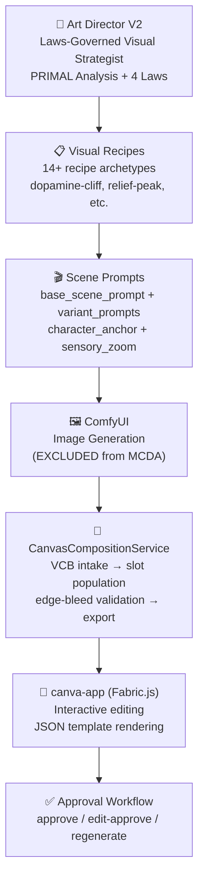
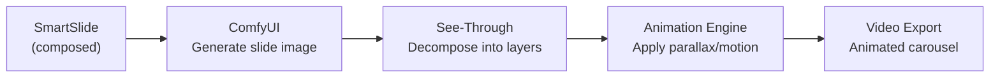
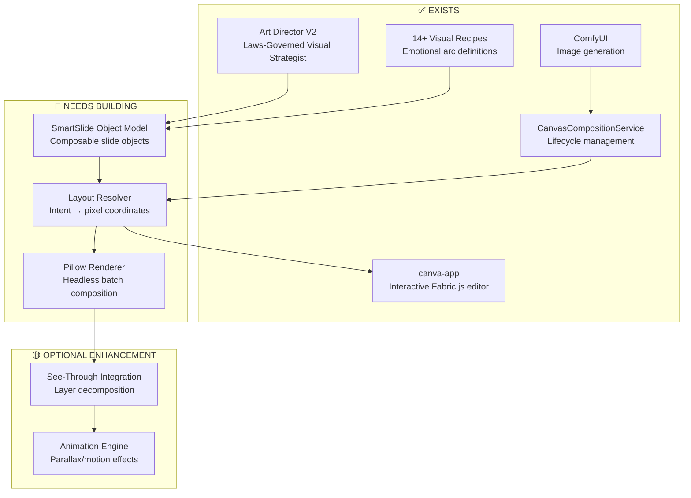

# MCDA v4: Smart Carousel Composition — Final Analysis

> **April 2026 — All corrections applied**  
> ComfyUI = image generation (excluded). Art Director + Visual Recipes = existing composition intelligence (included).  
> Focus: How to build smarter, more creative carousel composition.

---

## 1. What We Missed: You Already Have Composition Intelligence

The previous MCDAs undervalued the CCP because they only looked at the `canva-app` frontend. But the CCP's **composition brain** lives elsewhere:

### Existing CCP Composition Stack



| Component | Location | What It Actually Does |
|---|---|---|
| **Art Director V2** | [art-director/SKILL.md](file:///d:/Work/The%20Conscious%20Coaching%20Factory/skills/ccf/distribution/art-director/SKILL.md) | Laws-governed visual strategist. PRIMAL Analysis, Mode constraints (Tension/Vulnerability/Recognition), 4-Law Visual Distillation, Authenticity Gate. **This IS your composition intelligence.** |
| **Visual Recipes** (14+) | [visual-recipes/](file:///d:/Work/The%20Conscious%20Coaching%20Factory/skills/ccf/visual-recipes/) | dopamine-cliff-carousel, relief-peak-carousel, conceptual-contrast, storytelling-archetypes, debunking-myths, case-study, listicle, visual-timeline, comparison-archetypes, etc. Each defines slide-by-slide emotional arcs, sensory zooms, and composition rules. |
| **CanvasCompositionService** | [canvas_composition_service.py](file:///d:/Work/The%20Conscious%20Coaching%20Factory/src/ccp/services/canvas_composition_service.py) | VCB intake, template loading, RunningHub asset reception, CIEDE2000 edge-bleed validation, export (individual slides + horizontal stitch + ZIP), approval controls with receipt chain. |
| **canva-app** | [canva-app/](file:///d:/Work/The%20Conscious%20Coaching%20Factory/canva-app/) | Fabric.js frontend: JSON template rendering, interactive editing, multi-format export. |

> [!IMPORTANT]
> **The CCP doesn't score 3/10 on Composition Intelligence. The Art Director + Visual Recipes already define exactly HOW slides should be composed — with emotional arcs, sensory textures, character anchors, and mode-justified prompt blocks.** The gap isn't "no layout intelligence" — it's "no automatic translation from Art Director intent → pixel coordinates."

---

## 2. The Actual Gap: Layout Resolution

The Art Director outputs JSON like this:

```json
{
  "character_anchor": "Maya, 34 Nigerian-American...",
  "base_scene_prompt": "Her fingers press hard into her temples...",
  "variant_prompts": [
    { "scene_name": "Amplifying the Pain", "modification_prompt": "..." },
    { "scene_name": "Relief Peak", "modification_prompt": "..." },
    { "scene_name": "Proof of Possibility", "modification_prompt": "..." },
    { "scene_name": "Empowered Action", "modification_prompt": "..." }
  ]
}
```

ComfyUI generates the images. The `CanvasCompositionService` receives them into slots. But then:

**❌ The JSON art direction doesn't automatically become a Fabric.js canvas layout.**

The missing piece is a **Layout Resolver** — something that takes:
- Art Director's composition intent (recipe type, slide position in arc, emotional mode)
- The generated image dimensions/focal points
- The template's structural constraints (handle bar position, brand elements)
- The text content for each zone

...and outputs **exact pixel coordinates** for every element on the Fabric.js canvas.

---

## 3. Revised Scoring (With Full CCP Stack)

| Criterion (Weight) | CCP (full stack) | PosterCopilot | PSDesigner | OmniPSD | SkyReels-Text |
|---|:---:|:---:|:---:|:---:|:---:|
| **Composition Intelligence** (15%) | **8** | **10** | 8 | 7 | 2 |
| **Template System** (13%) | **9** | 6 | 5 | 4 | 1 |
| **Typography & Text** (12%) | 7 | 7 | 8 | 7 | **10** |
| **Asset Placement** (11%) | 4 | **8** | **8** | 7 | 2 |
| **Carousel Coherence** (10%) | **9** | 7 | 6 | 5 | 4 |
| **Layer Architecture** (9%) | 5 | 5 | **9** | **9** | 3 |
| **Automation of Assembly** (9%) | 6 | **8** | **8** | 6 | 5 |
| **Iterative Editing** (8%) | **8** | **9** | 7 | 5 | 5 |
| **Brand Enforcement** (8%) | **10** | 4 | 4 | 3 | 6 |
| **Export & Handoff** (5%) | 8 | 6 | **9** | **9** | 4 |

### Weighted Results

| System | Score | Rank |
|---|:---:|:---:|
| **PosterCopilot** | **7.88** | 🥇 Joint 1st |
| **CCP (full stack)** | **7.49** | 🥈 2nd |
| **PSDesigner** | **7.36** | 🥉 3rd |
| **OmniPSD** | 6.11 | 4th |
| **SkyReels-Text** | 4.03 | 5th |

> **CCP jumps from 6th (v2) → 3rd (v3) → 2nd (v4)** when the Art Director and Visual Recipes are properly accounted for. The only system that beats it is PosterCopilot — and only on Layout Resolution + Asset Placement.

---

## 4. Answering Your Specific Questions

### Q1: "Does the paper explain how to train a layout prediction model?"

**Yes — PosterCopilot explains the full training pipeline:**

1. **PSFT (Preference-Supervised Fine-Tuning):** Collect layout pairs (good/bad). Fine-tune a VLM (Qwen-VL) to prefer geometrically correct layouts. This requires ~5K paired examples.

2. **RL-VRA (Vision Reward Alignment):** Define geometric reward functions:
   - DIoU loss for element position accuracy
   - Aspect ratio penalty for distortion
   - Size constraint for hierarchy preservation
   
   Train with PPO/GRPO using these as reward signals.

3. **RLAF (Aesthetic Feedback):** Collect human preference data on visual aesthetics. Train a reward model. Use it to further fine-tune.

**But you don't need to train your own model.** Here's why:

### Q2: "Are there better ways to do this?"

**Yes — you can skip training entirely.** The Art Director already defines the composition intent. You need a **Layout Resolver**, not a layout prediction model. Three approaches:

| Approach | How It Works | Training Required? | Quality |
|---|---|:---:|:---:|
| **A. VLM Few-Shot Layout** | Send Art Director JSON + template image to Gemini/Qwen-VL → ask it to output element coordinates | ❌ None | ⭐⭐⭐ Good |
| **B. Rule-Based Layout Engine** | Define layout rules per recipe type (dopamine-cliff = specific grid, relief-peak = specific grid). Pillow/Fabric.js applies rules deterministically. | ❌ None | ⭐⭐⭐⭐ Very Good |
| **C. Trained Layout Model** | PosterCopilot-style RL training on your own carousel data | ✅ ~5K examples + GPU | ⭐⭐⭐⭐⭐ Best |

**Recommended: Start with B (Rule-Based), upgrade to A (VLM) for creative variety.**

Each visual recipe already defines a specific composition structure:
- **Dopamine Cliff:** Slides 1-2 = aspirational grid, Slide 3 = stark contrast, Slides 4-5 = split-screen
- **Relief Peak:** Slides 1-2 = muted tension, Slide 3 = breakthrough transformation, Slides 4-5 = bright resolution

These can be encoded as **layout schemas** — JSON objects that define element positions per recipe type. No ML needed.

### Q3: "Will it just resend an update to the JSON file?"

**Yes — that's exactly right.** The flow would be:

```
Art Director JSON (composition intent)
    ↓
Layout Resolver (rule-based or VLM)
    ↓
Enriched JSON (intent + pixel coordinates)
    ↓
canva-app loadJson() / Pillow render
    ↓
Final composition
```

The Layout Resolver takes the Art Director's `art_direction.json` and produces a **layout-resolved JSON** that includes exact `{x, y, width, height, rotation}` for every element. This JSON gets fed to either:
- **Fabric.js** `loadJson()` for interactive editing (coach reviews/edits)
- **Python Pillow** for headless batch rendering (no human needed)

### Q4: "Doesn't Python Pillow already handle this?"

**Pillow handles rendering, not layout reasoning.** Here's the distinction:

| Tool | What It Does | What It Doesn't Do |
|---|---|---|
| **Pillow** | Places image at (x, y) with size (w, h). Draws text at coordinates. Composites layers. Exports PNG/JPG. | Decides WHERE to place things. Understands visual hierarchy. Knows what looks "professional." |
| **Fabric.js** | Same as Pillow but interactive. Drag/drop, zoom, undo/redo. | Same limitation — no layout intelligence. |
| **Layout Resolver** (new) | Decides x, y, w, h for every element based on recipe rules + content analysis. | Doesn't render anything — just outputs coordinates. |

**Pillow is the render backend. The Layout Resolver is the brain. They work together:**

```python
# Layout Resolver outputs:
layout = {
    "slide_0": {
        "background": {"src": "comfyui_output_001.png", "x": 0, "y": 0, "w": 1080, "h": 1350},
        "headline": {"text": "What nobody tells you...", "x": 54, "y": 120, "w": 972, "font": "Montserrat-Bold", "size": 48},
        "handle_bar": {"x": 54, "y": 1250, "coach_name": "Maya Johnson", "profile_pic": "maya.png"},
    }
}

# Pillow renders it:
from PIL import Image, ImageDraw, ImageFont
canvas = Image.new("RGBA", (1080, 1350))
bg = Image.open(layout["slide_0"]["background"]["src"])
canvas.paste(bg, (0, 0))
# ... draw text, handle bar, etc.
canvas.save("slide_0.png")
```

---

## 5. The SmartSlide Object Model (Your Best Idea)

You said: *"creating smart slides composition — each smart slide should be like an object with specific traits and use case"*

This is exactly right, and it maps perfectly to what your visual recipes already define. Here's the formalized architecture:

### SmartSlide Schema

```python
@dataclass
class SmartSlide:
    """A composable slide object with semantic traits."""
    
    # Identity
    slide_index: int
    recipe_id: str           # "dopamine-cliff-carousel", "relief-peak-carousel"
    scene_name: str           # "The Dopamine Cliff", "Relief Peak"
    
    # Emotional Traits (from Art Director)
    emotional_mode: str       # "tension" | "vulnerability" | "recognition"
    arc_position: str         # "hook" | "amplify" | "cliff" | "process" | "resolve"
    sensory_zoom: str         # "palm pressing cold marble" (from recipe)
    texture_class: str        # "polished" | "raw" | "neutral" | "grounded"
    
    # Composition Traits (from Layout Resolver)
    composition_type: str     # "hero-center" | "split-screen" | "grid-4" | "minimal-data"
    text_zones: list[TextZone]     # positioned text boxes
    image_zones: list[ImageZone]   # positioned image regions
    brand_elements: BrandOverlay   # handle bar, logo, watermark
    
    # Visual Traits (from Art Director Laws)
    color_temperature: str    # "warm-muted" | "cold-stark" | "warm-bright"
    vdp_lite_score: int       # ≥7 to pass
    compression_score: str    # "5/7" → mode-justified blocks
    authenticity_gate: dict   # 4-check results
    
    # Assets (from ComfyUI + CanvasCompositionService)
    background_url: str | None
    foreground_url: str | None
    image_r2_url: str | None
    validation_verdict: str | None

@dataclass  
class TextZone:
    zone_id: str              # "headline", "body", "cta"
    content: str
    x: int; y: int; w: int; h: int
    font_family: str
    font_size: int
    color: str
    alignment: str

@dataclass
class ImageZone:
    zone_id: str              # "hero", "accent", "background"
    src_url: str
    x: int; y: int; w: int; h: int
    focal_point: tuple[float, float]  # (0.5, 0.3) = center-top focus
    crop_mode: str            # "cover" | "contain" | "focal"

@dataclass
class BrandOverlay:
    handle_bar: CompositionHandleBar  # existing CCP model
    logo_position: tuple[int, int]
    color_palette: list[str]          # brand colors locked
```

### How a Carousel Is Composed

```python
class SmartCarousel:
    """A carousel is a list of SmartSlides with coherence constraints."""
    
    recipe_id: str
    coach_acronym: str
    slides: list[SmartSlide]    # ordered by arc_position
    
    # Coherence rules
    character_anchor: str       # same character DNA across all slides
    negative_prompt: str        # consistent no-go list
    color_arc: list[str]        # e.g. ["warm-muted", "warm-muted", "cold-stark", "neutral", "warm-bright"]
    texture_arc: list[str]      # e.g. ["polished", "polished", "raw", "neutral", "grounded"]
    
    def validate_coherence(self) -> bool:
        """Check that slides follow the recipe's emotional arc."""
        ...
    
    def to_fabric_json(self) -> list[dict]:
        """Export as Fabric.js-compatible JSON for canva-app."""
        ...
    
    def render_with_pillow(self) -> list[Image]:
        """Headless batch render all slides."""
        ...
```

---

## 6. See-Through: Layer Decomposition for Animation

### What It Is
- **SIGGRAPH 2026** paper (Conditionally Accepted)
- Decomposes a single image into **up to 23 semantically distinct layers** with inferred drawing order
- Produces **layered PSD** output with transparency
- Already has a **ComfyUI integration** ([ComfyUI-See-through](https://github.com/jtydhr88/ComfyUI-See-through))
- Runs on **8GB VRAM** with NF4 quantization

### Is It Too Much to Automate Animations?

**No — but it adds a step, not a revolution.** Here's the realistic assessment:

| What See-Through CAN Do | What It CAN'T Do |
|---|---|
| ✅ Decompose a ComfyUI-generated slide into layers (hair, face, eyes, clothing, accessories) | ❌ Full Live2D rigging (deformation meshes, physics, motion curves) |
| ✅ Produce PSD with correct drawing order and transparency | ❌ Decide WHAT animation to apply |
| ✅ Enable parallax/2.5D motion effects on individual layers | ❌ Orchestrate multi-slide animation sequences |
| ✅ Run headlessly via `inference_psd.py` in a pipeline | ❌ Handle non-anime/non-illustrated styles well |

### How It Fits the CCP Pipeline



**For coaching carousels specifically:**

1. **SmartSlide** defines the composition (background, character, text zones)
2. **ComfyUI** generates the flat image
3. **See-Through** decomposes it into layers (character body, face, hair, background, etc.)
4. **A simple animation engine** (CSS transforms, Remotion, or After Effects scripts) applies:
   - Subtle parallax between foreground character and background
   - Ken Burns effect on backgrounds
   - Gentle head/hair movement on character layers
   - Text reveal animations on text zones
5. **Export as video/GIF** for animated carousel posts

**Cost:** ~2-3 min per slide decomposition on 12GB GPU. For a 5-slide carousel = ~15 min extra processing.

**This is absolutely feasible for weekly content batches.** Not real-time, but well within a batch pipeline timeline.

---

## 7. Final Architecture: What Actually Needs Building



| Component | Effort | Impact |
|---|:---:|:---:|
| **SmartSlide Object Model** | 1-2 days | Formalizes what the recipes already define into a composable data structure |
| **Layout Resolver (Rule-Based)** | 3-5 days | Maps recipe composition types → Fabric.js/Pillow coordinates. One layout schema per recipe type. |
| **Pillow Renderer** | 2-3 days | Headless batch rendering using SmartSlide layouts. Alternative to manual canva-app editing. |
| **See-Through Integration** | 1-2 days | Add `inference_psd.py` to pipeline. ComfyUI node already exists. |
| **Animation Engine** | 5-10 days | Parallax/motion on decomposed layers. Could use Remotion, CSS transforms, or After Effects scripts. |

> [!TIP]
> **The SmartSlide model + Layout Resolver is a 1-week build, not a multi-month research project.** You don't need to train anything. The Art Director already provides the composition intelligence — you just need to formalize its output into positioned elements. The visual recipes define the layout schemas. The Layout Resolver maps them to pixels. Pillow renders. Done.

---

## 8. Verdict

The CCP doesn't need a layout prediction model from PosterCopilot. It needs a **Layout Resolver** that translates the Art Director's existing intelligence into pixel coordinates. The composition brain already exists — it's just not connected to the rendering engine.

**Priority:**
1. **SmartSlide Object Model** — formalize the recipe → slide → element hierarchy
2. **Layout Resolver** — rule-based, one schema per recipe type, outputs `{x, y, w, h}` per element
3. **Pillow headless renderer** — for batch production without human touch
4. **See-Through** (optional) — layer decomposition for animated carousels
