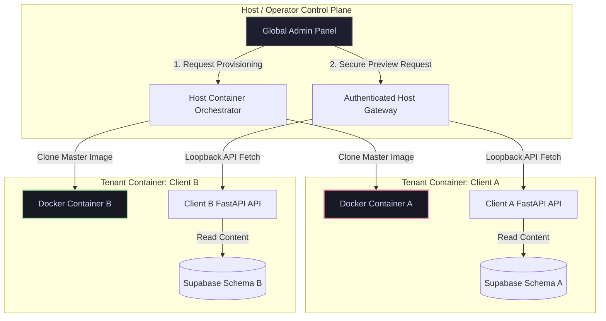

# Tech-Spec: FR-COM-02 — Global Admin Dashboard (Factory Floor)

**Created:** 2026-03-30  
**Updated:** 2026-05-21  
**Status:** Ready for Development  
**Version:** 2.0 (Aligned to Single-Tenant Multi-Container Isolation)  
**Architecture Reference:** ADR-01 (Coach Isolation — Container Boundary), FR49 (Single-Tenant Deployment)  
**Skill Implementation:** `skills/infrastructure/global_admin/` (Next.js operator interface + FastAPI Host Gateway)  
**Role Executing:** Principal CCP Tech-Spec Architect  

---

## 1. Files Read

- `docs/architecture/FR49_Single_Tenant_Deployment_Tech_Spec.md` — Single-tenant architecture and container boundaries
- `docs/architecture/CCP_MASTER_SYSTEM_LEDGER.md` — Active architecture governance mapping
- `docs/architecture/DEPRECATION_STREAMING_PLATFORM.md` — Decommissioning of streaming components

---

## 2. Overview

### Problem Statement
In our single-tenant architecture, each client/coach runs in a completely isolated container environment (FastAPI API server + isolated Supabase schema/database instance). This provides strong quarantine guarantees, protecting coach IP and client conversational data from leaking across tenant boundaries. 

However, this architecture creates a major operational challenge: the platform operator cannot use a single global database connection or simple Row-Level Security (RLS) bypass to aggregate stats, preview content, or trigger env duplications. Querying across container networks violates tenant isolation. The operator needs a mechanism to programmatically duplicate/clone master environments to create new client instances, and a secure way to preview and edit client content across separate containers from a central Global Admin Dashboard.

### Solution
FR-COM-02 implements a **Host-Level Control Plane** and **Authenticated Loopback API Gateway** model. 

1.  **Global Admin Control Panel:** A centralized Next.js application hosted on the host server (outside individual tenant containers).
2.  **Environment Provisioning (Container Duplication):** The admin panel talks to a host-level orchestrator service. When a new client is onboarded, the orchestrator programmatically duplicates/clones a **master client container template** (FastAPI app, pre-configured database seeds, and AFFiNE plugins) using the Docker Engine SDK or Kubernetes API.
3.  **Cross-Tenant Previews (Loopback API Routing):** The Global Admin Dashboard queries an Authenticated Host Gateway. The Gateway maintains a registry of active tenant containers, internal IPs, and secure API keys. When previewing or approving content for a client, the dashboard sends the request to the host gateway, which routes a secure loopback API call to the target tenant's container-local admin API, fetching or modifying data directly within that container's sandbox.



---

## 3. Scope

**In scope:**
*   **Factory Floor View:** Unified queue of content pending approval, aggregated via loopback API queries to all active tenant containers.
*   **Environment Duplicator (Provisioning Control):** Interface to spawn new client containers from a master template, configure credentials, and assign internal routing keys.
*   **Traffic Control View:** Host-level CPU/GPU metrics (AWS CloudWatch/Docker stats), showing resource allocation per tenant container.
*   **Treasury View:** Aggregated billing data retrieved via Stripe billing middleware integration.
*   **Host Gateway Server:** Lightweight FastAPI service on host machine that proxies requests to container-local admin endpoints.

**Out of scope:**
*   Direct database access to tenant containers from the host dashboard (all database reads are brokered via container-local FastAPI endpoints).
*   Streaming/Webinar monitoring (fully deprecated per `DEPRECATION_STREAMING_PLATFORM`).

---

## 4. Technical Architecture

### A. Environment Provisioning Flow
When the operator clicks "Provision New Client":
1.  **Orchestrator Trigger:** Dashboard calls Host Orchestrator `POST /api/operator/provision`.
2.  **Container Duplication:** Host Orchestrator duplicates the Master Client Docker Image:
    - Sets up isolated network bridge.
    - Mounts isolated host directory for tenant storage.
    - Generates unique tenant credentials (database password, JWT secrets, SFL keys).
3.  **Database Seeding:** Automatically runs PostgreSQL migrations and seeds baseline experience design templates into the new tenant's database.
4.  **Registry Registry Update:** Adds the tenant's metadata (container hostname, API port, and operator auth token) to the **Host Tenant Registry**.

### B. Loopback Preview Flow
When the operator previews client content:
1.  **Proxy Dispatch:** Dashboard calls Host Gateway `GET /api/operator/tenant/{tenant_id}/content`.
2.  **Registry Lookup:** Host Gateway resolves `tenant_id` to its internal container address (e.g. `http://tenant-container-12:8000`) and retrieves the secure operator token.
3.  **Loopback Request:** Gateway calls `GET http://tenant-container-12:8000/api/admin/content-preview` passing the `X-Operator-Token` in the header.
4.  **Local Execution:** The tenant container's FastAPI processes the request, bypasses standard user RLS checks locally using the operator token, fetches from its PostgreSQL instance, and returns the serialized content payload.

---

## 5. Endpoints & Data Model

### A. Host Gateway Endpoints

#### 1. Provision New Tenant
*   **Route:** `POST /api/operator/provision`
*   **Request Payload:**
    ```json
    {
      "tenant_name": "Audrey Beat Cluster",
      "tenant_subdomain": "audrey-bc",
      "tier": "premium",
      "master_template_id": "tpl-era3-v2"
    }
    ```
*   **Response Payload:**
    ```json
    {
      "tenant_id": "tnt_uuid_9999",
      "status": "provisioned",
      "internal_port": 8092,
      "admin_url": "https://audrey-bc.consciouselite.com"
    }
    ```

#### 2. Cross-Tenant Content Aggregation
*   **Route:** `GET /api/operator/review-queue`
*   **Details:** Gateway iterates through active host tenant registry records, queries each container's `/api/admin/pending-review` endpoint in parallel, aggregates responses, and returns the consolidated queue.

### B. Tenant Local Admin endpoints (in each client container)
*   `GET /api/admin/pending-review`: Returns contents waiting for validation. Protected by `X-Operator-Token`.
*   `POST /api/admin/content/{content_id}/action`: Executes `approve`, `reject`, or `regenerate` on a content block inside the container's isolated pipeline.

---

## 6. Security & Quarantine Controls

1.  **Token Rotation:** Operator tokens (`X-Operator-Token`) are generated during container duplication, stored in the host secret vault, and injected as environment variables into the tenant container.
2.  **No Cross-Container Network Path:** Tenant containers cannot communicate with each other. Network bridge interfaces only allow ingress from the Host Gateway.
3.  **Unprivileged Host Engine:** The Next.js dashboard does not run as root. The provisioning actions are serialized and passed through a secure socket to a restricted host manager daemon.
