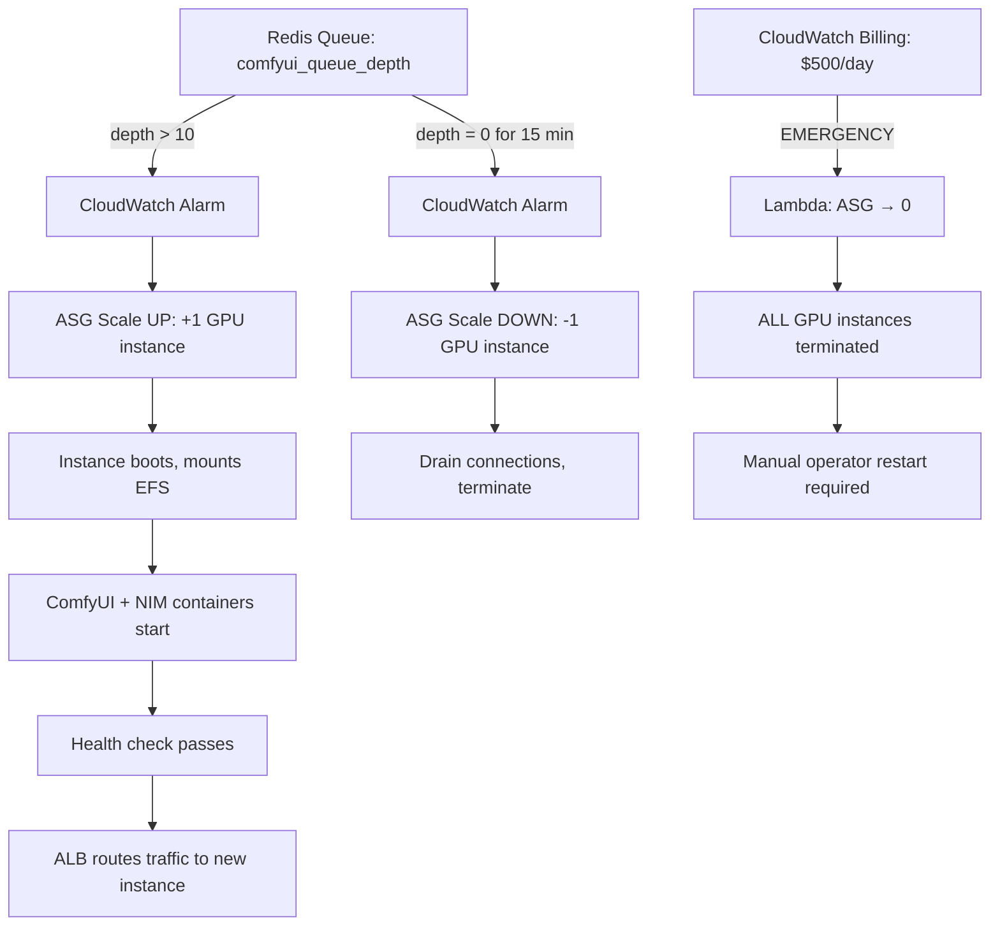

# Infrastructure Technical Specification: AWS × NVIDIA NIM Enterprise Deployment

**Document ID:** SPEC-INFRA-001
**Title:** Cloud Implementation & NVIDIA NIM Enterprise Deployment Architecture
**Version:** 2.0.0
**Date:** 2026-03-30
**Environment:** Production Launch (AWS)
**Classification:** STRATEGIC INFRASTRUCTURE
**Source Conversations:** Current session (666fb538), Cloud Credit Applications (0dd9c824), CMF Pipeline Docs (dc6b00cd)
**Source Artifacts:** `learning_roadmap_evaluation.md`, `cmf_ai_physics_learning_guide.md`, `prd-update-visual-control-layer.md`

---

## 1. Executive Summary

This document serves as the exhaustive architectural blueprint for deploying the **Conscious Coaching Platform (CCP)** and the **Conscious Media Factory (CMF)** into production on sovereign cloud infrastructure. It formally details every architectural decision made during the transition from a single-developer local prototype to a production-grade, multi-tenant agentic platform.

The architecture leverages three strategic assets:

1. **NVIDIA NIM Enterprise Partnership** — Access to pre-optimized inference containers (NIM microservices) with TensorRT-LLM acceleration, Triton Inference Server, and enterprise-grade model deployment.
2. **AWS Startup Credits** — Reserved GPU compute (p4d.24xlarge / p5.48xlarge), managed database infrastructure (RDS, ElastiCache, S3), and serverless orchestration (ECS Fargate, Step Functions, Lambda).
3. **Self-Hosted ComfyUI** — Replacing the third-party RunningHub API with a sovereign, version-controlled visual generation backend that mounts the ConsciousPose and Identity LoRA libraries dynamically via AWS Elastic File System (EFS).

By combining these three pillars, the CCP achieves what no third-party API can deliver: sub-second inference latency, zero data exfiltration, deterministic ControlNet-conditioned image generation, and per-coach cost isolation — all running inside a single AWS Virtual Private Cloud (VPC) with no external model API dependencies.

---

## 2. The Agent Harness Warning: Why Local Architecture Must Die

### 2.1 The Core Distinction: Agent Core vs. Agent Harness

The most consequential architectural realization driving this entire infrastructure design is the fundamental, irreconcilable difference between a **single-user agent** and a **multi-user agent platform**. This distinction, formalized in the Multi-User Agent architecture literature, defines two distinct layers:

- **Agent Core:** The pure intelligence — the LLM reasoning loop, the tool calls, the skill compilation. This is what the CCP has been building for 3 years: 84 named agents, 180+ skills, the JIT Skill Compiler, the CMF Pipeline Commander.
- **Agent Harness:** The production wrapper that makes the Agent Core safe to run for multiple concurrent users. This includes state isolation, token budgets, execution timeouts, cost monitoring, PII scrubbing, and session security.

In a local, single-developer environment, the Agent Core operates with unlimited privilege. It can loop indefinitely through the JIT Compiler, monopolize 80GB of GPU VRAM for a single FLUX 2 Dev generation, load the coach's entire Context Premise graph into a single Neo4j query, and retry a failed visual prompt 200 times without consequence. This depth-first approach is optimal for development.

**In production, with dozens of coaches and thousands of clients, this depth-first approach is catastrophic.** The Agent Harness is not optional — it is the difference between a functioning platform and a legal, financial, and operational disaster.

### 2.2 The Three Multi-User Threats

#### Threat 1: State Collision (Data Breach)

The CCP handles the most sensitive category of personal data: psychological profiles, trauma histories, coping trajectories, relationship dynamics, financial realities, and parasocial bond measurements. The CBCS (Conscious Behavioral Coaching System) accumulates this data through Social Penetration Theory depth gauges, Change Talk detection, and Intimacy Index calculations.

**The threat scenario:** Coach A's CCF batch generation triggers a JIT Compiler execution. Due to a shared Redis key namespace or an unsanitized Neo4j query, the JIT Compiler accidentally retrieves Coach B's Voice DNA object (DEP-ENG-003) or Coach B's client's coping trajectory from the Context Premise hypergraph. Coach A's generated content now contains linguistic patterns, personal stories, or therapeutic insights that belong to Coach B's clients.

**The consequence:** This is not merely a bug — it is a HIPAA-level data breach. In the coaching industry, where trust is the product, a single instance of cross-coach data leakage destroys both coaches' businesses and exposes the platform to legal liability.

**The architectural resolution:** Every Redis key is namespaced under `{coach_id}:{session_id}`. Every Neo4j query is scoped by a mandatory `WHERE coach_id = $current_coach_id` clause injected at the ORM level, not at the query author's discretion. Every Supabase Row-Level Security (RLS) policy gates access by `coach_id`. The Agent Harness enforces this isolation at the infrastructure level — individual agents cannot bypass it even if their prompts instruct them to.

#### Threat 2: Cost Explosion (Financial Ruin)

An unbounded agentic loop running on a $40/hour H100 instance can bankrupt a startup overnight. The CCP's architecture makes this risk particularly acute because:

- The CMF Pipeline Commander orchestrates up to 30 tool calls per video, each potentially invoking GPU inference.
- The Triple-Pass Validation Gate (Sophia/Marcus/Chen) can reject and regenerate visual assets multiple times.
- The Visual Validation Agent (FR-VIS-04) can trigger regeneration loops for expression fidelity or pose fidelity failures.
- The CRAL research pipeline can invoke embedding models thousands of times for semantic search.

**The threat scenario:** A bug in the Visual Validation Agent's expression fidelity check causes it to perpetually reject generated images (threshold drift). The agent enters a retry loop, submitting 500 image generation requests to ComfyUI at 45 seconds each on an A100 GPU. Cost: ~$280 in a single hour — for one coach's batch.

**The consequence:** With 20 coaches triggering weekly batches simultaneously, a systematic validation bug could consume the entire AWS startup credit allocation in a single weekend.

**The architectural resolution:** Redis Token Bucket quotas (Section 5.1) and per-agent execution timeouts (Section 5.2), backed by CloudWatch hardware kill switches (Section 5.3).

#### Threat 3: Concurrency Bottlenecks (System Paralysis)

When 15 coaches trigger their weekly CCF generation batch simultaneously (typically Monday mornings), the system must handle:

- 15 parallel JIT Compiler executions (each loading DEP registry, routing through Mood State architecture, compiling PSSL specs)
- 15 × ~20 image generation requests routed to ComfyUI/FLUX 2 Dev (each requiring ~40GB VRAM for ControlNet + adapter + LoRA inference)
- 15 parallel Whisper transcription requests (for any voice note inputs)
- 15 parallel Neo4j traversals (Context Premise graph reads)

**The threat scenario:** Without proper compute isolation, 15 concurrent FLUX 2 Dev inference requests attempt to load into the same GPU's VRAM. The first 1-2 succeed; the remaining 13 queue in VRAM, causing cascading timeouts. Meanwhile, a Whisper transcription request is starved of GPU compute entirely, causing a coaching session replay to hang for 20 minutes.

**The consequence:** The Monday morning batch window — the single most critical operational period — becomes a reliability disaster. Coaches lose trust in the platform's ability to deliver on schedule.

**The architectural resolution:** NVIDIA MIG partitioning (Section 3.2) guarantees hardware-level isolation between inference workloads. No amount of FLUX load can starve the Whisper partition.

---

## 3. NVIDIA NIM & MIG Partitioning

### 3.1 NIM Architecture (The Model Server Farm)

NVIDIA Inference Microservices (NIM) provides pre-built, optimized, and TensorRT-LLM-accelerated containers for deploying AI models as persistent stateless services. By utilizing the NVIDIA Enterprise Partnership, the CCP bypasses raw Docker/CUDA configuration in favor of production-ready Triton Inference Servers wrapped in NIM containers.

Instead of loading model weights dynamically in Python scripts (which causes cold-start latency and VRAM fragmentation), all core ML models are deployed as persistent, always-warm inference endpoints running on dedicated AWS p4d/p5 instances.

**The NIM Server Farm:**

| NIM Service | Model | Purpose | VRAM Requirement |
|:---|:---|:---|:---|
| **LLM NIM** | Llama 3 70B / Mistral variants | JIT Skill Compiler, Voice DNA distillation, CRAL research summarization, CBCS Change Talk detection | 20GB (quantized INT4/8) |
| **Vision NIM** | FLUX 2 Dev (12B MMDiT) | Base model for ALL Tier 3 visual generation. Runs inside ComfyUI with ControlNet, ConsciousSmile adapter, and Identity LoRA | 40GB (FP16 with ControlNet overhead) |
| **Audio NIM** | Whisper Large-v3 + Demucs | CMF Video Pipeline Audio Engine (STT transcription, vocal isolation, ambient scoring) | 10GB |
| **Embedding NIM** | Nomic-Embed-Text / CLIP | Neo4j vector ingestion, CRAL semantic search, T2I Quality Gate CLIP scoring | 4-8GB |

**Key NIM Advantages:**
- **Continuous Batching:** NIM's Triton backend dynamically batches incoming requests, so 15 simultaneous LLM calls are fused into a single GPU operation rather than 15 sequential ones.
- **KV Cache Optimization:** TensorRT-LLM pre-allocates key-value caches, eliminating the cold-start latency that plague raw HuggingFace deployments.
- **Health Monitoring:** Each NIM container exposes `/health` and `/metrics` endpoints, integrating directly with AWS CloudWatch for automated alerting.

### 3.2 MIG (Multi-Instance GPU) Partitioning Strategy

NVIDIA's **Multi-Instance GPU (MIG)** technology allows a single physical A100 or H100 GPU to be securely partitioned into up to seven fully isolated GPU instances, each with its own dedicated high-bandwidth memory (HBM), L2 cache, compute cores, and memory controllers. MIG partitions are hardware-enforced — a fault or memory overflow in Partition A cannot affect Partition B. This is not software-level process isolation; it is physical silicon separation.

**A100 (80GB HBM2e) Partitioning Strategy:**

```
┌──────────────────────────────────────────────────┐
│                   A100 80GB GPU                   │
├─────────────────────┬────────────────────────────┤
│  Partition A (40GB) │  Vision NIM               │
│  MIG Profile: 4g.40│  FLUX 2 Dev + ComfyUI     │
│                     │  ControlNet + Adapter      │
│                     │  + Identity LoRA           │
│                     │  + ConsciousPose Maps      │
├─────────────────────┼────────────────────────────┤
│  Partition B (20GB) │  LLM NIM                  │
│  MIG Profile: 2g.20│  Llama 3 70B (INT4)       │
│                     │  JIT Compiler + CRAL       │
│                     │  + Voice DNA + CBCS        │
├─────────────────────┼────────────────────────────┤
│  Partition C (10GB) │  Audio NIM                │
│  MIG Profile: 1g.10│  Whisper Large-v3         │
│                     │  + Demucs                  │
│                     │  Spikes only during        │
│                     │  video pipeline init       │
├─────────────────────┼────────────────────────────┤
│  Partition D (10GB) │  Embedding NIM + Utility  │
│  MIG Profile: 1g.10│  Nomic-Embed-Text         │
│                     │  + CLIP (Quality Gate)     │
│                     │  + Presidio NER (PII)      │
└─────────────────────┴────────────────────────────┘
```

**Why these specific allocations:**
- **40GB for Vision:** FLUX 2 Dev (12B parameters at FP16 = ~24GB) plus ControlNet conditioning maps in VRAM (~4GB), plus ConsciousSmile adapter weights (~2GB), plus Identity LoRA weights (~50MB per coach, cached), plus ComfyUI's KSampler working memory for batch operations (~8GB). The 40GB allocation provides headroom for 1080p generation with multi-model composition.
- **20GB for LLM:** Llama 3 70B quantized to INT4 fits in ~18GB. The remaining 2GB provides KV cache for the continuous batching that NIM's Triton backend manages. This handles ALL text-based agent reasoning across the entire 84-agent roster.
- **10GB for Audio:** Whisper Large-v3 (~3GB) + Demucs (~2GB) = ~5GB loaded. The remaining 5GB provides buffer for audio processing. Audio NIM spikes only during CMF video pipeline initialization and CCP Studio session transcription, then idles.
- **10GB for Embeddings:** Nomic-Embed-Text (~800MB) + CLIP ViT-L/14 (~1.5GB) + Presidio NER model (~500MB) = ~3GB. The remaining 7GB provides cache for embedding batch operations during CRAL semantic search sweeps.

**Why MIG solves the multi-user bottleneck:** Without MIG, if the Vision NIM is generating a 20-image batch for Coach A (consuming 40GB of VRAM), the Audio NIM's Whisper transcription for Coach B's session recording would be starved of compute, causing a 20-minute hang. MIG guarantees strict hardware-level isolation — a heavy FLUX generation load on Partition A has **zero measurable impact** on the latency of Whisper running on Partition C. Each partition operates as if it were a physically separate GPU.

---

## 4. AWS Cloud Infrastructure Architecture

### 4.1 Compute Layer: The CPU/GPU Split

The CCP's compute workloads split cleanly into two categories that demand fundamentally different infrastructure:

**CPU-Bound (Stateless Agent Orchestration) → AWS ECS Fargate:**

The Python FastAPI backend, the CMF Pipeline Commander, the JIT Skill Compiler orchestrator, all 84 named agents, the Receipt Chain Guard, the Fingerprint Archive, and the AFFiNE Sync Service — these are all lightweight, CPU-bound processes that primarily coordinate tool calls and API requests. They hold no persistent state in memory.

These run on **AWS ECS (Elastic Container Service) on Fargate** — a serverless container runtime. Fargate means:
- **Zero idle cost:** No EC2 instances running when no coaches are active. Billing is per-second of actual compute.
- **Horizontal scaling:** When Monday morning batch windows spike to 15 concurrent coaches, ECS automatically provisions additional Fargate tasks. When Saturday night is quiet, it scales to zero.
- **Per-coach isolation:** Each coach's pipeline execution runs in its own Fargate task with its own container, its own environment variables (including `COACH_ID`), and its own network interface. Cross-coach container communication is architecturally impossible.

**GPU-Bound (ML Inference) → AWS EC2 p4d/p5 Instances:**

The NIM containers (LLM, Vision, Audio, Embedding) and the ComfyUI backend require persistent GPU access. These run on reserved **Amazon EC2 p4d.24xlarge (8× A100 80GB)** or **p5.48xlarge (8× H100 80GB)** instances, utilizing the AWS Startup Credits for reserved pricing.

These instances run inside an **Auto Scaling Group (ASG)** managed by AWS. The ASG scales based on a custom CloudWatch metric: `comfyui_queue_depth` (the number of pending image generation requests in the Redis job queue). When queue depth exceeds 10, a second GPU instance boots. When queue depth drops to 0 for 15 minutes, the instance terminates.

### 4.2 Storage & Database Layer

| Service | Purpose | Data Isolation |
|:---|:---|:---|
| **Amazon RDS (PostgreSQL)** | Supabase-compatible relational database: users, billing, `conscious_pose_atoms`, `identity_lora_registry`, `first_frame_specs`, `social_performance`, `learning_path_registry` | Row-Level Security (RLS) policies enforce `coach_id` scoping on every table |
| **Neo4j (EC2 or Aura)** | Context Premise hypergraph, Voice DNA embeddings, CRAL evidence networks, Emotional DNA objects | All Cypher queries are parameterized with `$coach_id`; graph traversals are scoped at the query builder level |
| **AWS ElastiCache (Redis)** | State isolation (agent scratchpads under `{coach_id}:{session_id}` keys), Token Bucket quotas, CMF Pipeline job queues (Celery/RQ), Receipt Chain caching | Redis keyspace is namespaced per coach; cross-namespace access is blocked at the application layer |
| **AWS S3** | All blob storage: raw audio (`ccp-raw-audio/`), generated assets (`ccp-generated-assets/{coach_id}/`), system backups (`ccp-system-backups/`), CFED training datasets, ControlNet map archive | S3 bucket policies + IAM roles enforce per-coach prefix isolation; no coach's Fargate task can access another coach's S3 prefix |
| **AWS EFS (Elastic File System)** | Shared model storage for ComfyUI: ConsciousPose ControlNet maps (DEP-VIS-010), ConsciousSmile adapter weights (DEP-VIS-008), Identity LoRA registry (DEP-VIS-011) | Read-only mount for ComfyUI workers; write access limited to the `identity_lora_trainer.py` service |

### 4.3 Network Architecture

All infrastructure lives inside a **single AWS VPC** with the following subnet architecture:

- **Public Subnet:** Application Load Balancer (ALB) only. Terminates HTTPS. No compute resources directly accessible from the internet.
- **Private Subnet A (CPU):** ECS Fargate tasks. Access to RDS, ElastiCache, Neo4j, S3 via VPC endpoints.
- **Private Subnet B (GPU):** EC2 p4d/p5 instances running NIM containers and ComfyUI. No internet access. All model weights pre-loaded via EFS.
- **Private Subnet C (Data):** RDS PostgreSQL, ElastiCache Redis, Neo4j.

**Key security property:** The GPU instances in Private Subnet B have **no internet egress**. They cannot phone home to NVIDIA, OpenAI, Anthropic, or any external endpoint. All inference data stays inside the VPC. This is the foundation of the platform's data sovereignty claim.

---

## 5. Cost Containment & The "Kill Switch" Architecture

In an agentic system, a single logical bug can consume thousands of dollars in GPU compute within an hour. The CCP implements a three-tier defense system to protect the AWS Startup Credits and ensure long-term financial sustainability.

### 5.1 Per-Coach Quotas: The Redis Token Bucket

Every coach account is assigned a strictly enforced **token budget** stored in Redis, implementing a Token Bucket algorithm with the following buckets:

| Bucket | Capacity | Refill Rate | Overflow Behavior |
|:---|:---|:---|:---|
| `llm_tokens_in` | 500K tokens/day | Midnight UTC reset | `429 QUOTA_EXCEEDED` → agent halts |
| `llm_tokens_out` | 200K tokens/day | Midnight UTC reset | `429 QUOTA_EXCEEDED` → agent halts |
| `image_generation_seconds` | 1800s/day (30 min) | Midnight UTC reset | Pipeline enters `GENERATION_PAUSED` state |
| `video_rendering_minutes` | 60 min/day | Midnight UTC reset | CMF Commander enters `RENDERING_PAUSED` |
| `whisper_transcription_seconds` | 3600s/day (1 hr) | Midnight UTC reset | Audio pipeline queues for next reset |

**How it works:** The API Gateway (FastAPI middleware) queries Redis using `EVALSHA` (Lua script for atomic decrement) **before** routing any request to the NIM servers. If a coach's agentic loop goes rogue and drains the bucket, the system automatically halts further generation for that coach, logs the event to `cost_events` (Supabase), and fires a high-priority alert to the Platform Ops Telegram channel via AWS SNS.

**Why Token Bucket vs. hard limits:** Token Bucket allows burst capacity. A coach can front-load their weekly batch (consuming 80% of daily budget in 2 hours) without being throttled, as long as they don't exceed the daily total. This matches the natural CCF workflow where batch generation is concentrated in Monday morning windows.

### 5.2 Agent Execution Timeouts

The CMF Pipeline Commander orchestrates up to 30 tool calls per video. All agent orchestrations run within AWS Step Functions (for complex multi-step workflows) or persistent Celery workers (for simpler task chains). Every node in the workflow tree has a hard timeout, enforced at the infrastructure level:

| Operation | Timeout | On Failure |
|:---|:---|:---|
| LLM reasoning loop (single agent step) | 60 seconds | Terminate, log `AGENT_TIMEOUT`, retry once with simplified prompt |
| Image generation (single ComfyUI request) | 45 seconds | Terminate, refund token cost, mark `REGENERATION_REQUIRED` |
| Whisper transcription | 300 seconds | Terminate, log `TRANSCRIPTION_TIMEOUT`, alert ops |
| Visual Validation (expression + pose check) | 30 seconds | Skip validation, flag `UNVALIDATED` for human review |
| Full CMF batch (per coach) | 45 minutes | Kill entire batch, rollback Receipt Chain, alert ops |

If an agent gets stuck in a "thought loop" (LLM hallucinating tool calls that repeatedly fail validation), the Celery worker terminates the process, refunds the partial token cost to the Redis bucket, and marks the job as `REGENERATION_REQUIRED` with exponential backoff (30s → 60s → 120s). After 3 failures, the job enters `PENDING_HUMAN_REVIEW`.

### 5.3 The Hardware Kill Switch (CloudWatch → Lambda → ASG)

The ultimate defense. **AWS CloudWatch** billing alarms are configured at three thresholds:

| Threshold | Action |
|:---|:---|
| **$50/day** | `WARNING` alert to Platform Ops Telegram channel. No automated action. |
| **$100/day** | `CRITICAL` alert. Lambda function reduces ASG `DesiredCapacity` to 1 (single GPU instance). All non-critical workloads queued. |
| **$500/day** | `EMERGENCY` alert. Lambda function sets ASG `DesiredCapacity` to **0**, physically terminating ALL GPU instances. This cuts the cost vector to zero within 2 minutes. Only an operator with AWS Console access can restart. |

**Why this is a hardware kill switch, not software:** The Lambda function directly modifies the Auto Scaling Group's desired capacity via the AWS API. Even if every piece of CCP application code is compromised, even if Redis is corrupted, even if a rogue agent somehow bypasses token buckets — the ASG scaling event physically terminates the EC2 instances. No GPU → no cost. The attack surface is reduced to a single AWS IAM role that only the Lambda function and the platform operator can assume.

---

## 6. PII Buffering & Data Sovereignty Pipeline

Coaching involves extremely raw, private data — trauma narratives, financial anxieties, relationship conflicts, sexual insecurities, addiction histories, and therapeutic breakthroughs. The CBCS accumulates this data through Telegram voice notes, text messages, and ritual check-in responses. The Conscious Nurturing Architecture (FR-CBCS-14) processes these interactions through Change Talk detection, Social Penetration Theory depth gauges, and LIWC-22 linguistic analysis.

**The PII Buffer Layer** ensures that raw client data is scrubbed of personally identifiable information **before** it reaches any LLM inference endpoint — even though those endpoints are self-hosted inside our own VPC.

### 6.1 The Four-Stage PII Pipeline

```
Stage 1: INGESTION (Raw Data Entry)
├── Telegram voice note arrives via webhook
├── Stored in S3 (ccp-raw-audio/{coach_id}/{client_id}/)
├── NEVER leaves the VPC
└── Sent to Audio NIM (Whisper) on MIG Partition C

Stage 2: BUFFERING (PII Scrub)
├── Raw transcript passes through Presidio NER model
│   (runs on MIG Partition D alongside embeddings)
├── Entity types detected and masked:
│   ├── PERSON → [CLIENT_NAME], [PARTNER_NAME], [CHILD_NAME]
│   ├── LOCATION → [CITY], [COUNTRY], [ADDRESS]
│   ├── PHONE_NUMBER → [PHONE]
│   ├── EMAIL → [EMAIL]
│   ├── CREDIT_CARD → [CARD]
│   ├── DATE_OF_BIRTH → [DOB]
│   └── MEDICAL_RECORD → [MED_ID]
├── Entity mapping stored in encrypted Supabase table
│   (pii_entity_map: {entity_id, real_value, token, coach_id, client_id})
└── Masked transcript forwarded to processing stage

Stage 3: PROCESSING (Agent Reasoning)
├── LLM NIM (Partition B) receives ONLY the anonymized transcript
├── Agents reason on [CLIENT_NAME] went through [CITY]...
├── Change Talk detection, LIWC-22 analysis, coping trajectory
│   updates — all operate on anonymized tokens
├── Generated outputs (scripts, recommendations, coaching notes)
│   contain only tokens, never real PII
└── Context Premise graph (Neo4j) stores anonymized relationships

Stage 4: REHYDRATION (Output Delivery)
├── Before delivery to coach's AFFiNE workspace or Telegram:
│   ├── Query pii_entity_map for {coach_id, client_id}
│   ├── Replace all tokens with real values
│   └── Deliver personalized, human-readable output
├── Rehydration happens ONLY at the delivery layer
│   (affine_sync.py or telegram_bot.py)
└── The LLM never sees or generates real PII
```

### 6.2 Why Self-Hosted Still Needs PII Buffering

A common objection: "If the NIM containers run inside our own VPC, why scrub PII? The data never leaves our infrastructure."

Three reasons:

1. **Model weight updates.** If we ever fine-tune or update a NIM model, PII that was processed through the model could theoretically be memorized in weight updates. Scrubbing before inference guarantees that no PII is ever presented to any model, eliminating this vector entirely.
2. **Audit compliance.** HIPAA, GDPR, and SOC 2 compliance frameworks require demonstrable PII minimization. Having an architectural guarantee that "the LLM never sees real names" is a stronger compliance position than "the LLM sees names but the server is in our VPC."
3. **Defense in depth.** VPC boundaries can be misconfigured. IAM roles can be over-permissioned. A logging framework might accidentally dump model inputs to CloudWatch Logs. If PII is scrubbed before inference, none of these failure modes expose real client data.

---

## 7. Self-Hosted ComfyUI on AWS

### 7.1 The RunningHub Retirement

The previous PRD update (`prd-update-visual-control-layer.md`, ADR-08) formally retired RunningHub as the generation backend. RunningHub was a third-party API wrapper over ComfyUI that abstracted away the node graph into a simplified API. This abstraction layer made it impossible to:

- Inject ControlNet conditioning maps from the ConsciousPose library
- Load the ConsciousSmile expression adapter at inference time
- Stack per-coach Identity LoRAs dynamically
- Version-control generation workflows in Git
- Avoid per-image API costs

Self-hosted ComfyUI eliminates all five limitations.

### 7.2 ComfyUI Server Architecture on AWS

ComfyUI runs as a Docker container on the same EC2 GPU instances hosting the Vision NIM, with direct access to MIG Partition A (40GB VRAM). The container setup:

```yaml
# docker-compose.comfyui.yml (simplified)
services:
  comfyui:
    image: ccp-comfyui:latest
    deploy:
      resources:
        reservations:
          devices:
            - driver: nvidia
              device_ids: ["MIG-partition-a-uuid"]
              capabilities: [gpu]
    volumes:
      - efs-models:/comfyui/models        # EFS mount (read-only)
      - efs-controlnet:/comfyui/models/controlnet  # ConsciousPose maps
      - efs-loras:/comfyui/models/loras    # Identity LoRAs
      - efs-adapters:/comfyui/models/adapters  # ConsciousSmile
    environment:
      - COMFYUI_LISTEN=0.0.0.0
      - COMFYUI_PORT=8188
    ports:
      - "8188:8188"
```

### 7.3 AWS EFS for Instant Horizontal Scaling

The critical innovation is using **AWS Elastic File System (EFS)** as a shared, network-attached model store. EFS provides:

- **Shared access:** Multiple ComfyUI replicas across multiple EC2 instances mount the same EFS volume simultaneously. Every worker sees the same ConsciousPose library, the same ConsciousSmile adapter, the same Identity LoRA collection.
- **Instant boot:** When the Auto Scaling Group launches a new GPU instance (because `comfyui_queue_depth > 10`), the new ComfyUI container mounts EFS and immediately has access to the full 300+ ControlNet map library — no S3 download, no rsync, no cold-start model transfer. The new worker is generating images within 60 seconds of instance boot.
- **Live LoRA deployment:** When `identity_lora_trainer.py` finishes training a new coach's Identity LoRA (~2 hours on A100), it writes the `.safetensors` file directly to the EFS lora directory. All running ComfyUI instances see the new file immediately on the next API request — no container restart, no deployment pipeline for model weights.

**EFS Directory Structure:**

```
/efs/ccp-models/
├── checkpoints/
│   └── flux2-dev-fp16.safetensors          # Base model (~24GB)
├── controlnet/
│   ├── depth/
│   │   ├── CP-B-001_standing_neutral.png
│   │   ├── CP-B-002_standing_confident.png
│   │   └── ... (298 depth maps)
│   └── openpose/
│       ├── CP-B-001_standing_neutral.png
│       ├── CP-B-002_standing_confident.png
│       └── ... (298 openpose skeletons)
├── loras/
│   ├── coach_001_identity_v1.safetensors
│   ├── coach_002_identity_v1.safetensors
│   └── ... (one per coach, ~50MB each)
├── adapters/
│   └── conscious_smile_v1.safetensors       # Expression adapter (~200MB)
└── workflows/
    ├── tier3_controlnet_expression_v1.json  # Standard Tier 3 workflow
    ├── tier3_prompt_only_v1.json            # Legacy fallback
    └── tier4_ghibli_v1.json                 # Illustration workflow
```

### 7.4 ComfyUI API Integration

Paradoxe (the PSSL Prompt Compiler, FR-VIS-03) communicates with ComfyUI via its native REST API:

1. **Submit:** `POST /prompt` with the assembled workflow JSON (containing ControlNet nodes, adapter nodes, LoRA nodes, and the PSSL-compiled prose prompt).
2. **Poll:** `GET /history/{prompt_id}` with exponential backoff (initial: 5s, max: 60s, timeout: 10 minutes).
3. **Retrieve:** `GET /view?filename={output_filename}` to download the generated image.
4. **Forward:** Generated image is passed to the Visual Validation Agent for expression and pose fidelity checks (FR-VIS-04 amendment).

All workflow JSON files are version-controlled in the Git repository (`comfyui-workflows/`). Every visual composition is fully reproducible: same workflow + same seed + same ControlNet maps = identical output.

---

## 8. Operational Workflow: Deployment Pipeline

### 8.1 Blue/Green Deployment

To deploy updates to this infrastructure without disrupting live coaches, the system uses a Blue/Green deployment strategy via AWS CodePipeline:

1. **Agent Logic Updates:** Changes to `skills/**/*.md` or Python source code trigger a GitHub Action.
2. **Container Build:** A new Docker image is built for the ECS Fargate cluster.
3. **Approval Gate:** Automated tests must pass (integration tests + CMF pipeline regression tests).
4. **Zero-Downtime Rollout:** ECS provisions new Fargate containers alongside old ones. The ALB gradually shifts traffic. Once new containers report healthy for 5 minutes, old containers are terminated.
5. **Model Weight Updates:** New Identity LoRAs, updated adapter weights, or new ControlNet maps are uploaded directly to EFS. ComfyUI instances pick up new files automatically — no container restart required.

### 8.2 GPU Instance Lifecycle



---

## 9. Summary of Architectural Achievements

By successfully bridging the CCP prototype to AWS and NVIDIA NIM, the platform achieves five irreducible production properties:

1. **Data Sovereignty (100%):** No client psychological data touches public API endpoints. All inference runs inside a single VPC with no internet egress from GPU subnets. PII is scrubbed before reaching any model. The LLM never sees a real name, address, or phone number.

2. **Hardware Efficiency:** NVIDIA MIG partitioning maximizes the utility of every dollar spent on A100/H100 instances. Four workloads (Vision, LLM, Audio, Embedding) share a single GPU with zero cross-partition interference. The ASG scales GPU instances based on actual queue depth, not provisioned capacity.

3. **Multi-User Safety:** Redis state isolation (namespaced keys), Supabase RLS (per-coach row policies), Neo4j query scoping (mandatory `coach_id` clauses), and ECS Fargate task isolation (per-coach containers) provide four independent layers of cross-coach data protection. Any single layer failing is caught by the others.

4. **Cost Certainty:** Redis Token Bucket quotas enforce per-coach daily budgets. Agent execution timeouts prevent runaway loops. CloudWatch billing alarms provide escalating automated responses from throttling ($100/day) to hardware kill ($500/day). The platform cannot accidentally consume its entire startup credit allocation.

5. **Visual Determinism:** Self-hosted ComfyUI with EFS-mounted ConsciousPose ControlNet maps, ConsciousSmile expression adapter, and per-coach Identity LoRAs delivers deterministic, reproducible visual generation. The same workflow + seed + ControlNet maps = the same image, every time. RunningHub's API abstraction layer — which hid node-level control and prevented ControlNet/adapter/LoRA workflows — is permanently retired.

---

*This infrastructure is not merely a hosting environment; it is the physical manifestation of the Conscious Coaching Platform's intelligence layer, built to scale to thousands of coaches without a linear increase in operational overhead or a single compromise in data sovereignty.*
