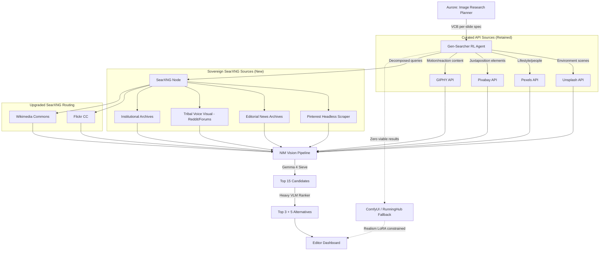

# Sovereign Visual Research Engine — System Architecture Brief

**Status:** Pre-Tech-Spec — Specialized Image Research Architecture  
**Context:** CVE V3.0 (Conscious Visual Engine), Aurore Image Research Planner  
**Feeds Into:** SKILL-IMG-005 through SKILL-IMG-009 Replacement, CMF Agentic Architecture PRD Update  
**Companion Document:** Sovereign CRAL Research Engine (separate brief)

---

## 1. The Problem Statement: What Image Research Is Missing

The CVE V3.0 specification defines nine composable image search skills that Aurore assembles per slide. Four of these are dedicated API sources with genuine value: Unsplash (SKILL-IMG-001), Pexels (SKILL-IMG-002), Pixabay (SKILL-IMG-003), and GIPHY (SKILL-IMG-004). Two depend on Serper for Google/Bing image search (SKILL-IMG-005, SKILL-IMG-006). The remaining three handle Flickr, Wikimedia, and RunningHub generative fallback.

The curated library APIs — Unsplash, Pexels, Pixabay, GIPHY — are not the problem. These platforms have genuinely improved their services, and their core value proposition is architecturally aligned with the CCP: every image on these platforms implies human creative work behind it. In an era of AI-generated slop flooding the web, curated human-photographed libraries will only grow in value. Each has distinct strengths that make it ideal for specific use cases (detailed in Section 6).

The architecture suffers from two genuine failures and one critical gap:

**Failure 1 — The Serper Single-Shot Bottleneck.** SKILL-IMG-005 fires a single query to Google Images via Serper, retrieves 10 results, and scores them against PSSL parameters. If the tribal noun visual congruent is too specific (e.g., "Phone screen visible showing timestamp 03:14, draft email open"), the query returns irrelevant results. The system escalates to the fallback query, and if that fails, flags the slide for RunningHub generation. The agent never attempts to decompose, refine, or iterate the query. It surrenders after two shots. **Serper is the dependency being eliminated** — not the curated libraries.

**Failure 2 — No Juxtaposition Sequencing Intelligence.** When a carousel demands a 5-slide emotional arc (tension → vulnerability → semiotic climax → recognition), the current system searches each slide independently. It has no mechanism to ensure the retrieved images form a compositionally coherent sequence. Slide 1 might come from Unsplash with warm tones, slide 2 from Pexels with cold tones, and slide 3 from Serper with completely different lighting grammar. The visual narrative fractures.

**Critical Gap — Missing Source Categories.** The CVE V3.0 specification does not include Pinterest (the single most powerful source for curated real-world composition), does not access news wire editorial photography, does not query cultural archives with compositional intent, and does not leverage the deep cultural web (Reddit photo communities, photojournalism archives). These sources are where tribally saturated, documentarily authentic imagery lives — and they must be added alongside the existing curated libraries, not as replacements for them.

---

## 2. The Sovereign Visual Research Engine: Architectural Overview

The upgraded architecture fuses three innovations into the existing skill system:

1. **SearXNG as the Sovereign Retrieval Layer** — replacing Serper (SKILL-IMG-005, SKILL-IMG-006) with a self-hosted meta-search node, while retaining Unsplash, Pexels, Pixabay, and GIPHY as dedicated specialized API sources.
2. **Gen-Searcher RL Multi-Hop Logic as the Agentic Search Brain** — replacing the linear two-shot query-then-fallback pattern with a learned, iterative, decomposition-capable search agent that orchestrates across ALL source types.
3. **The 10-Source Image Taxonomy** — expanding the current nine skills to ten purpose-built source categories: four retained curated APIs (Unsplash, Pexels, Pixabay, GIPHY), four new sovereign SearXNG categories (Pinterest, Editorial News, Tribal Voice, Institutional Archive), plus Flickr CC and Wikimedia (upgraded with SearXNG routing).



---

## 3. Pinterest: The Holy Grail Source

### 3.1 Why Pinterest Is Architecturally Critical

Pinterest is the single most valuable source for coaching content imagery for a reason no other platform replicates: its users curate collections of real-world aesthetic compositions organized by emotional intent. A Pinterest board titled "Morning Routine Aesthetic" contains dozens of unposed, warm-toned, domestically authentic photographs that a human found, loved, and saved precisely because they evoke a specific feeling. These images are not stock photography — they are curated documentary fragments organized by human emotional intelligence.

For the CCP, this means:
- **Recognition Mode (R) imagery** — Pinterest boards are saturated with tribally specific domestic environments, morning rituals, workspace aesthetics, and "my life" photography that triggers the exact tribal recognition response M7 RELATABLE demands in visual form.
- **Composition references** — Even when an image cannot be used directly (licensing), its composition, color palette, and staging provide the exact real-world texture references that Gen-Searcher needs to constrain ComfyUI synthesis.
- **Anti-stock by definition** — Pinterest's curation model means the images have already survived a human authenticity filter. Nobody pins corporate stock photography to their private aesthetic boards.

### 3.2 The Pinterest Integration Architecture

Pinterest has no public search API. The official API is restricted to authenticated user account management and advertising. This means we must access Pinterest through the sovereign headless scraper.

**The Headless Pinterest Scraper (SKILL-IMG-P01):**
- A dedicated Playwright Docker container running on the AWS VPC.
- Aurore passes the VCB's `tribal_noun_visual_congruent` to the scraper as a Pinterest search URL: `https://pinterest.com/search/pins/?q={{encoded_query}}`.
- The headless browser renders the Pinterest search results page, scrolls to load 30-50 pin thumbnails, and extracts the high-resolution image URLs from the DOM.
- Images are downloaded to the internal staging cache and immediately passed to the NIM Vision pipeline.
- The scraper rotates through the residential proxy mesh to prevent Pinterest from detecting automated access.

**Critical Design Choice:** Pinterest images are used as **composition references and direct retrieval candidates.** When an image's licensing allows direct use (many Pinterest images link back to CC-licensed Flickr photos or personal blogs), it is used directly. When licensing is unclear, the image becomes a texture/composition reference for the ComfyUI constrained synthesis — the Gen-Searcher RL agent extracts the specific color palette, spatial density, and environmental grammar and injects them as hard constraints into the generative prompt.

---

## 4. Editorial News Photography: The Untapped Authenticity Pool

### 4.1 Why News Wire Images Are Perfect for Coaching Content

News wire editorial photography (AP, Reuters, AFP) represents the highest tier of documentary authenticity available on the internet. These images are shot by professional photojournalists under real conditions — no staging, no art direction, no "stock" optimization. When a Reuters photographer captures a tech CEO's exhausted expression during a congressional hearing, that image contains the exact corrugator activation, zygomaticus suppression, and environmental gram that the CVE's PSSL parameters are trying to specify in words.

The problem: AP, Reuters, and AFP do not offer free public APIs. Their imagery is commercially licensed to news organizations.

### 4.2 The Sovereign News Image Strategy

We do not need the wire services directly. We need the downstream distribution of their imagery across the open web:

**Source A — Wikimedia Commons Editorial Images (SKILL-IMG-W01):**
Wikimedia Commons hosts tens of thousands of editorial photographs uploaded under Creative Commons licenses. Many are official governmental, institutional, and event photographs. SearXNG's `wikimedia` engine is configured at maximum weight within the `editorial_news` category.

**Source B — SearXNG News Image Aggregation:**
When major news events are photographed by wire services, the images are syndicated to hundreds of online news outlets. Many outlets display these images on publicly accessible pages. SearXNG, querying Google News, Bing News, and DuckDuckGo News simultaneously, retrieves URLs to these pages. The Gen-Searcher RL agent uses its `browse` tool to navigate to the page, extract the high-resolution image, and verify attribution.

**Source C — Government and Institutional Photo Archives:**
Federal agencies (NASA, USDA, NIH, Library of Congress), international organizations (WHO, UNESCO), and many universities publish high-resolution photography under public domain or CC licenses. These images carry maximum documentary authority and zero licensing risk. SearXNG routes queries containing institutional keywords to these specialized indexes.

**Source D — Flickr Creative Commons:**
Flickr remains the single largest repository of CC-licensed photography on the internet. Critically, many Flickr photographers shoot in a documentarian or street photography style — exactly the aesthetic the CVE demands. SearXNG's Flickr engine is configured at weight 2.5 within the `documentary_photo` category, and Aurore's query specifically appends `license:cc` to constrain results.

---

## 5. The Gen-Searcher RL Integration: From K-Score to T-Score

### 5.1 Why the Original Gen-Searcher Reward Function Fails for CCP

Gen-Searcher's Dual Reward combines a Text Reward (does the gathered text contain sufficient information?) with an Image Reward (K-Score: Faithfulness + Visual Correctness + Text Accuracy + Aesthetics). The K-Score weights Visual Correctness and Text Accuracy at 0.4 each, with Faithfulness and Aesthetics at 0.1 each.

This reward function is designed for knowledge-intensive factual image generation ("Generate an image of the 2024 Nobel Prize ceremony podium"). It rewards factual accuracy. The CCP does not need factual accuracy in images — it needs **emotional precision**. An image of a "3am integrity check" does not need to contain a factually accurate office. It needs to contain the specific physiological state (corrugator active, zygomaticus suppressed), the specific temporal signal (fluorescent overhead, no natural light), and the specific tribal artifact (phone screen glowing) that triggers the viewer's prediction error.

### 5.2 The CCP T-Score (Tribal Score) Reward Function

We replace K-Score with a CCP-native reward function that optimizes for the CVE's actual success criteria:

```
T-Score = 0.30 × Emotional_Mode_Match 
        + 0.25 × Tribal_Authenticity 
        + 0.20 × PSSL_Parameter_Alignment 
        + 0.15 × Anti_AI_Artifact_Score 
        + 0.10 × Compositional_Usability
```

| Dimension | What It Measures | How the VLM Scores It |
|:---|:---|:---|
| **Emotional Mode Match** | Does the image create Tension, Vulnerability, or Recognition as specified by the VCB? | VLM evaluates the dominant emotional register of the image against the VCB's `arc_stage` field |
| **Tribal Authenticity** | Does the image feel like it belongs to this specific tribe's lived reality? | VLM checks for tribal noun presence, environmental specificity, and absence of generic/universal staging |
| **PSSL Parameter Alignment** | Do the image's lighting, color temperature, spatial density, and PAD scores match the VCB specification? | VLM estimates quantitative PSSL scores and computes deviation from VCB targets |
| **Anti-AI Artifact Score** | Does the image look like a real, unedited photograph? | VLM scans for AI artifacts: unnaturally smooth skin, perfect symmetry, impossible geometry, cinematic rim lighting without a visible source |
| **Compositional Usability** | Can this image be placed directly into the Canva App canvas layer slot? | VLM checks resolution, aspect ratio compatibility, subject positioning relative to typography zones |

### 5.3 The Agentic Decomposition Workflow

The Gen-Searcher RL agent, when invoked by Aurore for a complex visual query, executes a multi-hop search loop that no linear skill can replicate:

**Example:** VCB specifies "Phone screen visible showing timestamp 03:14, draft email open — send button visible but untouched, cursor blinking in message body"

1. **Hop 1 — Broad Cultural Scan:** Agent queries SearXNG `documentary_photo` category: `"working late phone screen email draft real photo"`. Returns 30 candidates. VLM sieve eliminates 25 (stock, low-res, irrelevant).
2. **Hop 2 — Pinterest Composition Mining:** Agent queries Pinterest scraper: `"late night work aesthetic phone glow"`. Returns 20 curated composition references. Extracts the dominant color palette (blue-white phone glow against warm-yellow desk lamp) and spatial arrangement.
3. **Hop 3 — Reddit Documentary Deep Dive:** Agent queries SearXNG `tribal_voice` category targeting Reddit: `"3am work email reddit photo"`. Returns raw, unposed user-submitted photographs from r/antiwork, r/overemployed, r/startups. These images are the most tribally authentic assets available on the internet.
4. **Hop 4 — News Editorial Cross-Reference:** Agent queries SearXNG `editorial_news` category: `"startup burnout late night office documentary"`. Returns photojournalism from business publications — real founders, real offices, real exhaustion.
5. **Evaluation:** The NIM Vision pipeline scores all surviving candidates against T-Score. If any candidate scores above 0.75, retrieval succeeds. If not, the agent performs one more hop or escalates to ComfyUI synthesis using the Pinterest composition references as hard texture constraints.

This is the fundamental architectural difference. The current CVE fires SKILL-IMG-005 once, gets 10 results, and surrenders. The Gen-Searcher RL agent fires 4-5 hops across 4 different source taxonomies, adaptively refining its query based on what each hop returned, and only escalates to synthesis when the entire open web has been exhausted.

---

## 6. The 10-Source Image Taxonomy: Flood All, Score Best, Adapt

### 6.1 The Core Principle: Never Pre-Filter Creativity

The previous version of this taxonomy made the mistake of locking each source to a "best use case" — Unsplash for environments, Pexels for people, Pixabay for juxtaposition elements. This is architecturally wrong. Each of these platforms has millions of images. Even if only 1% of any given library is top-notch for a specific query, that's thousands of viable candidates. Pre-filtering sources by assumed strength eliminates the possibility that Pixabay returns the perfect environment shot that Unsplash missed, or that Pexels delivers the exact symbolic artifact that Pixabay was "supposed" to find.

The correct principle: **query every applicable source in parallel, flood the candidate pool, and let the T-Score VLM pipeline pick the winner regardless of origin.** The source that produced the image is irrelevant. The only thing that matters is the T-Score.

### 6.2 The Source Registry

All 10 sources are defined in a Source Registry with initial weight hints — not hard routing constraints. Weights represent the system's current confidence that a source will produce a high-T-Score result for a given query class. **All weights are adaptive** — they update automatically based on which sources actually win the T-Score competition over time.

| Source | Access Method | Known Strength (Initial Hint) | Initial Weight | Notes |
|:---|:---|:---|:---:|:---|
| **Unsplash** | Direct API | High-res environments, architectural, spatial atmospherics | 1.0 | Human-curated, implies real photography. Strong natural lighting. |
| **Pexels** | Direct API | Lifestyle, people in natural contexts, domestic scenes | 1.0 | Contributor guidelines enforce natural posing. Recently improved curation. |
| **Pixabay** | Direct API | Broad catalog, symbolic objects, conceptual imagery | 1.0 | Massive volume. Excellent for specific isolatable elements. |
| **GIPHY** | Direct API | Motion content, reaction GIFs, animated elements | 1.0 | Only source for motion. Exclusive for `motion_content` image type. |
| **Pinterest** | Headless Playwright Scraper | Curated real-world compositions, emotional aesthetics | 1.0 | Human-curated emotional intent. Holy grail for composition reference. |
| **Editorial News** | SearXNG `editorial_news` | Documentary-grade authenticity, real-event photography | 1.0 | News wire syndication. Maximum documentary authority. |
| **Tribal Voice** | SearXNG `tribal_voice_visual` | User-submitted Reddit/Imgur/forum photography | 1.0 | Raw, unposed, tribally authentic. Never accessible via commercial API. |
| **Institutional Archive** | SearXNG `institutional_archive` | Government, NGO, academic archives | 1.0 | Public domain. Zero licensing risk. Institutional credibility. |
| **Flickr CC** | SearXNG `documentary_photo` | Street photography, CC-licensed documentary | 1.0 | Largest CC photo repository. Many shoot in documentary style. |
| **Known Persons** | SearXNG `known_persons` | Named public figures in specific contexts | 1.0 | Multi-engine concordance. Only activated for `named_person_public_figure`. |

### 6.3 The Flood-All Query Strategy

For every image search (except the two hard-routed exceptions below), the Gen-Searcher RL Agent fires the same VCB-derived query to **all applicable sources simultaneously:**

- **Unsplash, Pexels, Pixabay** → Each receives the same `image_search_query` via their respective APIs, returning 10 candidates each.
- **SearXNG** → Receives the query across all image-enabled categories (`editorial_news`, `tribal_voice_visual`, `institutional_archive`, `documentary_photo`), returning 30-50 candidates total.
- **Pinterest** → Receives the query via the headless scraper, returning 20-30 candidates.

**Total candidate pool per slide: 80-120 images from all sources combined.**

The NIM Vision Pipeline then scores every candidate identically against the T-Score. The winning images are selected purely on score — source origin is recorded but has zero influence on selection.

**Hard-Routed Exceptions (only two):**
- `character_brand_avatar` → RunningHub direct (generative, no retrieval)
- `motion_content` → GIPHY exclusive (only motion source)

Everything else — `environment_scene`, `named_person_public_figure`, juxtaposition elements, conceptual pieces — floods all sources.

### 6.4 The Performance-Adaptive Weight System

After each project completes, the system logs which source produced the winning image (the one that survived to the final editor cut) for each slide. Over time, this produces a **source win-rate matrix** per `image_type`:

```json
{
  "win_rate_matrix": {
    "environment_scene": {
      "unsplash": 0.34,
      "pexels": 0.18,
      "pixabay": 0.09,
      "pinterest": 0.22,
      "editorial_news": 0.11,
      "tribal_voice": 0.04,
      "flickr_cc": 0.02
    },
    "named_person_public_figure": {
      "known_persons_searxng": 0.61,
      "wikimedia": 0.24,
      "editorial_news": 0.12,
      "pexels": 0.03
    }
  }
}
```

These win rates update source weights automatically:
- A source with a 0.34 win rate for `environment_scene` gets its weight increased → SearXNG allocates more results from its engine, and the API query returns more candidates.
- A source with a 0.02 win rate doesn't get disabled — it still participates — but its candidate count is reduced from 10 to 3, freeing pipeline bandwidth for higher-performing sources.
- **No source is ever fully excluded.** Even a 1% win rate means it occasionally produces the single best image. That's the entire point of the quantity-first philosophy.

The weight update formula is a simple exponential moving average:

```
new_weight = (1 - α) × current_weight + α × recent_win_rate
```

Where `α = 0.2` (slow adaptation to prevent overcorrection from small sample sizes). Weights are recalculated after every 10 completed projects, giving enough statistical signal to be meaningful.

### 6.5 What Changes vs. CVE V3.0

**Eliminated:**
- SKILL-IMG-005 (Serper General Image Search) — replaced by SearXNG sovereign categories
- SKILL-IMG-006 (Serper Known Persons) — replaced by SearXNG `known_persons` with multi-engine concordance
- All per-query Serper API billing
- All rigid source-to-use-case routing logic

**Retained (Every Source Queries Every Search):**
- Unsplash, Pexels, Pixabay APIs — queried in parallel for every image search
- GIPHY — exclusive for motion content
- Flickr and Wikimedia — upgraded with SearXNG engine weighting

**Added:**
- Pinterest Headless Scraper — composition references and curated authenticity
- Tribal Voice Visual — Reddit, Imgur, forum user photography
- Institutional Archive — government and academic photo archives
- Editorial News — documentary-grade news photography
- Performance-Adaptive Weight System — source weights evolve based on actual win rates

---

## 7. The Cascading NIM Vision Pipeline

All images from all six sources converge into a single scoring pipeline:

**Stage 1 — Gemma 4 First-Pass Sieve (500ms per batch of 50):**
- Eliminates watermarked images, sub-1080px resolution, obvious AI generation artifacts, completely irrelevant content
- Reduces the candidate pool from 50-80 raw retrievals to 15 viable candidates

**Stage 2 — Heavy VLM Deep Ranker (2s per batch of 15):**
- Computes full T-Score across all five dimensions
- Classifies each image into T/V/R emotional mode
- Checks gaze architecture for multi-character compositions (Face Priority Trap prevention)
- Verifies accumulation prohibition compliance for Dopamine Cliff recipes
- Produces ranked list: Top 3 selections + 5 alternatives with justification traces

**Stage 3 — Source Attribution & Licensing Check:**
- Automated CC license detection for Flickr and Wikimedia sources
- Pinterest source-tracing (following the pin's source URL to determine original licensing)
- Flagging of editorial images that require attribution placement in the canvas

---

## 8. Implementation Prerequisites

1. **Playwright Docker Container for Pinterest Scraper** — Must run within the AWS VPC with residential proxy rotation. Pinterest's bot detection is sophisticated; the scraper must emulate realistic scroll behavior, random delays, and genuine browser fingerprints.
2. **SearXNG `settings.yml` Image-Specific Configuration** — The six source categories must be defined as custom categories with image-only engine routing. The `server.image_proxy: true` setting is mandatory to prevent tracking pixel activation when downloading candidate images.
3. **Gen-Searcher RL Agent Adaptation** — The original Gen-Searcher is trained on Qwen3-VL-8B. We need to evaluate whether to fine-tune on our own T-Score reward function or to use prompt-based behavioral alignment with the existing model's multi-hop capabilities. The former is more powerful; the latter is deployable immediately.
4. **T-Score VLM Prompt Engineering** — The T-Score reward function must be encoded as a structured VLM evaluation prompt that the heavy ranker (Qwen2-VL or equivalent) can execute reliably across diverse tribal contexts.

> [!CAUTION]
> **Critical Decision:** The Gen-Searcher paper trains with 8 H800 GPUs for SFT and 16 H800 GPUs for RL rollouts. Full RL fine-tuning of a CCP-specific visual search agent requires GPU capacity we may not have immediately. The pragmatic Phase 1 approach is to use the Gen-Searcher's pre-trained multi-hop search logic as-is and inject CCP-specific behavior through prompt engineering + the T-Score evaluation at the scoring layer. Phase 2 (post-AWS deployment) would involve actual RL fine-tuning against T-Score rewards.
