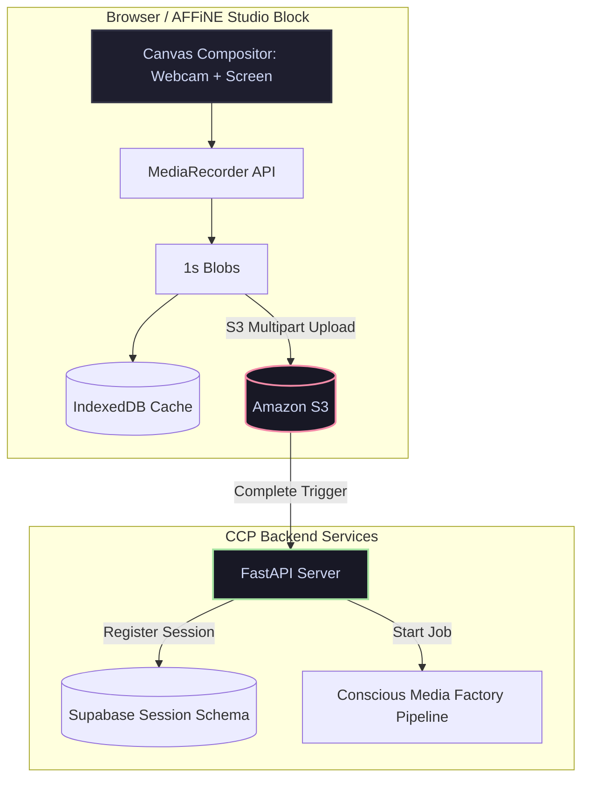

# Tech-Spec: FR-CA11-16 — CCP Studio Block (Asynchronous Loom Recording)

**Created:** 2026-03-25  
**Updated:** 2026-05-21  
**Status:** Ready for Development  
**Version:** 2.0 (Restricted to Asynchronous Recording Only)  
**Architecture Reference:** PRD-Update-CA11 §4.5, ADR-07  
**Skill Implementation:** `ccp-blocks/studio-block/` (React/TypeScript, AFFiNE BlockSuite plugin)  
**Role Executing:** Principal CCP Tech-Spec Architect  
**Replaces:** FR-CA11-13 (OBS Recording Controller), FR-CA11-14 (Excalidraw Live OBS Overlay), FR-CA11-21 (Studio Guest Join), FR-CA11-22 (Stream Overlay Trivianar Display)

---

## 1. Files Read

- `docs/architecture/DEPRECATION_STREAMING_PLATFORM.md` — Formal decommissioning of all streaming systems
- `docs/architecture/DEPRECATION_VISUAL_INTELLIGENCE_ENGINE.md` — Obsolete visual engine details

---

## 2. Overview

### Problem Statement
Live streaming and real-time multi-party broadcasting introduce massive operational complexity (WebRTC SFUs, TURN relay bandwidth, WebSocket-to-RTMP transmuxing servers) and fail to deliver the predictable high-quality content required for professional coaching assets. Furthermore, legacy OBS-based setups require coaches to learn external applications and manage local overlays.

### Solution
FR-CA11-16 implements the **CCP Studio Block** — a native AFFiNE BlockSuite plugin that provides high-performance, asynchronous screen and camera recording (`loom_quick` mode) directly inside the coaching workspace. 

The coach activates it with `/studio` in any AFFiNE page. Recordings are encoded client-side in the browser using the native canvas compositing and `MediaRecorder` APIs. Encoded WebM/VP9 chunks are stored in client-side storage (IndexedDB) for crash resilience and uploaded directly to S3 via pre-signed URLs. 

Upon completion, an API webhook notifies the backend to register the session and trigger CMF pipeline editorial rendering templates. All live streaming, RTMP relay, and multi-party guest join features are completely deprecated and removed.



---

## 3. Scope

**In scope:**
*   BlockSuite plugin registration and lifecycle.
*   `loom_quick` recording mode (YouTube/Course video layout presets).
*   WebRTC capture (webcam, screen, canvas compositing).
*   `MediaRecorder` client-side encoding (VP9/VP8/H.264, 1080p/720p).
*   Teleprompter component (auto-scroll script, font size, mirror mode for teleprompter glass).
*   Asset panel (overlay visual assets from current AFFiNE page onto the canvas).
*   Direct-to-S3 chunked upload using pre-signed S3 URLs.
*   Supabase session logging.
*   Immutable tracking via Receipt Chain Guard (`DEP-ENG-041`).

**Out of scope:**
*   WebRTC multi-party guest join (`FR-CA11-21` is deprecated).
*   Real-time RTMP streaming and external relays (`ccp-stream-service` is deprecated).
*   Excalidraw Live OBS overlays (`FR-CA11-14` is deprecated).
*   WebRTC SFU block broadcasting.

---

## 4. Technical Architecture

### A. High-Performance Canvas Compositing Loop
1.  **Feed Capture:** Acquire user webcam (`navigator.mediaDevices.getUserMedia`) and screen capture (`navigator.mediaDevices.getDisplayMedia`).
2.  **Canvas Drawing:** Create an offscreen `<canvas>` at target resolution (1920×1080 for landscape, 1080×1920 for vertical). Run a rendering loop using `requestAnimationFrame`.
3.  **Layout Rendering:** 
    - Base layer: screen capture stream.
    - Overlay layer: webcam stream mapped to a PiP coordinate (e.g. bottom-right corner, optionally masked in a circular frame).
4.  **Audio Mixing:** Combine user microphone and screen system audio tracks using a native browser `AudioContext` and output a single mixed audio track.

### B. MediaRecorder Encoding & IndexedDB Cache
1.  **MediaRecorder Setup:** Construct `new MediaRecorder` from `canvas.captureStream(30)` combined with the mixed audio track.
2.  **Codec Prioritization:** VP9/Opus (`video/webm;codecs=vp9,opus`) with H.264 fallback.
3.  **Timeslice Emitting:** Call `mediaRecorder.start(1000)` to force the browser to emit 1-second WebM chunks.
4.  **Local Cache (IndexedDB):** Write chunks immediately to IndexedDB via a background Web Worker. If the browser window is closed or crashes, the cached chunks can be recovered and uploaded upon the next visit.

### C. Direct-to-S3 Multipart Upload
1.  **Upload Initialization:** On record start, request an upload ID from the FastAPI backend: `POST /api/studio/upload/init` -> returns `UploadId` and signed S3 URLs.
2.  **Worker Upload:** The Web Worker consolidates 1-second chunks into 5MB parts and PUTs them to the pre-signed S3 URLs.
3.  **Finalization:** On record stop, the component sends `POST /api/studio/upload/complete` containing the ETags of all uploaded parts. The FastAPI backend calls S3 `complete_multipart_upload()` and inserts the record into `studio_sessions`.

---

## 5. Endpoints & Data Model

### A. FastAPI Backend Routes
*   `POST /api/studio/upload/init`: Initializes multipart upload and returns pre-signed URLs.
*   `POST /api/studio/upload/complete`: Fuses chunks in S3, logs database entry, and triggers CMF.

### B. Data Model
```sql
CREATE TABLE studio_sessions (
    id UUID PRIMARY KEY DEFAULT gen_random_uuid(),
    coach_id UUID NOT NULL REFERENCES coaches(id),
    source_page_id VARCHAR(255) NOT NULL,
    recording_mode VARCHAR(30) NOT NULL, -- e.g. 'loom_quick_horizontal', 'loom_quick_vertical'
    aspect_ratio VARCHAR(5) NOT NULL,    -- '16:9' or '9:16'
    resolution VARCHAR(10) NOT NULL,     -- '1080p' or '720p'
    s3_recording_url TEXT NOT NULL,
    duration_seconds INTEGER,
    cmf_pipeline_template VARCHAR(50),
    cmf_job_id UUID,
    receipt_chain_id UUID REFERENCES receipt_chain(id),
    status VARCHAR(20) DEFAULT 'processing',
    started_at TIMESTAMP WITH TIME ZONE NOT NULL,
    ended_at TIMESTAMP WITH TIME ZONE,
    created_at TIMESTAMP WITH TIME ZONE DEFAULT NOW()
);
```

---

## 6. Testing Strategy

### Unit Tests
*   **Compositor Math:** Verify that webcam PiP coordinates do not exceed canvas boundaries.
*   **Aspect Ratio Validation:** Assert that vertical mode correctly sets coordinates at 1080×1920.

### Integration Tests
*   **Recording & Upload:** Mock the browser MediaRecorder and verify that chunks are correctly cached in IndexedDB and uploaded to S3.
*   **Crash Recovery:** Simulate a page reload during recording, verify chunks remain in IndexedDB, and assert they are re-queued for upload.
