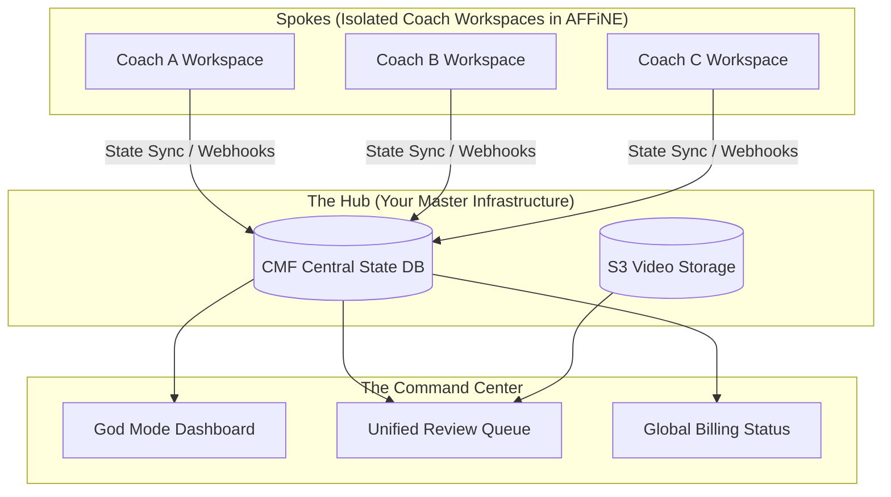

# The "God Mode" Master Dashboard Architecture

You have identified the exact reason agencies die when scaling: **The Multi-Tenant Blindspot.** 

If you have 50 coaches, you cannot log into 50 different AFFiNE workspaces to check on their videos. You need a centralized command center.

Here is the architectural pattern to solve this: **The Hub and Spoke Model.**

## 1. Hub and Spoke Data Architecture

While each Coach's data is *isolated* (Single-Tenant Spokes) for privacy and compliance, the CMF Pipeline Commander (The Hub) has God-level access across all tenants.

## 2. How the Unified Review Queue Works

You do not go *into* their workspaces to review videos. The videos come to *you*.

When the CMF Pipeline finishes rendering a video for Coach A, it hits **State 14: Quality Gate / Review.**
1. The video is flagged in the central database with `status: pending_review` and `tenant_id: coach_a`.
2. The **God Mode Dashboard** queries the database: *"Show me all videos from ALL coaches that are pending review."*
3. You see a TikTok-style feed or a Kanban board on your master dashboard.
4. You click **"Approve"**.
5. The CMF Backend updates the database to `status: approved` and pushes an event *down* to Coach A's AFFiNE workspace: *"Your video is ready for download/posting!"*

## 3. Core Features of the Master Dashboard

To run a high-volume content factory without burning out, your custom Commander Dashboard (built on standard web tech like Next.js or React Admin, completely separate from the coaches' AFFiNE views) must have these views:

### A. The "Factory Floor" (Video Queue)
*   **Filter:** Show me everything stuck in "Pending Review".
*   **Action:** One-click Approve, Regererate, or Reject with notes.
*   **Routing:** When approved, the system automatically routes the asset back to the correct isolated coach workspace.

### B. The "Traffic Control" (Pipeline Health)
*   **Metrics:** "We have 14 videos currently rendering on NVIDIA NIMs. 3 have failed due to audio sync errors."
*   **Action:** Retry failed pipeline stages en-masse.
*   **Insight:** "Coach B hasn't submitted a raw voice note in 4 days." → Trigger Telegram bot to nudge them.

### C. The "Treasury" (Billing & CBCS)
*   **Metrics:** "We injected 412 new end-users this week."
*   **Friction Feed:** "Coach D's $25 weekly payment failed. Their pipeline is paused."
*   **Overhead Check:** "Our AWS/NVIDIA GPU cost this week is $140. Our Stripe revenue is $1,100."

## Why This Maintains "Single-Tenant" Security

The coaches DO NOT have accounts on the Master Dashboard. They only exist inside their isolated AFFiNE workspaces and their Telegram bots.

Your Master Dashboard holds the "Master Keys" to query the central database (which relies on Row-Level Security where every row has a `tenant_id`). You are looking at an aggregated view of the database, while the coaches' software is physically restricted to only querying rows that match their specific `tenant_id`.

**The Rule:** Coaches pull from their isolated siloes; You query the global ocean.
