# 🧠 CMF LLM RESOURCE ALLOCATION STRATEGY

> **A Systems Thinking Analysis of Model Selection for the Conscious Movie Factory Pipeline**

---

## EXECUTIVE SUMMARY

This document applies **Systems Thinking** and **SWOT Analysis** to determine the optimal allocation of Large Language Model (LLM) resources across the CMF production pipeline. Our goal is to maximize emotional intelligence, prompt obedience, and token efficiency while minimizing costs and latency.

The CMF pipeline has distinct cognitive demands at each phase. A "one-model-fits-all" approach (currently using only Gemini 3 Pro/Flash) creates bottlenecks where the model's strengths don't align with the task's requirements. This analysis proposes a **Hybrid Multi-Model Architecture** where different models handle different phases based on their core competencies.

---

## PART 1: SYSTEMS THINKING FRAMEWORK

### 1.1 The Pipeline as a System

The CMF pipeline is not a linear sequence—it is an interconnected system where outputs flow downstream and quality compounds. Understanding these dynamics reveals where to invest model capacity.

```mermaid
graph TD
    A[📝 Transcript] --> B[Phase 1A: DIAGNOSE]
    B --> C[Phase 1A: NARRATIVE]
    C --> D[Phase 1A: SCRIPT]
    D --> E[Phase 1B: STORYBOARD]
    D --> F[Phase 1B: MOTION GMG/CAC]
    E --> G[Phase 2: UNIFIED BATCH]
    F --> G
    G --> H[ComfyUI Generation]
    
    style A fill:#333,stroke:#888
    style B fill:#4a9,stroke:#2a7
    style C fill:#4a9,stroke:#2a7
    style D fill:#c93,stroke:#a71
    style E fill:#93c,stroke:#71a
    style F fill:#93c,stroke:#71a
    style G fill:#39c,stroke:#17a
```

### 1.2 Identifying Leverage Points

In systems thinking, **leverage points** are places where a small change produces significant downstream effects. In the CMF pipeline:

| Leverage Point | Why It Matters | Current Pain |
|----------------|----------------|--------------|
| **DIAGNOSE (Arc Selection)** | Wrong arc = entire script misfires | Gemini sometimes selects generic arcs |
| **SCRIPT (Final Script)** | The "DNA" for all visuals | Scripts occasionally lack emotional punch |
| **VISUAL POETRY** | Directly becomes image prompts | Prompts sometimes feel "AI-generated" |
| **GMG/CAC Prompts** | Must evoke specific emotions | Metaphors can be clichéd or generic |

### 1.3 The Token Economy

Each model has a different cost-to-quality trade-off. Systems optimization requires allocating "expensive" tokens to high-leverage phases and "cheap" tokens to routine phases.

| Phase | Complexity | Token Volume | Leverage | Ideal Model Class |
|-------|------------|--------------|----------|-------------------|
| Diagnose | Medium | ~2K | HIGH | Reasoning-focused |
| Narrative | High | ~8K | MEDIUM | Creative + Obedient |
| Script | Very High | ~10K | CRITICAL | Emotional Intelligence |
| Storyboard (5 agents) | Extreme | ~15K total | CRITICAL | Creative + Visual |
| GMG/CAC | High | ~6K | HIGH | Metaphorical Thinking |
| Batch Population | Low | Automated | LOW | N/A (Python) |

---

## PART 2: MODEL CAPABILITY MATRIX (2026)

Based on the Nut Studio research and your experience with Kimi K2 and Mistral Large, here is a capability matrix tailored to CMF requirements:

### 2.1 Core Capabilities Defined

- **Emotional Intelligence (EI):** Understanding subtext, pacing, and human emotion
- **Obedience:** Following complex multi-step instructions precisely
- **Creativity:** Generating novel metaphors, avoiding clichés
- **Context Window:** How much prior context the model can hold
- **Local/Cost:** Whether it can run locally or has API costs

### 2.2 Model Comparison Table

| Model | EI | Obedience | Creativity | Context | Cost | Best CMF Phase |
|-------|----|-----------|-----------:|---------|------|----------------|
| **Claude Opus 4.5** | ★★★★★ | ★★★★ | ★★★★★ | 500K | High | SCRIPT, VISUAL POETRY |
| **Kimi K2 0905** | ★★★★ | ★★★★★ | ★★★★ | 1.8M | Med | DIAGNOSE, NARRATIVE |
| **GPT-5.2** | ★★★★ | ★★★★★ | ★★★★ | 1M | High | SCRIPT (Structure) |
| **Gemini 3 Pro** | ★★★★ | ★★★ | ★★★★ | 1M | Med | STORYBOARD (Visual) |
| **Mistral Large** | ★★★ | ★★★★★ | ★★★ | 32K | Low | GMG/CAC (Obedience) |
| **LLaMA 3.3 70B** | ★★★★ | ★★★★ | ★★★★ | 128K | Local | DIALOGUE refinement |
| **DeepSeek R1** | ★★ | ★★★★★ | ★★ | 128K | Local | Tech docs, NOT creative |
| **Gemini 3 Flash** | ★★★ | ★★★ | ★★★ | 1M | Low | Low-stakes Validation |

---

## PART 3: PHASE-BY-PHASE SWOT ANALYSIS

### 3.1 PHASE 1A: DIAGNOSE (Story Doctor + Brand Avatar)

**Current Model:** Gemini 3 Pro
**Task Requirements:** Analyze transcript → Select 1 of 13 Arc Types → Generate strategy_brief.json

#### SWOT: Gemini 3 Pro for DIAGNOSE

| Strengths | Weaknesses |
|-----------|------------|
| ✅ Good reasoning | ❌ Sometimes picks "safe" arcs |
| ✅ Fast turnaround | ❌ Misses emotional subtext |
| ✅ Handles large transcripts | ❌ Can be generic in voice detection |

| Opportunities | Threats |
|---------------|---------|
| 🔄 Kimi K2's 1.8M context = full transcript analysis | ⚠️ Wrong arc cascades downstream |
| 🔄 Claude's EI = better protagonist voice detection | ⚠️ Brand Avatar depends on Qwen VL (fixed) |

**RECOMMENDATION:** Test **Kimi K2 0905** for DIAGNOSE. Its 1.8M context and strong obedience make it ideal for structured JSON output from long transcripts.

---

### 3.2 PHASE 1A: NARRATIVE (Quote Mining + Premise)

**Current Model:** Gemini 3 Pro
**Task Requirements:** Extract emotionally charged quotes → Build premise analysis

#### SWOT: Gemini 3 Pro for NARRATIVE

| Strengths | Weaknesses |
|-----------|------------|
| ✅ Can find quotes | ❌ Sometimes misses subtle emotional beats |
| ✅ Handles JSON output | ❌ Premise can lack "soul" |

| Opportunities | Threats |
|---------------|---------|
| 🔄 Claude Opus 4.5's subtext understanding = richer quotes | ⚠️ Weak premise = weak script foundation |
| 🔄 LLaMA 3.3's dialogue focus = better quote attribution | |

**RECOMMENDATION:** Test **Claude Opus 4.5** for NARRATIVE. Its "show, don't tell" expertise should yield more evocative quote mining.

---

### 3.3 PHASE 1A: SCRIPT (Final Script Assembly)

**Current Model:** Gemini 3 Pro
**Task Requirements:** Assemble final_script.json from premise, quotes, and arc → Create emotional through-line

**This is the HIGHEST LEVERAGE phase.** The script is the DNA of the entire video.

#### SWOT: Gemini 3 Pro for SCRIPT

| Strengths | Weaknesses |
|-----------|------------|
| ✅ Structured JSON output | ❌ Scripts sometimes feel "corporate" |
| ✅ Consistent formatting | ❌ Lacks the "human hand" |

| Opportunities | Threats |
|---------------|---------|
| 🔄 Claude Opus 4.5 = human-like emotional intelligence | ⚠️ A flat script destroys viewer engagement |
| 🔄 GPT-5.2's "Dynamic Voice Calibration" = precise tone | |

**RECOMMENDATION:** **Claude Opus 4.5** is the priority test for SCRIPT. Its "emotional pacing" and "distinct character voices" directly address the reported struggle with script output.

---

### 3.4 PHASE 1B: STORYBOARD (5-Agent Visual Pipeline)

**Current Model:** Gemini 3 Pro
**Task Requirements:** 5 sequential agents generate increasingly refined visual prompts (Primal → Enriched → Structured → Visual Poetry → Authorized)

#### SWOT: Gemini 3 Pro for STORYBOARD

| Strengths | Weaknesses |
|-----------|------------|
| ✅ Good at structured multi-step | ❌ Visual Poetry can feel "AI-generated" |
| ✅ Handles long context | ❌ Repetitive phrasing across scenes |

| Opportunities | Threats |
|---------------|---------|
| 🔄 Gemini's native multimodality could enhance visual thinking | ⚠️ Bland prompts = bland images |
| 🔄 Claude's prose quality could elevate Visual Poetry | |

**RECOMMENDATION:** Use a **Hybrid Approach:**
- **Agents 1-3 (Primal, Enriched, Structured):** Gemini 3 Pro (structure-focused)
- **Agent 4 (Visual Poetry):** Claude Opus 4.5 (prose quality)
- **Agent 5 (Authorization):** Mistral Large (obedience + validation)

---

### 3.5 PHASE 1B: MOTION (GMG + CAC Prompts)

**Current Model:** Gemini 3 Pro
**Task Requirements:** Generate metaphorical motion graphics prompts (GMG) and ambient cinema prompts (CAC)

#### SWOT: Gemini 3 Pro for MOTION

| Strengths | Weaknesses |
|-----------|------------|
| ✅ Can generate valid prompts | ❌ Metaphors sometimes clichéd |
| ✅ Follows format | ❌ Less "evocative" than desired |

| Opportunities | Threats |
|---------------|---------|
| 🔄 Mistral Large's strict obedience = perfect format compliance | ⚠️ Weak metaphors = weak visual impact |
| 🔄 Claude for metaphor generation, Mistral for formatting | |

**RECOMMENDATION:** Test **Kimi K2** for GMG/CAC due to its balance of creativity and obedience. Alternatively, use **Claude** for creative generation and **Mistral Large** for final formatting.

---

## PART 4: PROPOSED HYBRID ARCHITECTURE

Based on the SWOT analysis, here is the recommended multi-model allocation:

### 4.1 Primary Allocation

| Phase | Primary Model | Fallback Model | Rationale |
|-------|---------------|----------------|-----------|
| DIAGNOSE | Kimi K2 0905 | Gemini 3 Pro | Massive context, structured output |
| NARRATIVE | Claude Opus 4.5 | Kimi K2 | Emotional subtext detection |
| SCRIPT | Claude Opus 4.5 | GPT-5.2 | **CRITICAL:** Emotional intelligence |
| STORYBOARD (1-3) | Gemini 3 Pro | Gemini 3 Flash | Multi-step structure |
| VISUAL POETRY | Claude Opus 4.5 | Gemini 3 Pro | Prose quality |
| GMG/CAC | Kimi K2 0905 | Mistral Large | Metaphor + Obedience |
| AUTHORIZE | Mistral Large | Gemini 3 Flash | Strict validation |

### 4.2 Cost Optimization Layer

To manage API costs, introduce a **Tiered Execution Strategy:**

1. **Tier 1 (High Stakes):** SCRIPT, VISUAL POETRY → Claude Opus 4.5
2. **Tier 2 (Medium Stakes):** DIAGNOSE, NARRATIVE, GMG → Kimi K2 / GPT-5.2
3. **Tier 3 (Low Stakes):** Validation, Authorization → Mistral Large / Gemini Flash
4. **Tier 4 (Automation):** Batch Population → Python (no LLM needed)

---

## PART 5: TESTING PLAN

### 5.1 A/B Testing Framework

To validate the hybrid architecture, run controlled tests on ONE project before full rollout.

**Test Project:** `06_50-12 Monia` (already complete, can compare outputs)

| Test | Control (Current) | Variant (Proposed) | Metric |
|------|-------------------|--------------------| -------|
| A | Gemini 3 Pro for SCRIPT | Claude Opus 4.5 for SCRIPT | Emotional resonance score |
| B | Gemini 3 Pro for NARRATIVE | Kimi K2 for NARRATIVE | Quote richness score |
| C | Gemini 3 Pro for VISUAL POETRY | Claude Opus 4.5 | Prompt naturalness score |

### 5.2 Evaluation Criteria

For each test, evaluate outputs on:

1. **Emotional Resonance:** Does it "feel" human? (1-10 scale)
2. **Prompt Obedience:** Did it follow all instructions? (Binary)
3. **Uniqueness:** Are metaphors fresh or clichéd? (1-10 scale)
4. **Token Efficiency:** How many tokens used? (Count)
5. **Latency:** How long did generation take? (Seconds)

### 5.3 Implementation Roadmap

| Week | Action | Owners |
|------|--------|--------|
| 1 | Integrate OpenRouter endpoints for Claude, Kimi, Mistral | Dev |
| 2 | Modify RUN_PIPELINE.ps1 to support model selection | Dev |
| 3 | Run Monia tests for SCRIPT and NARRATIVE | QA |
| 4 | Analyze results, adjust allocation | Team |
| 5 | Full rollout to all 5 projects | Ops |

---

## PART 6: CONCLUSION AND RECOMMENDATIONS

The CMF pipeline's current reliance on Gemini 3 Pro creates a "jack of all trades, master of none" situation. The systems analysis reveals three key leverage points where model upgrades would have the highest impact:

1. **SCRIPT (Highest Priority):** Switch to Claude Opus 4.5 for its unmatched emotional intelligence and prose quality.
2. **VISUAL POETRY (High Priority):** Use Claude for the final prompt generation to eliminate "AI-generated" feel.
3. **DIAGNOSE (Medium Priority):** Test Kimi K2's massive context window for better arc selection from long transcripts.

**Immediate Action Items:**

1. ✅ Set up OpenRouter API access for Claude Opus 4.5 and Kimi K2
2. ✅ Create a `--model` flag in RUN_PIPELINE.ps1 to enable per-phase model selection
3. ✅ Run A/B tests on Monia project
4. ✅ Document results in a new `LLM_TEST_RESULTS.md` artifact

By moving from a monolithic to a hybrid architecture, CMF can achieve higher emotional resonance, better prompt obedience, and lower token waste—ultimately producing videos that feel more "human" and less "AI."

---

**Document Version:** 1.0
**Author:** CMF Engineering Team
**Date:** 2026-01-18
