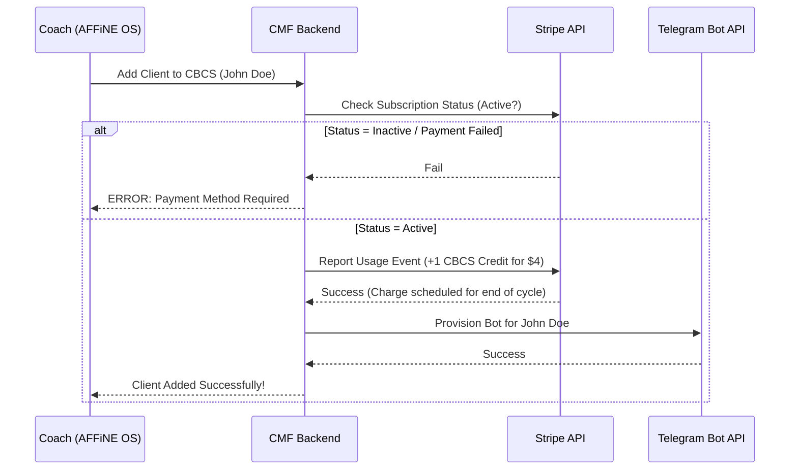

# AFFiNE Billing & Credit Architecture

To prevent abuse and make the $4/user transactions invisible, we must integrate Stripe deeply into the AFFiNE Coach OS. We cannot rely on trust; the architecture must literally prevent a Telegram bot from provisioning if the credit check fails.

## Core Logical Flow: The "Coin-Operated" Machine

Every significant action in the Coach OS (adding a client, requesting a video generation) must pass through a **Billing Middleware** before execution.

## The Three Components of the System

### 1. The Stripe Backend (The Engine)
We will use **Stripe Subscriptions with Metered Billing**.
*   **The Base Plan:** A recurring weekly subscription of $25 or $50.
*   **The Metered Item:** An additional line item on the subscription for "CBCS Active Users" priced at $4/unit.
*   **Behavior:** When a coach adds a user, we send a Usage Record to Stripe. At the end of the week, Stripe automatically calculates: Base Plan + (Number of reported users × $4) and charges the card on file in one seamless transaction.

### 2. The AFFiNE Front-End (The Dashboard)
Inside the AFFiNE workspace, we build a **Wallet/Billing Block**.
*   **Visuals:** A simple dashboard showing "Current Weekly Cost: $41" ($25 base + 4 clients @ $4).
*   **Gateways:** If a coach tries to drag a client into the "Active" column of their CRM board, the AFFiNE block makes an API call to our backend.
*   **Frictionless:** If their card fails on Friday, they get an alert in AFFiNE: *"Billing failed. Client bots are paused. [Update Card]"*. If they don't update, the Telegram bots stop sending messages.

### 3. The Redis State Manager (The Enforcement)
We don't want to query Stripe for every single action. We use Redis to cache the coach's "Permission State."
*   `coach:uuid:status` -> `active` (If `past_due`, everything blocks instantly).
*   `coach:uuid:active_clients` -> `[array of client IDs]`.
*   **Webhook Reconciliation:** Stripe sends Webhooks (e.g., `invoice.payment_succeeded` or `invoice.payment_failed`). Our backend listens to these and instantly updates the Redis state.

## How to Prevent Abuse (The "Jail" System)

Coaches are smart. They might add a client, let the bot run for 6 days, and delete the client before the weekly bill hits to avoid the $4 charge. 

**The Fix:**
1.  **Instant Usage Reporting:** The moment the bot sends its FIRST message to the client, we send the "Usage Record" to Stripe. The $4 is locked in for that week, even if they delete the client the next day.
2.  **Grace Periods:** If a payment fails, we don't delete their data. We "Mute" it. The Telegram bots stop engaging, and the AFFiNE workspace locks them into read-only mode until the card is updated.
3.  **Watermarking (For Free Tiers):** If you ever offer a "free trial", all generated videos must have a massive Conscious Elite watermark that is removed via the API only AFTER a successful credit check.

## Implementation Steps for Construction

1.  **Setup Stripe Products:** Create internal Product IDs for the Base Tier, Premium Tier, and the Metered Client Tier.
2.  **Build Billing Middleware:** Create a Node.js middleware function `requireCredits(cost)` that wraps the AFFiNE endpoints.
3.  **AFFiNE Payment Modal:** Integrate Stripe Elements directly into an AFFiNE modal so they never leave the OS to update their card.
