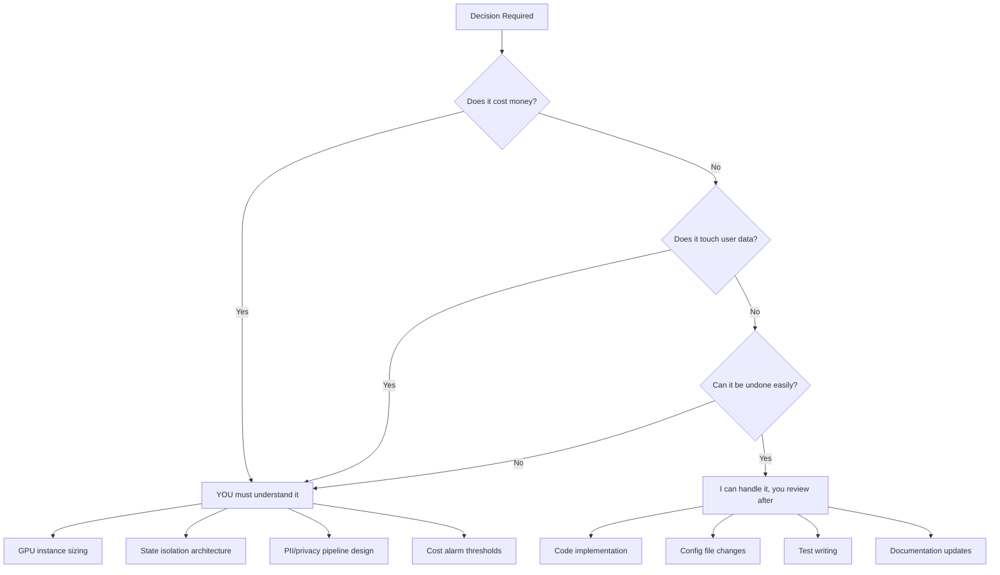

# Learning Roadmap: What YOU Need vs What I Handle

## The Honest Answer to "Do I Even Need to Learn?"

You're right — I can guide you step-by-step through implementation. But there's a **clear line** where your understanding becomes the bottleneck:

| You MUST understand | I handle the rest |
|---|---|
| **Architectural decisions** — WHY we choose X over Y | Syntax, boilerplate, configuration files |
| **Cost implications** — GPU hours = real money | Writing Terraform/CloudFormation templates |
| **Multi-user risks** — one leak = dead product | Implementing state isolation patterns |
| **When something breaks at 3am** — triage instinct | The actual fix once you identify the symptom |

> [!IMPORTANT]
> The gap that kills founders isn't coding ability — it's **not recognizing when a $200/hr GPU instance has been running idle for 6 hours** or **not understanding why User A is seeing User B's coaching data**. These 7 resources were evaluated against THAT gap.

---

## 🟢 MUST WATCH — Directly Protects Your Launch

### 1. "Single-User vs Multi-User Agents" (Video Transcript)
**Priority: 🔴 CRITICAL** · ~15 min watch · **Watch this week**

**Why this matters to YOU specifically:**
CCP is a **multi-user coaching platform**. This video's core insight — the difference between "agent core" vs "agent harness" — is the #1 architectural concept you need in your head. Every decision we make about Redis state isolation, PII buffering, per-user cost quotas, and session security traces back to this.

**Key takeaways you need to internalize:**
- Single-user = optimize for depth. Multi-user = optimize for isolation, cost control, observability
- State collision risks (one coach seeing another's client data = lawsuit)
- Cost explosion without per-user budgets (one bad agentic loop = $500 GPU bill)
- Latency balloons with concurrent users — need queues, retries, fallbacks

> [!CAUTION]
> Without this mental model, you won't catch it when I accidentally design a component that leaks state between users. **You are the last line of defense.**

---

### 2. "The 5 Techniques Separating Top Agentic Engineers" (Video Transcript)
**Priority: 🟠 HIGH** · ~12 min watch · **Watch this week**

**Why this matters to YOU specifically:**
Your entire CCP codebase is already structured around agentic principles (the PROMPT_Spec_Build, the CMF Pipeline Commander). This video formalizes what you're already doing and gives you the vocabulary to communicate with me more efficiently.

**Key techniques directly applicable to CCP/CMF:**
1. **PRD-first development** — You already do this with your spec files. Keep doing it.
2. **Modular rules architecture** — How to structure `.agent/` rules so I don't lose context
3. **Commandifying workflows** — Template your engineering so agents can repeat it
4. **Context resets** — Prevent context window degradation across long sessions
5. **System evolution mindset** — Build systems that build systems

---

### 3. NVIDIA NCA-AIIO Course (Selective Sections Only)
**Priority: 🟠 HIGH** · ~4 hours of selective content · **Watch within 2 weeks**

**Why this matters to YOU specifically:**
You have NVIDIA Enterprise Partnership access. You're deploying on A100/H100 GPUs. You don't need the full cert, but you MUST understand:

| Watch These Sections | Skip These Sections |
|---|---|
| GPU Architecture (H100 vs A100 differences) | Data center physical design |
| MIG partitioning (splitting one GPU for multiple workloads) | Cooling/power density planning |
| CUDA basics (understand what NIM abstracts away) | Slurm cluster management |
| Triton Inference Server overview | DGX pod networking |

> [!TIP]
> When a NIM container fails at 2am, knowing whether it's a MIG partition issue vs a CUDA memory issue vs a model loading issue is the difference between a 5-minute fix and a 5-hour debug session. I can tell you WHAT to type, but you need to understand WHICH direction to look.

---

## 🟡 WORTH WATCHING — Deepens Your Decision-Making

### 4. "Building Agentic AI Workloads – Crash Course" (Video Transcript)
**Priority: 🟡 MEDIUM** · ~20 min · **Watch within 2 weeks**

**Relevant sections for CCP/CMF:**
- Agent vs Workflow distinction (your CMF Pipeline Commander is a hybrid)
- Memory types: short-term (context window) vs long-term (vector DB) vs procedural
- Multi-agent patterns: orchestrator, evaluator, router — all used in your pipeline
- Agent evaluation strategies — how to know if your agents are actually performing

**Less relevant:** LLM selection advice (you're locked into NIM-served models)

---

### 5. "What is Agentic AI Engineering" — Meta Staff Engineer (Video Transcript)
**Priority: 🟡 MEDIUM** · ~25 min · **Watch within 2 weeks**

**Relevant pillars for you:**
- **Context Engineering** — directly applies to your Voice DNA extraction pipeline
- **Agentic Codebases** — how to structure code so AI agents can work with it effectively
- **Compound Engineering** — stacking multiple AI capabilities (what CMF pipeline does)

**Less relevant:** Agentic validation patterns (more for large team environments)

---

## 🔴 SKIP — Not Worth Your Time Right Now

### 6. "Pi CEO Agents / Claude 1M Context / Multi-Agent Teams" (Video Transcript)
**Verdict: ⏭️ SKIP**

**Why:** This is essentially a 40-minute course sales pitch for "Tactical Agent Coding" and "Agentic Horizon" paid courses. The multi-agent CEO/Board pattern is intellectually interesting but:
- Not applicable to CCP/CMF launch (you're building a coaching platform, not a strategic decision engine)
- The custom agent harness (Pi) concept is relevant but you'll learn this organically as we build
- The 1M context window discussion is Claude-specific; you're on NVIDIA NIM

**Steal this one idea and move on:** Agent expertise files (persistent scratchpads that accumulate domain knowledge across sessions) — we can implement this for your coaching agents.

---

### 7. "Build Serverless AI Agents with Langbase" (Video Transcript)
**Verdict: ⏭️ SKIP**

**Why:** This is a platform-specific tutorial for Langbase's proprietary SDK. Your architecture uses NVIDIA NIM + AWS + custom pipeline, not Langbase. Zero overlap with your stack. Every minute spent here is a minute stolen from launch.

---

## Your Optimized Learning Schedule

```
WEEK 1 (Before any deployment):
├── Day 1-2: "Single-User vs Multi-User Agents" [15 min watch + 1hr reflection]
├── Day 3-4: "5 Techniques for Agentic Engineers" [12 min watch]
└── Day 5:   Apply both → Review our Redis isolation + PII buffer design with fresh eyes

WEEK 2 (During infrastructure setup):
├── Day 1-3: NVIDIA NCA-AIIO selective sections [4 hrs total]
├── Day 4:   "Building Agentic AI Workloads" crash course [20 min]
└── Day 5:   "Agentic AI Engineering (Meta)" [25 min]

WEEK 3+: LAUNCH. Learn by doing. I guide, you drive.
```

> [!NOTE]
> **Total actual learning time: ~7 hours across 2 weeks.** Not 200 hours of certification prep. Just enough to be dangerous — in the right way.

---

## The Line Where YOUR Understanding Matters


