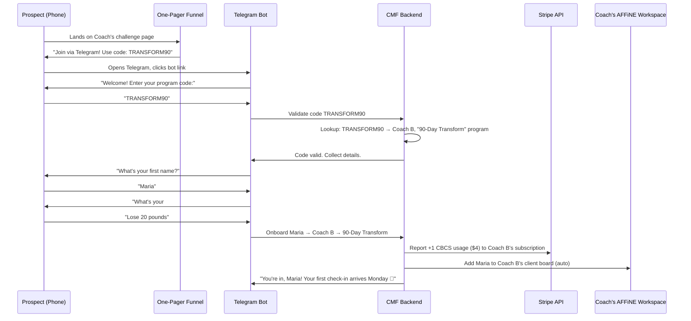

# Telegram-First Onboarding & Program Management Architecture

## Your 5 Questions, Answered

### 1. "If I give you AWS CLI access, can you help me set up infrastructure?"

**Yes, absolutely.** With AWS CLI credentials configured on your machine, I can walk you through — and in many cases directly execute — the provisioning of:
- VPC networking, S3 buckets, CloudFront distributions
- Stripe webhook endpoints on API Gateway + Lambda
- Redis (ElastiCache) for billing state management
- GPU instance auto-scaling groups for NIM containers
- CloudWatch billing alarms so you don't wake up to a $2,000 bill

> [!IMPORTANT]
> You still need to understand WHAT we're building (the learning roadmap), but I can type every `aws` command for you. The courses teach you to **audit** my work, not replace it.

---

### 2. The Special Code Onboarding Flow

This is the killer feature. Here's the exact mechanism:



**What just happened with ZERO manual work from the coach:**
1. Maria found the coach's funnel page
2. She clicked the Telegram link and entered code `TRANSFORM90`
3. The bot collected her info conversationally (name, goal, etc.)
4. The backend auto-assigned her to Coach B's "90-Day Transform" program
5. Stripe auto-charged Coach B $4 for the new CBCS credit
6. Maria appeared on Coach B's AFFiNE client board automatically
7. The CBCS bot is now scheduled to message Maria on Monday

---

### 3. Coach Program & Campaign Management

Coaches need to create and manage programs FROM WITHIN AFFiNE. Here is the data model:

```
Coach Workspace (AFFiNE)
├── Programs/
│   ├── "90-Day Transform"
│   │   ├── code: TRANSFORM90
│   │   ├── price: $197 (what the coach charges the client)
│   │   ├── duration: 90 days
│   │   ├── check-in schedule: Mon/Wed/Fri
│   │   ├── max_clients: 30
│   │   └── clients: [Maria, John, ...]
│   │
│   └── "21-Day Kickstart"
│       ├── code: KICK21
│       ├── price: $47
│       ├── duration: 21 days
│       ├── check-in schedule: Daily
│       ├── max_clients: 50
│       └── clients: [...]
│
├── Campaigns/
│   ├── "March Launch"
│   │   ├── program: "90-Day Transform"
│   │   ├── funnel_url: conscious.co/coach-b/transform
│   │   ├── telegram_code: TRANSFORM90
│   │   ├── start_date: April 1
│   │   └── status: Enrolling
```

**The AFFiNE workflow:**
1. Coach creates a new Program (fills out a form inside a custom AFFiNE Block)
2. System auto-generates a unique `SPECIAL_CODE` for that program
3. Coach creates a Campaign linked to that program
4. System auto-generates the one-pager funnel URL + Telegram bot link
5. Coach shares that link everywhere (Instagram bio, email, etc.)
6. Clients self-enroll via the Telegram code flow above

---

### 4. Payment Flow: Who Pays, How?

You have two clean options:

| Model | Flow | Pros | Cons |
|---|---|---|---|
| **A: Coach-Pays** | Coach pays us $4/client. Coach collects from their own clients however they want (Stripe, PayPal, cash). | Simple for us. We only have one billing relationship. | Coach must handle their own payment collection. |
| **B: We-Collect** | Client pays on the funnel page. We take our $4 cut, send the rest to the Coach via Stripe Connect. | Seamless. Coach gets paid automatically. | We become a payment processor. More compliance. Stripe Connect setup required. |

> [!TIP]
> **Start with Model A** (Coach-Pays). It's simpler, faster to build, and the coaches are already used to collecting payments from their clients through their own checkout pages. We just charge them $4/user automatically via metered billing. Move to Model B later when you have volume and want to offer it as a premium feature.

---

### 5. Why AFFiNE Over Notion Makes This Possible

| Capability | Notion | AFFiNE |
|---|---|---|
| Custom interactive blocks | ❌ No | ✅ BlockSuite plugins |
| Embedded Stripe payment modal | ❌ No | ✅ Custom Block |
| Real-time webhook-driven updates | ❌ Limited | ✅ WebSocket sync |
| Client auto-appearing on board | ❌ API only, janky | ✅ Native Block events |
| Self-hosted / full control | ❌ No | ✅ Yes |
| Telegram bot → workspace sync | ❌ Requires Zapier | ✅ Direct API integration |

AFFiNE's open-source BlockSuite means we can build a "Program Creator" block, a "Client Board" block, a "Billing Dashboard" block — all native inside the coach's workspace. Notion could never.

---

## What This Means for Build Priority

This discussion has revealed **3 new critical systems** that need to be added to the build spec:

1. **Program & Campaign Manager** (AFFiNE Block) — Coaches create programs, get auto-generated codes
2. **Telegram Code Onboarding Agent** — Bot validates codes, collects client info, auto-provisions
3. **Funnel One-Pager Generator** — Auto-generates a branded landing page per campaign with Telegram link

These sit BETWEEN the existing CBCS (which handles the ongoing client engagement) and the Billing System (which handles payment). They are the missing "enrollment layer."
