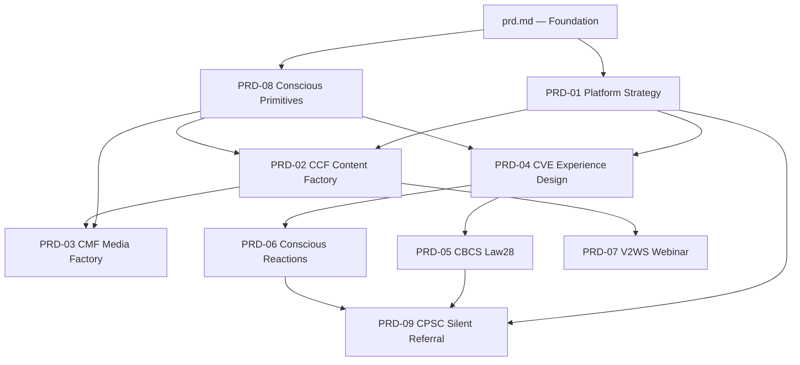

# CCP Modular PRD Index — Router & Master Reference

**Version:** 6.0 (Post-Core-24 Brownfield Rebuild)
**Status:** Source of Truth
**Date:** 2026-05-06

---

## 1. Purpose

This document serves as the **queryable router** for the CCP's modular PRD architecture. Any agent, skill, or human operator needing architectural context must consult this index first to identify which PRD module(s) contain the relevant requirements.

### How to Use This Index

1. **Identify your context** — what environment, primitive family, or capability area are you working in?
2. **Consult the cross-reference tables below** to find the relevant PRD module(s)
3. **Load the specific module(s)** from `docs/prd/modules/PRD_0X_*.md`
4. **Adhere to the Operational Skills** — Consult `skills/prd/SKILL_PRD_Module_Writer.md` for writing standards and `docs/prd/evolution_timeline.md` for the mandatory discernment filter.
5. **Never load all 9 modules simultaneously** — Each module is 4,800–5,400 words. Load only what you need.

### Relationship to the Foundational PRD

The original `docs/prd/prd.md` (264KB, March 2026) remains the **foundational architectural truth**. It contains the 14-step build sequence, 60+ functional requirements, the full dependency registry (DEP-ENG/LIB/PROTO/VIS), and the risk mitigation matrix. These 9 modular PRDs **do not replace** `prd.md` — they **extend and update** it with the April–May 2026 evolutions (the "Core 24" updates).

### Lineage Discipline

The modular PRDs should be written using a **retain / reframe / reject** discipline:

- **Retain** older mechanisms that still improve truth, safety, control, determinism, or leverage.
- **Reframe** older concepts when the product center or commercial positioning changed.
- **Reject** only what the evolution timeline explicitly marks as superseded.

This matters because several March and early-April documents still define active architecture, including:

- Psychological Routing and the Semantic Affinity Guard
- Audience Maturity and payload masking logic
- Cultural Memory Map, Coach Story Archive, and Context Performance Registry
- Context Reasoning and memetic calibration
- first-frame visual control and deterministic webinar geometry

---

## 2. Module Registry

| Module | File | Words | One-Line Description |
|---|---|---|---|
| **PRD-01** | `PRD_01_CCP_Platform_Strategy.md` | 4,800–5,400 | Platform DNA: Human-First doctrine, Invisible App (AFFiNE + Telegram), Voice DNA growth model, 4 Voice Notes Programs, Sovereign Growth criteria, Silent Referral, CAU, data sovereignty |
| **PRD-02** | `PRD_02_CCF_Content_Factory.md` | 4,800–5,400 | Content Factory: Trigger-First CCF pipeline, edge extraction, archetype routing, Content Trinity, export governance |
| **PRD-03** | `PRD_03_CMF_Media_Factory.md` | 4,800–5,400 | Media Factory: CMF pipeline (narrative → cinematic → sonic), VDP/VCP visual prompts, beat clusters, sonic phases, anti-slop visual standards |
| **PRD-04** | `PRD_04_CVE_Experience_Design.md` | 4,800–5,400 | Experience Design: Voice-First doctrine, Communication Skill Ladder, Experience Primitive orchestration, async-first surfaces, Telegram continuity |
| **PRD-05** | `PRD_05_CBCS_Law28.md` | 4,800–5,400 | CBCS Law28: 4-Engine coaching system, biometric-gated progression, 28-Command suite, accountability architecture, Sunday Postcard |
| **PRD-06** | `PRD_06_Conscious_Reactions.md` | 4,800–5,400 | Conscious Reactions: Solo/Debate/Jury/Tier List modes, topic intelligence, viral thresholds, acquisition-through-reaction, co-created clips |
| **PRD-07** | `PRD_07_V2WS_Webinar.md` | 4,800–5,400 | Webinar System: V2WS pipeline, YOLO/Interactive modes, slide generation, teaching-while-selling, CTA architecture |
| **PRD-08** | `PRD_08_Conscious_Primitives.md` | 4,800–5,400 | Primitive Registry: Meaning vs Experience planes, registry schema, coalition formation, edging pipeline, orchestration dichotomy, YAML codification |
| **PRD-09** | `PRD_09_CPSC_Silent_Referral.md` | 4,800–5,400 | Commercial Layer: Pricing architecture, Silent Referral viral loops, OFO, Trust-Transfer Ladder, Church vertical, B2B2C metering |

---

## 3. Cross-Reference: Capability Areas → PRD Modules

This table maps the foundational PRD's Capability Areas (CA) and Feature Requirements (FR) to their modular PRD coverage.

| Capability Area | FRs Covered | Primary Module | Secondary Module(s) |
|---|---|---|---|
| **CA-0: Pre-Production Intelligence** | FR0A–FR0E, FR-GA | PRD-01 | PRD-08 (primitive extraction) |
| **CA-1: Coach Identity & Voice** | FR1–FR13 | PRD-01 | PRD-04 (Voice-First doctrine) |
| **CA-2: Psychological Routing** | FR18–FR23 | PRD-02 | PRD-08 (primitive orchestration) |
| **CA-3: CRAL Research Intelligence** | FR14–FR17 | PRD-02 | PRD-01 (CRAL strategy) |
| **CA-4: Weekly Pipeline & Governance** | FR24–FR26 | PRD-02 | PRD-03 (media production) |
| **CA-5: CBCS Client Coaching** | FR27–FR32 | PRD-05 | PRD-04 (experience design) |
| **CA-5B: CBCS Relationship Intelligence** | FR-CBCS-01–14 | PRD-05 | PRD-09 (CPSC integration) |
| **CA-6: Webinar & Visual Content** | FR33–FR36 | PRD-07 | PRD-03 (CMF pipeline) |
| **CA-7: Cross-System Intelligence** | FR37–FR41 | PRD-01 | All modules |
| **CA-8: Performance & Governance** | FR42–FR50 | PRD-01 | PRD-02 (CCF governance) |
| **CA-9: CPSC Sales Cycle** | FR51–FR60 | PRD-09 | PRD-05 (CBCS gates) |
| **CA-10: CVE & SVRE** | FR-VIS-01–18 | PRD-03 | PRD-08 (TIAR integration) |

---

## 4. Cross-Reference: April Update Features → PRD Modules

| April Feature ID | Feature Name | Primary Module |
|---|---|---|
| FR-APR-01 | B2B2C Metered Billing | PRD-09 |
| FR-APR-02 | 30-Day Challenge Funnel | PRD-05 |
| FR-APR-03 | Speaker Audit Engine | PRD-04 |
| FR-APR-04 | Telegram Mini App Platform | PRD-04 |
| FR-APR-05 | WebRTC Roleplay Engine | PRD-04 | ⚠️ De-centered — async Skill Ladder replaces roleplay as primary surface |
| FR-APR-06 | Conscious Reactions (absorbed Trivianar mechanics) | PRD-06 | ✅ Trivianar absorbed — async reaction modes replace synchronous events |
| FR-APR-07 | Voice-First Orchestration | PRD-04 |
| FR-APR-08 | Orchestration Dichotomy | PRD-08 |
| FR-APR-09 | 28-Command Intelligence Suite | PRD-05 |
| FR-APR-10 | Content Trinity & Export Limits | PRD-02 |
| FR-APR-11 | Coach Dashboard | PRD-01 |

---

## 5. Cross-Reference: Primitive Families → PRD Modules

### Meaning Plane Primitives

| Family Code | Family Name | Count | Primary Module | Secondary Module |
|---|---|---|---|---|
| **STR** | Narrative Structure | 27 | PRD-02 | PRD-03 |
| **PRS** | Persuasion | 35 | PRD-02 | PRD-07 |
| **HUM** | Humor & Distortion | 12 | PRD-06 | PRD-02 |
| **CON** | Contrast & Juxtaposition | 8 | PRD-02 | PRD-06 |
| **PSY** | Psychological Diagnostics | 12 | PRD-05 | PRD-08 |
| **VOC** | Voice & Audio Intimacy | 12 | PRD-04 | PRD-03 |
| **VSG** | Visual & Sonic Guidance | 12 | PRD-03 | PRD-08 |
| **ACT** | Performance & Delivery | 10 | PRD-04 | PRD-05 |
| **REF** | Referral & Trust-Transfer | 9 | PRD-09 | PRD-01 |
| **BUS** | Design & Business | 14 | PRD-01 | PRD-07 |

### Experience Plane Primitives

| Family Code | Family Name | Primary Module | Secondary Module |
|---|---|---|---|
| **TRG** | Trigger & Hook Design | PRD-04 | PRD-06 |
| **FRC** | Friction & Flow Management | PRD-04 | PRD-05 |
| **FBK** | Feedback & Scoring | PRD-05 | PRD-06 |
| **PRG** | Progression & Mastery | PRD-05 | PRD-04 |
| **SAF** | Safety & Trust Signals | PRD-05 | PRD-01 |
| **PER** | Personalization & Adaptation | PRD-04 | PRD-02 |
| **SOC** | Social & Community Dynamics | PRD-06 | PRD-09 |
| **TRB** | Tribal Identity & Belonging | PRD-09 | PRD-06 |

---

## 6. Cross-Reference: Source Documents → PRD Modules

### Architecture & Strategy Sources

| Source Document | Location | Primary Module(s) |
|---|---|---|
| `prd.md` (Foundation PRD) | `docs/prd/` | ALL (foundation) |
| `evolution_timeline.md` | `docs/prd/` | ALL (discernment filter) |
| `Human_First_Brand_Doctrine.md` | `lab/CCP APRIL Updates/05_Core_Experience/` | PRD-01 |
| `Voice_DNA_Growth_Doctrine.md` | `lab/CCP APRIL Updates/04_Voice_Doctrines/` | PRD-01, PRD-04 |
| `Voice_Coach_Growth_Engine_Positioning.md` | `lab/CCP APRIL Updates/03_Growth_Library/` | PRD-01 |
| `Perceptual_Primitives_Architecture.md` | `lab/CCP APRIL Updates/05_Core_Experience/` | PRD-08, PRD-01 |
| `Sovereign_Growth_MCDA.md` | `lab/CCP APRIL Updates/02_MCDA_Synthesis/` | PRD-01 |
| `MCDA_Master_Growth_Ranking.md` | `lab/CCP update/` | PRD-01 |
| `Communication_Skill_Ladder_Architecture.md` | `lab/CCP APRIL Updates/01_Architecture_PRDs/` | PRD-04, PRD-05, PRD-07 |
| `Law28_CBCS_Program_Architecture_Brief.md` | `lab/CCP APRIL Updates/01_Architecture_PRDs/` | PRD-05 |
| `Conscious_Reactions_Source_of_Truth.md` | `lab/CCP APRIL Updates/05_Core_Experience/` | PRD-06 |
| `Conscious_Reactions_Viral_Thresholds.md` | `lab/CCP APRIL Updates/05_Core_Experience/` | PRD-06, PRD-09 |
| `Pricing_Silent_Referral_CoCreation_Architecture.md` | `lab/CCP APRIL Updates/05_Core_Experience/` | PRD-09 |
| `Church_Community_Growth_Architecture.md` | `lab/CCP APRIL Updates/03_Growth_Library/` | PRD-09 |
| `Matrix of Edging.md` | `lab/CCP APRIL Updates/05_Core_Experience/` | PRD-08, PRD-02 |
| `Primitive_Family_Classification_CCP_CMF.md` | `lab/CCP APRIL Updates/05_Core_Experience/` | PRD-08 |
| `Primitive_Packets_and_Registry_Spec.md` | `lab/CCP APRIL Updates/05_Core_Experience/` | PRD-08 |
| `Primitive_Conscious_Orchestration_Architecture.md` | `lab/CCP APRIL Updates/05_Core_Experience/` | PRD-08 |
| `Experience_Primitive_Registry_Spec.md` | `lab/CCP APRIL Updates/05_Core_Experience/` | PRD-04, PRD-08 |
| `Meaning_Primitive_Registry_Spec.md` | `lab/CCP APRIL Updates/05_Core_Experience/` | PRD-08 |

### Retained R&D Lineage Sources

| Source Document | Location | Still-Active Contribution | Primary Module(s) |
|---|---|---|---|
| `CCP_Evolution_Architecture_Report_V2.docx.md` | `lab/CCP update/` | Psychological Routing, Client Intelligence Layer, 3-tier maturity model, payload masking, Semantic Affinity Guard | PRD-02, PRD-04, PRD-05, PRD-07 |
| `CCP_Architecture_V5.0.docx.md` | `lab/CCP update/` | Cultural Memory Map, Coach Story Archive, Context Performance Registry, Context Reasoning, Memetic Engine | PRD-01, PRD-02, PRD-08 |
| `CCP_Sales_Cycle_Documentation_V1.docx.md` | `lab/CCP update/` | business intelligence summary, OFAP lineage, commercial sequencing | PRD-01, PRD-09 |
| `prd-update-how-we-got-here-svre-scre.md` | `docs/prd/` | sovereign research and visual intelligence convergence | PRD-01, PRD-02, PRD-03 |
| `prd-update-visual-control-layer.md` | `docs/prd/` | first-frame control, visual hook engineering, deterministic visual hierarchy | PRD-03, PRD-07 |
| `prd-update-CA11-quad-platform.md` | `docs/prd/` | AFFiNE integration lineage, studio/webinar execution memory | PRD-01, PRD-07 |
| `Mood_State_Architecture_Documentation.docx.md` | `lab/CCP update/` | 4 Mood States, Semantic Affinity Guard, sequencing, audience maturity | PRD-02, PRD-04, PRD-07 |
| `CVE_Documentation_V2.md` | `lab/CCP update/` | visual composition constraints, format validity, image-source discipline | PRD-03, PRD-07 |

### MCDA & Technical Specs

| Source Document | Location | Primary Module(s) |
|---|---|---|
| `Sovereign_Visual_Research_Engine_TechSpec_V1.md` | `lab/CCP update/` | PRD-03 |
| `Sovereign_CRAL_Research_Engine_TechSpec_V1.md` | `lab/CCP update/` | PRD-02 |
| `Conscious_Typography_Architecture.md` | `lab/CCP update/` | PRD-03 |
| `MCDA_Geometrics_vs_CVE_Principles.md` | `lab/CCP update/` | PRD-03 |
| `MCDA_Sovereign_NIM_Writing_Reasoning_Models.md` | `lab/CCP update/` | PRD-01 |
| `Parametric_Template_Feasibility.md` | `lab/CCP update/` | PRD-03 |
| `SearXNG_Custom_Scaffolding_Engine.md` | `lab/CCP update/` | PRD-02 |
| `CVE_Documentation_V1-V3.md` | `lab/CCP update/` | PRD-03 |
| `CRAL_Documentation_V1.docx.md` | `lab/CCP update/` | PRD-02 |
| `JIT_Skill_Compiler_Architecture.docx.md` | `lab/CCP update/` | PRD-02 |
| `CCP_CBCS_CPSC_V3.docx.md` | `lab/CCP update/` | PRD-05, PRD-09 |

### Audit Library (Meaning Primitives)

| Audit Source | Families Fed | Primary Module(s) |
|---|---|---|
| `AUDIT_Resonate_Nancy_Duarte.md` | STR, PRS | PRD-02 |
| `AUDIT_TED_Talks_Chris_Anderson.md` | PRS, ACT | PRD-02, PRD-04 |
| `AUDIT_Steal_the_Show_Michael_Port.md` | ACT, PRS | PRD-04 |
| `AUDIT_HBR_Guide_Persuasive_Presentations.md` | PRS, BUS | PRD-02 |
| `AUDIT_Talk_Like_TED_Carmine_Gallo.md` | PRS, STR | PRD-02 |
| `AUDIT_Supercommunicators_Charles_Duhigg.md` | PSY, REF | PRD-05, PRD-09 |
| `AUDIT_The_Psychology_Workbook_for_Writers.md` | PSY | PRD-05, PRD-08 |
| `AUDIT_Born_a_Crime.md` | HUM, PSY, VSG | PRD-06, PRD-03 |
| `AUDIT_Photography_Story_Composition.md` | VSG | PRD-03 |
| `AUDIT_The_Filmmakers_Eye.md` | VSG | PRD-03 |
| `AUDIT_Sound_Design_Harrison_Lawrence_Murch.md` | VOC, VSG | PRD-03, PRD-04 |
| `AUDIT_Finding_Your_Voice_Barbara_McAfee.md` | VOC | PRD-04 |
| `AUDIT_Interviewing_for_Radio_Jim_Beaman.md` | VOC | PRD-04 |
| `AUDIT_Radio_Drama_Handbook_Richard_Hand.md` | VOC | PRD-04 |
| `AUDIT_Design_Is_Storytelling.md` | BUS | PRD-01 |
| `AUDIT_Beautiful_Users.md` | BUS | PRD-01 |
| `AUDIT_Jay_Abraham_Referral_Systems.md` | REF | PRD-09 |
| `AUDIT_Dont_Make_Me_Think.md` | BUS, FRC | PRD-01, PRD-04 |

### Audit Library (Experience Primitives)

| Audit Source | Families Fed | Primary Module(s) |
|---|---|---|
| `AUDIT_Beyond_Belief_Nir_Eyal.md` | TRG, FRC, FBK | PRD-04 |
| `AUDIT_Gamify_Brian_Burke.md` | PRG, FBK, SOC | PRD-05, PRD-06 |
| `AUDIT_Reality_Is_Broken_Jane_McGonigal.md` | PRG, SOC, TRB | PRD-05, PRD-06 |
| `AUDIT_The_Art_of_Game_Design_Jesse_Schell.md` | FBK, PRG, PER | PRD-04, PRD-05 |

---

## 7. Version History & Evolution Timeline

### The CCP Evolution Arc (March–May 2026)

| Date | Event | Impact |
|---|---|---|
| **March 2026** | `prd.md` written — Foundation PRD (264KB) | Established 14-step build, 60+ FRs, 45 DEP IDs, 7 core pillars |
| **March 10-17** | Trigger-First, Mood State, CRAL, JIT, and CBCS/CPSC documentation sprint | locked in retained routing, challenge, intake, and compiler mechanisms later inherited by the modular PRDs |
| **March 12** | `CCP_Architecture_V5.0.docx.md` lineage begins | Cultural Memory Map, Story Archive, Context Performance Registry, Memetic Engine, Context Reasoning enter the architecture |
| **March 16-30** | sales, visual control, and quad-platform update docs | webinar, first-frame, OFAP, and AFFiNE integration lineage deepened before the human-first rewrite |
| **April 6** | SearXNG Scaffolding Engine spec | CRAL shifts from Serper/Tavily to sovereign self-hosted search |
| **April 7** | Conscious Typography Architecture + Geometrics MCDA + SVRE TechSpec | Visual pipeline crystallizes: DOM-less Skia rendering, SAM3, Pretext, T-Score |
| **April 7** | Parametric Template Feasibility | JSON-driven generative layouts replace static PSD templates |
| **April 8** | Sovereign CRAL Research Engine TechSpec | SCRE replaces legacy CRAL with SearXNG + autocomplete polling |
| **April 9** | MCDA Sovereign NIM Writing/Reasoning Models | Model roster finalized: gemma4-31b, Kimi-K2.5, Qwen3.5, GLM-5 |
| **April 11** | MCDA Master Growth Ranking | Top 16 sovereign growth features ranked via 8-criteria MCDA |
| **April 14–25** | PDF Research Library Conversion | 40+ audit PDFs converted to Markdown for LLM ingestion |
| **April 25–May 1** | Public Speaking Audit Sprint | 15+ audits (Duarte, Anderson, Port, Gallo, Duhigg, etc.) |
| **May 1** | Human-First Brand Doctrine | Anti-slop mandate formalized, OFAP defined, positioning crystallized |
| **May 1** | Voice DNA Growth Doctrine | 3-layer model (Core/Style/Growth), Non-Imitation Doctrine |
| **May 1** | Voice-First Experience Doctrine | Six Emotional Jobs, Sonic Composition Law, Telegram Continuity |
| **May 2** | Perceptual Primitives Architecture | Meaning/Experience plane distinction, coalition formation theory |
| **May 2** | Primitive Family Classification | 10 meaning + 8 experience families formally classified |
| **May 2** | Primitive Packets & Registry Spec | 64KB — full packet contracts, registry schema, YAML standards |
| **May 2** | Communication Skill Ladder Architecture | Async-first: Law28, Webinar Sales, Networking OFAP, Social Co-Creations |
| **May 2** | Conscious Reactions Source of Truth | 1,384-line definitive spec for Solo/Debate/Jury/Tier List modes |
| **May 2** | Pricing & Silent Referral Architecture | $39.99/$99.99 value ladder, Silent Referral viral loops |
| **May 2** | Matrix of Edging | Controlled tension selection anchored to meaning plane |
| **May 3** | `April_Updates_Master_PRD.md` written | 35KB monolithic bridge PRD — now superseded by this modular architecture |
| **May 4–5** | Experience Engineering Audit Sprint | Hooked, Gamify, Reality Is Broken, Art of Game Design → 8 experience families |
| **May 5–6** | Primitive Codification Sprint | 150+ meaning primitives codified as YAML across 10 families |
| **May 6** | **Modular PRD Decomposition** | This 9-module architecture replaces the monolithic Master PRD |

### What Went Up (Elevated in April–May)

- **Primitive Registry** — from vague concept to 150+ codified YAML atoms with dual-source validation
- **Meaning/Experience Plane Separation** — from implicit to formally architected with distinct schemas
- **Async-First Communication** — from roleplay-centric to laddered skill surfaces (Law28 → Webinar → OFAP → Social)
- **Sovereign GPU Infrastructure** — from RunningHub dependency to self-hosted NIM on AWS EC2
- **Sovereign Search** — from Serper/Tavily to self-hosted SearXNG with custom category routing
- **Voice DNA Growth Model** — from static extraction to 3-layer living baseline (Core/Style/Growth)
- **Conscious Reactions** — from nonexistent to core acquisition engine with 4 modes (absorbed Trivianar mechanics)
- **Silent Referral Architecture** — from generic affiliate to product-led viral loops through participation
- **Invisible App Doctrine** — two touchpoints only (AFFiNE + Telegram), all backend invisible
- **Self-Translation Principle** — coaching sessions auto-produce content assets and Brand DNA/RNA refinement
- **Coalition Theory** — from single-primitive selection to weighted coalition signatures
- **Experience Engineering** — from implicit UX to 8 formally codified experience primitive families

### What Went Down (De-Centered, Absorbed, or Archived)

- **Trivianar as synchronous-first flagship** — absorbed into Conscious Reactions (mechanics preserved, calendar bottleneck removed)
- **Synchronous Roleplay** — de-centered from primary skill surface to optional byproduct (Skill Ladder §5)
- **Tripwire pricing ($16.95 → $39.95/week → $49.95/week)** — replaced by Lead Magnet → $39.99/mo → $99.99/mo value ladder
- **Advocate Ledger** — deferred; Silent Referral through participation replaces explicit advocacy
- **RunningHub Dependency** — replaced by sovereign NIM on AWS EC2
- **Serper/Tavily** — replaced by SearXNG + SCRE
- **Monolithic Master PRD** — decomposed into this 9-module architecture
- **Content Trinity as sole format** — expanded to 8 format categories with export limits
- **Calendar-gated progression** — replaced by biometric-gated milestone progression
- **Static Voice DNA** — replaced by 3-layer growth model with periodic retuning
- **Separate content creation workflows** — replaced by Self-Translation Principle (coaching sessions auto-produce content)

---

## 8. Dependency Graph



---

## 9. Agent Loading Protocol

When any CCP agent or SKILL needs architectural context, it must follow this protocol:

```yaml
prd_loading_protocol:
  step_1: "Read PRD_INDEX.md to identify relevant module(s)"
  step_2: "Load ONLY the identified module(s) — never load all 9"
  step_3: "Cross-reference the module's 'Active Primitives' section against the current task"
  step_4: "If the task spans multiple environments, load the primary + secondary modules listed in the cross-reference tables"
  
  mandatory_for:
    - primitive_codification: "Load the module matching the primitive's family (see Section 5)"
    - content_generation: "Load PRD-02 (CCF) + the relevant primitive family module"
    - experience_design: "Load PRD-04 + PRD-08"
    - coaching_interaction: "Load PRD-05"
    - visual_production: "Load PRD-03"
    - commercial_operations: "Load PRD-09"
    - platform_architecture: "Load PRD-01"
```
