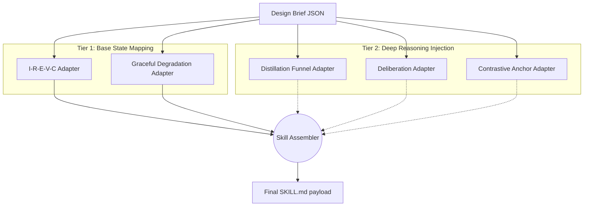

# CCBS Adapter Registry (Phase 2 Modules)

**5 Active Adaptation Modules · Ecosystem Mappers · Execution Flow Modifiers**

---

## Part 1: Philosophy & Distinction

This registry documents the **Phase 2 Adapters** within the Conscious Coaching Building System (CCBS).

**How Adapters differ from Dependencies:**
*   `dependency_registry.md` logs **State** (the JSONs, YAMLs, and static constraints that agents read).
*   This Adapter Registry logs **Action** (the Active Skills that mutate universal prompt blocks into domain-specific execution rules).

Adapters exist because the CCBS uses universal paradigms (like the Distillation Funnel or Deliberation). However, a universal Deliberation protocol produces generic output. An Adapter takes the specific `skill_design_brief` and mutates the universal paradigm into an *Ecologically Adapted* function.

**Invocation Rule:**
Adapters are executed exclusively by the **Skill Assembler Agent** during Phase 2 of Skill creation, and only when the Design Brief explicitly requests that module. (The one exception is `I-R-E-V-C`, which is mandatory for all skills).

---

## Part 2: The 5 Core Adapters

### 1. The I-R-E-V-C Adapter (`irevc-adapter`)
The fundamental skeleton of execution. It maps the 11-field Design Brief into a standardized 5-stage protocol that prevents LLMs from hallucinating steps.
*   **Execution Tier:** Standard
*   **Mandatory:** Yes, required for all CCP Skills.
*   **Adaptation Target:**
    *   **Ingest:** Strict input loading (Boundaries/Constraints *first*).
    *   **Reason:** Step-by-step algorithm injection.
    *   **Emit:** Output formatting rules.
    *   **Validate:** Converting subjective criteria into machine-verifiable checks.
    *   **Checkpoint:** State tracking.

### 2. The Distillation Funnel Adapter (`distillation-funnel-adapter`)
Translates the universal 4-law funnel into context-specific density operations.
*   **Execution Tier:** Deep/Premium
*   **Mandatory:** No, used when density/extraction is required.
*   **Adaptation Target:**
    *   **Saturation:** Defines how to load (passive array vs. cross-input collision).
    *   **Classification:** Invents a 3-5 category taxonomy specific to the domain.
    *   **Compression:** Defines the specific algorithmic density test (e.g., "The Collapse Test", "The Evidence Test").
    *   **The Gate:** Defines the final pass/fail authenticity criterion.

### 3. The Deliberation Adapter (`deliberation-adapter`)
Instantiates the Draft → Critic → Synthesis protocol for internal quality loops.
*   **Execution Tier:** Deep/Premium
*   **Mandatory:** No, used when self-correction and evaluation are required.
*   **Adaptation Target:**
    *   **Critic Rules:** Mutates generic "Is this good?" questions into 4-6 highly specific failure-mode checks (e.g., "Does this quote contain actual numbers or just imply them?").
    *   **Synthesis Mechanism:** Defines whether to REVISE_AND_REPLACE, REVISE_FLAGGED_ONLY, or EXPAND_CANDIDATES.

### 4. The Contrastive Anchor Adapter (`contrastive-anchor-adapter`)
Creates customized "Anti-Drafts" to serve as negative repelling magnets for LLM inference.
*   **Execution Tier:** Deep/Premium
*   **Mandatory:** No, used when the domain has a high risk of LLM sycophancy or generic formatting.
*   **Adaptation Target:**
    *   **Negative Demonstration:** Generates a literal 3-5 sentence example of what "average AI output" looks like for this specific task.
    *   **Visibility:** Explains *why* the AI naturally produces this bad output (e.g., mean reversion).
    *   **Steering:** Creates explicit semantic distance instructions and forbidden vocabulary lists.

### 5. The Graceful Degradation Adapter (`graceful-degradation-adapter`)
Establishes the fallback physics of the Skill so it never silently fails or hallucinates missing inputs.
*   **Execution Tier:** Standard
*   **Mandatory:** Yes, implicitly required structurally by CCP conventions.
*   **Adaptation Target:**
    *   **Input Failure:** Maps every input to Critical (Halt), Important (Degrade), or Optional (Proceed). Uses the `[MISSING_DATA]` pattern.
    *   **Method Degradation:** Defines what the minimum viable output is if a processing step crashes.

---

## Part 3: Adapter Sequencing (The Assembly Pipeline)

When the Skill Assembler triggers Phase 2, the Adapters run in a strict topological order to build up the final `SKILL.md`.

### Why this architecture matters
By separating the universal logic (the Core DNA) from the specific execution context (the Adapter output), the CCBS guarantees that every single Skill in the ecosystem operates on the same baseline physics, but executes with highly specialized, non-generic nuance.
