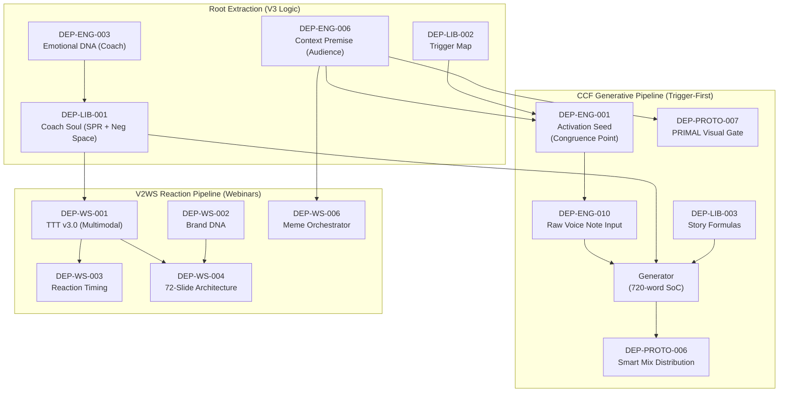

# CCP Formal Dependency Registry v3.0 (Trigger-First Architecture)

**38 Reusable Macro-Dependencies · DEP-{CAT}-{SEQ} IDs · Unified DAG**

---

## Part 1: Architecture Philosophy & Scope

This registry defines the **building blocks** of the CCP Prompt Engine.

**Scope Bound:** To qualify as a dependency here, an item must be a *reusable structural unit* (a file, a schema, a constraint, or a protocol) that an LLM or Agent actively loads.

> [!WARNING]
> In accordance with the CCF Bible v2 and Trigger-First Engine architectures, all legacy V2 role-play components (e.g., `ttt_matrix`, `character_lexicon`, generic `persuasion_layers`) have been purged. The generative system is anchored strictly on Emotional DNA, Context Premises, and Negative Space.

**The ID Schema:**
`DEP-{CATEGORY}-{SEQUENCE}` (e.g., `DEP-ENG-005`)

---

## Part 2: The 38-Component Registry

### Category 1: Engine Outputs & Raw Data Assets (15 Items)

Dynamic structures produced per-project, per-theme, or per-week.

| DEP ID | Name | File/Location | Required By | Status |
|:-------|:-----|:--------------|:------------|:-------|
| `DEP-ENG-001` | Structural Congruence Point | `activation_seeds.json` | Script Prompts (V3) | ⚠️ CCF Only |
| `DEP-ENG-002` | Voice DNA SPR (3-Layer)* | `coach_soul.json` | Script Prompts | ✅ CBCS |
| `DEP-ENG-003` | Emotional DNA (10 Variables) | `emotional_dna.json` | Voice DNA Profiler | ✅ CBCS |
| `DEP-ENG-004` | Negative Space Object | `coach_soul.json` | Script Prompts | ✅ CBCS |
| `DEP-ENG-005` | Authentication Certificate | Stage 4 Trigger Engine | Fidelity Gates | ⚠️ Partial |
| `DEP-ENG-006` | Context Premise Summary | `context_premise_map.json` | Art Director, ENG-001 | ✅ CCF/CBCS |
| `DEP-ENG-007` | Audience Tribal Terms | `tribe_soul.json` | Script Prompts | ✅ CBCS |
| `DEP-ENG-008` | Tribe Soul Profile | `tribe_soul.json` | intelligence-radar | ✅ CBCS |
| `DEP-ENG-009` | Identity Pillars | `identity_pillars.yaml` | blueprint-orchestrator | ✅ CBCS |
| `DEP-ENG-010` | Stream of Consciousness Batch | `coach_soc_batch.md` | Extractor Agents | ✅ CCF |
| `DEP-ENG-011` | Project Context | `project_context.json` | Planners | ✅ CCF |
| `DEP-ENG-012` | Intelligence Radar | `intelligence_radar.json` | theme-generator | ✅ CCF |
| `DEP-ENG-013` | Provocation Questions | `provocation_questions.json` | coach-elicitation | ✅ CCF |
| `DEP-ENG-014` | Validated Content Payload | `validation/verdicts/` | E-roll, smart-mix | ✅ CCF |
| `DEP-ENG-015` | Script Prompt Schema | `script_prompt_schema.json` | All Scripts | ✅ CBCS |

### Category 2: Component Library & Constraints (7 Items)

Structural libraries enforcing logic and formatting (stripped of legacy persona artifacts).

| DEP ID | Name | File/Location | Required By | Status |
|:-------|:-----|:--------------|:------------|:-------|
| `DEP-LIB-001` | Coach Soul Kernel | `coach_soul.json` | Voice/Execution | ✅ CBCS |
| `DEP-LIB-002` | Trigger Map Architecture | `trigger_map.json` | radar, trigger-match | ✅ CBCS |
| `DEP-LIB-003` | Story Formulas | `story_formulas.yaml` | Script Prompts | ✅ CBCS |
| `DEP-LIB-004` | Persuasive Angles | `persuasive_angles.json` | Script Prompts | ✅ CBCS |
| `DEP-LIB-005` | Cognitive Distortion Defs | `cognitive_distortion...yaml` | Script Prompts | ✅ CBCS |
| `DEP-LIB-006` | Identity Threat Taxonomy | `identity_threat...yaml` | Trigger Matching | ✅ CBCS |
| `DEP-LIB-007` | SDT Markers | `sdt_markers.yaml` | Script Prompts | ✅ CBCS |

### Category 3: Sacred Protocols & Quality Gates (10 Items)

Operational laws constraining drift and enforcing depth.

| DEP ID | Name | Enforced By | Required By | Status |
|:-------|:-----|:------------|:------------|:-------|
| `DEP-PROTO-001` | Research Synthesis (Deep/Fresh) | `raw-deep-research` | Intelligence | ✅ CCF |
| `DEP-PROTO-002` | Authenticity Protocol | Script Generation | Identity | Implied |
| `DEP-PROTO-003` | Memetic Protocol (4 Pillars) | `smart-mix` | Distribution | Implied |
| `DEP-PROTO-004` | Conscious Movie Alchemy | `dynamic-theme-gen` | Planning | ✅ CCF |
| `DEP-PROTO-005` | Late Binding Protocol | Pipeline Routing | Orchestration | Implied |
| `DEP-PROTO-006` | Smart Mix Synthesis | `smart-mix` | Final Assembly | ✅ CCF |
| `DEP-PROTO-007` | PRIMAL Felt Specificity Gate | `art-director` | Visual Prompts | ✅ CCF |
| `DEP-PROTO-008` | Visual Authenticity Gate | `art-director` | Visual Prompts | ✅ CCF |
| `DEP-PROTO-009` | AIP 5-Lens Protocol | `vibe-comments` | Research | ✅ CCF |
| `DEP-PROTO-010` | I-R-E-V-C Session State Machine | Markdown Skills | All Agents | ✅ CCF |

### Category 4: V2WS Extrapolation Libraries (6 Items)

The multimodal physics layer specifically driving the "Reaction Paradigm" of the Voice2WebinarSystem.

| DEP ID | Name | File/Location | Required By | Status |
|:-------|:-----|:--------------|:------------|:-------|
| `DEP-WS-001` | TTT System v3.0 (Visual/Timing) | `ttt_system_v3.json` | V2WS Scripting | ✅ V2WS |
| `DEP-WS-002` | Brand DNA (Functional Color) | `brand_DNA.json` | Visual Director | ✅ V2WS |
| `DEP-WS-003` | Reaction Timing Framework | `reaction_timing...yaml` | Delivery Engineer | ✅ V2WS |
| `DEP-WS-004` | 72-Slide Modular Architecture | `framework_72_slides.yaml` | Script Architect | ✅ V2WS |
| `DEP-WS-005` | Slide Design Physics | `slide_design_physics.yaml`| V2WS Assembly | ✅ V2WS |
| `DEP-WS-006` | Humor Theory Selector | `meme_orchestrator.yaml` | Visual Director | ✅ V2WS |

---

## Part 3: Cross-System Context Graph (DAG)

Unlike previous isolated diagrams, this graph illustrates the **Trigger-First flow**, moving from abstract Audience Context and Coach Emotional DNA directly into Generative Pipelines without detour into fake Personas.

## Part 4: Topological Sort (Build Order)

The 38 architecture dependencies must conceptually be generated, loaded, or evaluated in the following phased build order to prevent "ghost variable" references. 

### Tier 0 — The Immutable Constants & Base Extractions
*These components have absolutely zero upstream dependencies. They are static libraries or base abstractions.*

| DEP ID | Name | Sub-System |
|:-------|:-----|:-----------|
| `DEP-ENG-003` | Emotional DNA (10 Variables) | Base Engine |
| `DEP-ENG-006` | Context Premise Summary | Base Engine |
| `DEP-LIB-002` | Trigger Map Architecture | Base Engine |
| `DEP-ENG-009` | Identity Pillars | Base Component |
| `DEP-ENG-011` | Project Context | Base Component |
| `DEP-ENG-015` | Script Prompt Schema | Validation |
| `DEP-LIB-003` | Story Formulas | Library |
| `DEP-LIB-004` | Persuasive Angles | Library |
| `DEP-LIB-005` | Cognitive Distortion Defs | Library |
| `DEP-LIB-006` | Identity Threat Taxonomy | Library |
| `DEP-LIB-007` | SDT Markers | Library |
| `DEP-WS-002` | Brand DNA (Functional Color) | V2WS |
| `DEP-WS-005` | Slide Design Physics | V2WS |
| `DEP-PROTO-*`| All 10 Protocols / Quality Gates | Operational |

### Tier 1 — Derived Identities
*Generated by synthesizing Tier 0 root extractions.*

| DEP ID | Name | Upstream Triggers |
|:-------|:-----|:------------------|
| `DEP-LIB-001` | Coach Soul Kernel | `DEP-ENG-003` (Emotional DNA) |
| `DEP-ENG-002` | Voice DNA SPR (3-Layer) | `DEP-LIB-001` (Coach Soul) |
| `DEP-ENG-004` | Negative Space Object | `DEP-LIB-001` (Coach Soul) |
| `DEP-ENG-007` | Audience Tribal Terms | `DEP-ENG-006` (Context Premise) |
| `DEP-ENG-008` | Tribe Soul Profile | `DEP-ENG-006`, `DEP-ENG-007` |
| `DEP-ENG-013` | Provocation Questions | `DEP-LIB-001`, `DEP-LIB-002` |
| `DEP-ENG-001` | Structural Congruence Point | `DEP-ENG-006`, `DEP-LIB-002` |
| `DEP-WS-006` | Humor Theory Selector | `DEP-ENG-006` (Context Premise) |

### Tier 2 — Orchestration & Preparation
*Preparing to ingest or coordinate dynamic content delivery.*

| DEP ID | Name | Upstream Triggers |
|:-------|:-----|:------------------|
| `DEP-ENG-010` | Stream of Consciousness Batch | `DEP-ENG-001`, `DEP-ENG-013` |
| `DEP-ENG-012` | Intelligence Radar | `DEP-ENG-008`, `DEP-LIB-002` |
| `DEP-WS-001` | TTT System v3.0 (Visual/Timing) | `DEP-LIB-001` (Coach Soul) |

### Tier 3 — Advanced Generation & Rendering Logic
*These assets govern the timing, slides, and final verification metrics logic.*

| DEP ID | Name | Upstream Triggers |
|:-------|:-----|:------------------|
| `DEP-ENG-005` | Authentication Certificate | Generated from Phase 4 Trigger |
| `DEP-WS-003` | Reaction Timing Framework | `DEP-WS-001` (TTT System v3.0) |
| `DEP-WS-004` | 72-Slide Modular Architecture | `DEP-WS-001`, `DEP-WS-002` |

### Tier 4 — Verified Payload Output
*The final product yielded exclusively if all prior schemas and protocols have passed correctly.*

| DEP ID | Name | Upstream Triggers |
|:-------|:-----|:------------------|
| `DEP-ENG-014` | Validated Content Payload | Generation + Validation (`PROTO`) |

---

## Next Steps: Resolving Missing Files

By purging the legacy role-play dependencies (`ttt_matrix`, `character_lexicon`, etc.), we have resolved the worst "ghost variables" that were causing downstream LLM hallucinations. 

The immediate next priority is ensuring that the actual V3 structural files (`emotional_dna.json`, `context_premise_map.json`) exist and are populated with correct data in the `lab/CCBS` workspace.
