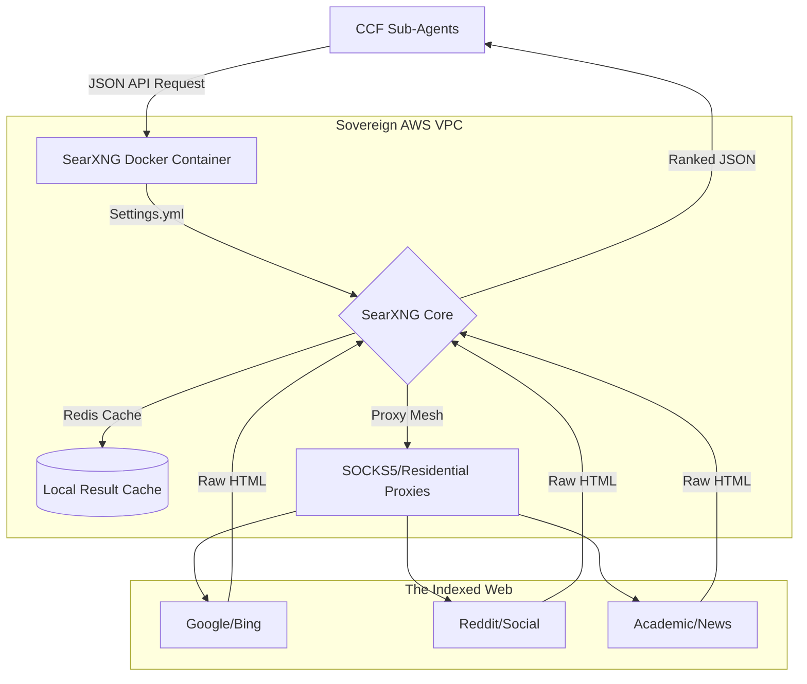

# Sovereign Search Engine: Internal SearXNG Scaffolding

You are completely correct to reject Perplexica. Relying on an intermediate UI wrapper adds another black box between your agents and the raw data. By custom-building our own SearXNG configuration via exactly tuned YAML files, we gain total deterministic control over how the Conscious Coaching Factory hunts for knowledge, ranks virality, and filters "slop."

---

## 1. The Internal Engine Scaffolding

The architecture for our custom Sovereign Search Engine physically separates the scraping mechanism from the LLM synthesis. Agents run the queries, SearXNG aggregates the raw truth, and the Agent's internal prompt synthesizes the JSON.

**The Scaffolding Steps:**
1. **The Caller:** The Analyst Agent generates a strict URL: `http://localhost:8080/search?q=high+ticket+coaching+trends&format=json&categories=viral_social&time_range=week`
2. **The Cache Check:** SearXNG checks the local Redis cache to prevent burning proxy bandwidth on duplicate queries.
3. **The Proxy Distribution:** SearXNG splits the request across our configured residential proxy IPs, hitting 15 different sites (Reddit, X, Google, Qwant) simultaneously without triggering bot-protection.
4. **The Aggregation:** It parses the raw HTML, applies our custom weighting algorithm (e.g., favoring Reddit over Forbes), and returns a clean, structured JSON file back to the Agent.

---

## 2. The 16 Critical `settings.yml` Customization Parameters

SearXNG is driven entirely by a `settings.yml` file. By altering these 16 specific parameters, we mutate it from a generic privacy browser into a specialized, viral-detecting, agent-serving API.

### A. The Core API Parameters
These parameters ensure SearXNG behaves silently as a machine-to-machine API rather than a human web app.
1. **`search.formats: [json]`** 
   - *Why:* Absolutely critical. Disables the HTML/UI rendering and forces SearXNG to only output machine-readable JSON structured arrays for our agents.
2. **`server.image_proxy: true`**
   - *Why:* Instead of letting agents ping original image URLs directly (which triggers tracking pixels and CORS blocks), SearXNG downloads the image locally and proxies it directly to our VLM node. Total invisibility.
3. **`redis.url: "redis://localhost:6379/0"`**
   - *Why:* Enables high-speed caching. If three different agents are researching the same viral topic simultaneously, SearXNG only hits the external web once, serving the JSON from RAM for all subsequent agents.
4. **`server.bind_address: "127.0.0.1"`**
   - *Why:* Network isolation. Prevents the search engine from being public-facing. It only accepts queries sent from agents located internally on our AWS VPC.

### B. The Engine Weighting & Virality Tuners
This is how we kill "AI slop" and elevate unvarnished viral truth.
5. **`engines.*.weight:`** 
   - *Why:* We can assign strict mathematical multipliers to specific search engines. By setting `engines.reddit: { weight: 3.0 }` and `engines.google: { weight: 0.5 }`, SearXNG will automatically rank raw human sentiment threads over highly-optimized commercial listicles.
6. **`categories: [viral_social, tribal_image, deep_fact]`**
   - *Why:* We delete SearXNG's default categories (IT, Science) and create custom CCF categories. The Agent can append `&categories=viral_social` to instantly constrain the query exclusively to social and forum-based engines.
7. **`engines.*.shortcut:`**
   - *Why:* Allows us to create custom "Bangs" for the `smart-query-generator`. We can create the `!truth` bang to simultaneously ping Wikipedia, HackerNews, and Google Scholar in a single keystroke.
8. **`search.safe_search: 0`**
   - *Why:* Disables the algorithmic "SafeSearch" filter. Viral and memetic content often triggers false positives on SafeSearch due to chaotic, unstructured, or controversial tribal language. We need the raw feed, unpoliced.

### C. Architecture Output Defenses
9. **`search.max_ban_time_on_fail: 120`**
   - *Why:* If Google detects our scraping and throws a 403 HTTP error, this parameter autonomously disables Google from the search pool for 120 seconds, allowing the agents to continue receiving results from other engines (Bing, DuckDuckGo) without the pipeline crashing or throwing errors.
10. **`engines.*.time_range_support: true`**
   - *Why:* Absolutely essential for measuring viral velocity. Allows the agents to append `&time_range=day` to queries, forcing the engine to ignore legacy SEO content and only pull data moving across the web within the last 24 hours.
11. **`search.default_page_results: 50`**
   - *Why:* Agents don't need UI pagination. We force the engine to aggregate 50 results at once, providing the Agent with a massive context window to synthesize without requiring iterative page-scrolling prompts.

### D. The Egress & Proxy Mesh
12. **`outgoing.proxies.http: ["socks5://our_proxy_ip_1", "socks5://our_proxy_ip_2"]`**
    - *Why:* This routes SearXNG traffic through a rotating pool of residential IPs. Google and Reddit will block AWS data-center IPs immediately. Routing through SOCKS5 residential proxies guarantees uninterrupted data flow.
13. **`outgoing.using_tor_proxy: false`**
    - *Why:* While hyper-private, the Tor network is too slow for 36-video-a-week production scales and frequently triggers CAPTCHAs on image searches. We manually disable this to enforce our own high-speed proxy mesh.
14. **`outgoing.pool_maxsize: 100`**
    - *Why:* Scales the maximum number of concurrent HTTP outgoing connections. Since we are orchestrating multiple agents simultaneously via the Agentic Harness, we need massive concurrent bandwidth.
15. **`engines.*.timeout: 4.0`**
    - *Why:* Strict fallback physics. If a specific niche engine or forum takes longer than 4.0 seconds to respond, SearXNG kills the thread and returns the JSON from the engines that *did* succeed, preventing a single slow forum from locking up an Agent's processing loop.
16. **`outgoing.useragent_suffix: ""`**
    - *Why:* By default, SearXNG declares itself. We remove the suffix entirely to emulate organic browser traffic, reducing the frequency of CAPTCHA gates.
